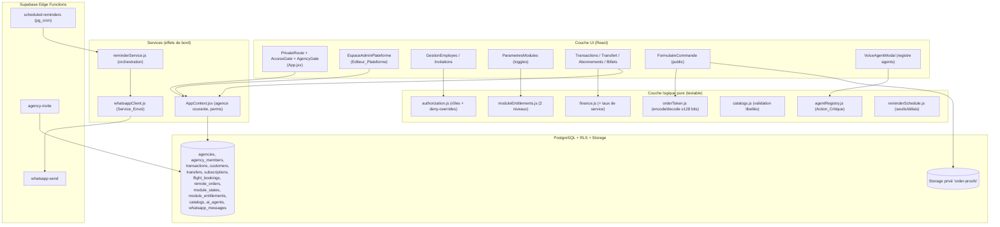
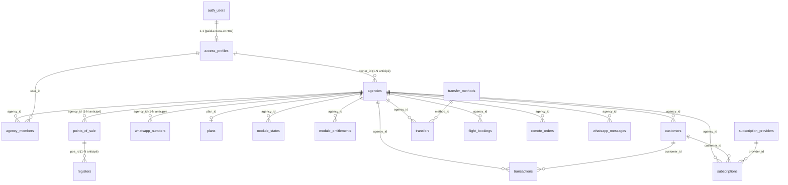
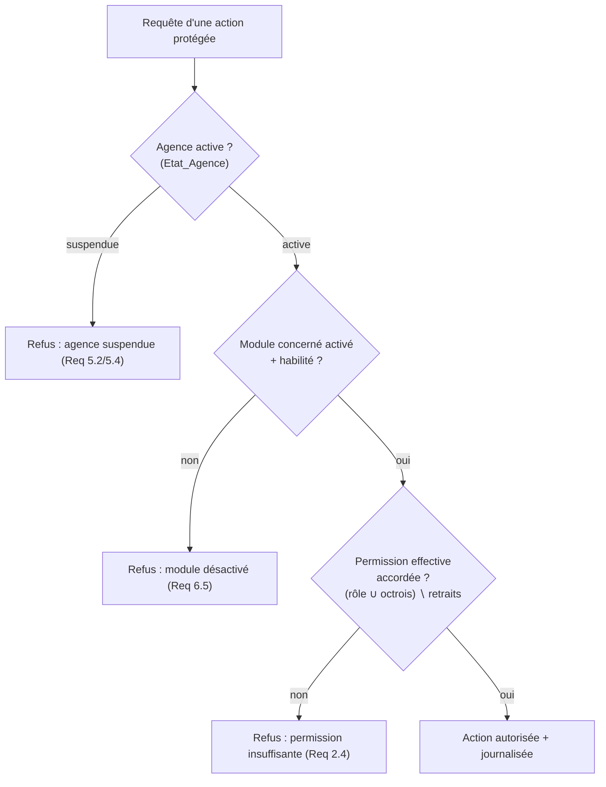

# Document de Conception

## Overview

Cette fonctionnalité fait évoluer **OpaysFox** (PWA React + Vite, backend Supabase : Auth + PostgreSQL + RLS + Storage + Edge Functions) d'une application mono-opérateur de suivi forex vers les **fondations d'une plateforme SaaS multi-agences**. Elle couvre sept chantiers complémentaires décrits dans les 18 exigences :

1. **Comptes employés et invitations** (Req 1) ;
2. **Modèle de rôles et permissions** avec override individuel deny-overrides (Req 2) ;
3. **Architecture multi-tenant évolutive** par clé d'agence et RLS de cloisonnement (Req 3) ;
4. **Administration plateforme** : droits de module, cycle de vie des agences, catalogues de référence (Req 4, 5, 9, 11) ;
5. **Modules activables** à deux niveaux (habilitation plateforme + activation agence) (Req 6) ;
6. **Taux flexibles** : taux de change manuel + taux de service optionnel (Req 7) ;
7. **Services additionnels** : transfert d'argent, abonnements TV, billets d'avion (Req 8, 10, 12) ;
8. **WhatsApp centralisé**, publication et commande à distance (Req 13, 14) ;
9. **Registre d'agents IA** avec validation humaine systématique (Req 15) ;
10. **UX premium, responsive, accessible** (Req 16) ;
11. **Performance et scalabilité** (Req 17) ;
12. **Non-régression** des fonctionnalités livrées (Req 18).

### Principe directeur : étendre l'existant, ne jamais dupliquer

Conformément à `AGENTS.md`, la conception **réutilise et étend** le code et les specs déjà livrés. Les trois specs antérieures constituent le socle :

| Préoccupation | Socle existant (spec / code) | Action de conception |
|---|---|---|
| Accès payant + profils | **paid-access-control** : `access_profiles (role user/admin)`, `has_access()`, `is_admin()`, trigger `handle_new_user`, RLS unifiée (`supabase/migrations/0001_paid_access_control.sql`) | **Étendre** : ajouter `agencies`, `agency_id`, rôles fins, `Editeur_Plateforme`, RLS de cloisonnement — sans supprimer `acces_autorise`/`has_access` |
| WhatsApp sortant | **whatsapp-client-reminders** : `Service_Envoi` (`whatsapp-send` edge + `src/services/whatsappClient.js`), `reminderService.js`, `reminder_history`, `message_templates`, `rateLimiter.js`, `reminderQueue.js`, `sendResult.js`, `phoneValidation.js` | **Réutiliser tel quel** comme unique canal ; ajouter `feature_source`, `numero_whatsapp_agence_id` et étendre l'historique |
| Opérations & finance | **financial-ops-audit-voice-agent** : `src/utils/finance.js`, `VoiceAgentModal.jsx`, `voiceAgent.js`, `customerMatching.js`, `txnValidation.js` | **Étendre** `finance.js` avec le taux de service (fonction pure additive, no-op à taux 0) ; brancher l'agent vocal sur l'ajustement du taux |
| Charte & i18n | `src/styles/buttonPalette.js`, classes CSS `var(--...)`, `src/i18n.js` (`fr`/`en`, `useT()`) | Réutiliser pour tous les nouveaux écrans ; ajouter les clés `fr`+`en` |

### Décision d'architecture centrale : la sécurité repose sur la base

Comme pour paid-access-control, le *gating* côté React est une **commodité UX**, jamais une barrière. La clé `VITE_SUPABASE_ANON_KEY` étant publique, **l'autorité finale est la RLS PostgreSQL**. Le cloisonnement multi-tenant (Req 3.6), l'isolation des agences (Req 1.12), la suspension d'agence (Req 5.2), les droits de module (Req 4.8) et les permissions d'écriture (Req 2.8) sont **tous** imposés par des politiques RLS s'appuyant sur des fonctions `SECURITY DEFINER`, en complément des contrôles d'interface.

### Périmètre V1 vs anticipation structurelle

Le tableau distingue le **comportement testable de la V1** de ce que le **schéma anticipe** sans l'implémenter :

| Concept | Comportement V1 | Anticipation structurelle (schéma seulement) |
|---|---|---|
| Agence | 1 agence active par propriétaire | FK `owner_id` un-à-plusieurs (Req 3.1) |
| Point de vente / Caisse | 1 par défaut implicite | FK `agency_id`→`points_of_sale`→`registers` (Req 3.3, 3.4) |
| Numéro WhatsApp | 1 par défaut | FK `agency_id`→`whatsapp_numbers` (Req 3.5, 13.6) |
| Plan tarifaire | 1 plan par défaut, aucune facturation | FK `plan_id`, table `platform_subscriptions` (Req 5.7) |
| Catalogues de référence | administration plateforme | FK `agency_id` nullable pour ajouts par agence (Req 11.3) |
| Agents IA | registre des 6 types, validation humaine | abstraction extensible (Req 15.1, 15.2) |

## Architecture

### Vue d'ensemble des couches



### Modèle relationnel (vue d'ensemble)



### Modèle d'autorisation à trois niveaux

L'autorisation combine trois portes successives, toutes redoublées en RLS :



### Stack et conventions (rappel)

- **React + Vite**, navigation par état `activeTab` (`AppShell`) + `react-router-dom` pour les routes publiques/privées ; `framer-motion`, `lucide-react`.
- **i18n** : `src/i18n.js`, hook `useT()`, dictionnaires `fr`/`en` à parité stricte.
- **Styles** : variables CSS `var(--...)`, palette `src/styles/buttonPalette.js`, **Theme_Clair uniquement**.
- **Tests** : `vitest` + `@testing-library` + `fast-check` (tag `// Feature: agency-operations-expansion, Property {n}: ...`, `numRuns: 100`).
- **Edge Functions** : patron `gemini-proxy`/`whatsapp-send` (secrets en `Deno.env`, jamais exposés au client).

## Components and Interfaces

### A. Couche logique pure — `src/utils/` (testable, sans réseau)

#### 1. `finance.js` (étendu — taux de service)

Ajouts **purs et additifs**. Les fonctions existantes (`roundHalfUp`, `convertToUSD`, `computeExchangeRate`, `computeProfitUSD`, `applyBalances`, `sumDailyProfit`, `sumMonthlyProfit`) restent **strictement inchangées** (non-régression Req 18.1).

```js
// Montant de commission de service prélevé sur le montant source AVANT conversion.
// montant_service = roundHalfUp(sourceAmount * serviceRate / 100, 2)   (Req 7.3)
// Invariant no-op : serviceRate === 0  ⇒  { montantService: 0, netSource: sourceAmount }
// Garde : serviceRate hors [0,100] ou non numérique ⇒ { ok:false, error } (Req 7.5)
export const computeServiceAmount = (sourceAmount, serviceRate) =>
  ({ ok: boolean, montantService?: number, netSource?: number, error?: string });

// Conversion d'une opération avec taux de service optionnel.
// 1. (montantService, netSource) = computeServiceAmount(source, serviceRate ?? 0)
// 2. destAmount = roundHalfUp(netSource * exchangeRate, <décimales devise>)
// Si module taux_service désactivé, l'appelant force serviceRate = 0 (Req 7.8).
export const computeOperationAmounts = ({ sourceAmount, exchangeRate, serviceRate }) =>
  ({ ok: boolean, montantService?, netSource?, destAmount?, error? });
```

> **Garantie de non-régression (no-op à taux nul)** : `computeOperationAmounts` avec `serviceRate = 0` retourne `montantService = 0`, `netSource = sourceAmount` et `destAmount = roundHalfUp(sourceAmount * exchangeRate, …)`, soit exactement le résultat du flux actuel sans taux de service. Le `Montant_Service` est compté en bénéfice de l'agence (Req 7.3, hypothèse Q3) en l'ajoutant à `profit_usd` après conversion en USD via `convertToUSD`.

#### 2. `authorization.js` (nouveau — modèle de rôles et permissions)

```js
// Ensemble fermé des rôles (Req 2.1) et catalogue des permissions.
export const ROLES = ['proprietaire', 'gerant', 'caissier', 'observateur'];
export const PERMISSIONS = [
  'transactions.creer', 'transactions.lire', 'taux.modifier',
  'services.vendre', 'employes.gerer', 'modules.gerer',
  'clients.gerer', 'whatsapp.envoyer', 'rapports.lire'
];
// Matrice rôle → permissions (proprietaire = toutes — Req 2.2).
export const ROLE_PERMISSIONS = { proprietaire: [...PERMISSIONS], gerant: [...], caissier: [...], observateur: [...] };

// Permissions effectives = (rôle ∪ octrois individuels) ∖ retraits individuels.
// deny-overrides : un retrait l'emporte sur tout octroi (Req 2.5, 2.6).
export const effectivePermissions = (role, grants = [], denies = []) => string[];

// Décision d'autorisation (Req 2.3) : true ssi permission ∈ effectives.
export const isAuthorized = (role, grants, denies, requiredPermission) => boolean;

// Validation de rôle (Req 1.5, 2.1) : rejette tout rôle hors ROLES.
export const isValidRole = (role) => boolean;

// Validation d'e-mail d'invitation (Req 1.2, 1.4) : `partie@domaine`, ≤ 254 car.
export const isValidInvitationEmail = (email) => boolean;
```

#### 3. `moduleEntitlements.js` (nouveau — activation à deux niveaux)

```js
export const BASE_MODULES = ['portefeuilles', 'transactions', 'depenses', 'clients'];      // Req 6.1
export const OPTIONAL_MODULES = ['prets', 'dettes', 'taux_service', 'publication_whatsapp', 'commande_distance'];
export const ADDITIONAL_MODULES = ['transfert_argent', 'abonnements', 'billets_avion'];     // Req 4.1

// Un Module_Additionnel n'est ACTIVABLE que s'il est HABILITÉ par la plateforme (Req 6.2).
export const isModuleActivatable = (moduleKey, entitlements) => boolean;

// Un module est UTILISABLE ssi : base, OU (optionnel activé), OU (additionnel habilité ET activé) (Req 6.5).
export const isModuleEnabled = (moduleKey, { moduleStates, entitlements }) => boolean;

// État par défaut : seuls les Modules_Base activés, additionnels désactivés (Req 6.8, 4.3).
export const defaultModuleState = () => Record<string, boolean>;
```

#### 4. `orderToken.js` (nouveau — lien de commande à distance)

```js
// Génère un jeton non devinable d'au moins 128 bits d'entropie (Req 14.2)
// via crypto.getRandomValues (16 octets) encodé base64url.
export const generateOrderToken = () => string;

// Vérifie le format/longueur d'un jeton candidat avant lookup DB.
export const isWellFormedToken = (token) => boolean;

// Round-trip d'encodage du payload de lien (agencyId + token) :
// decodeOrderLink(encodeOrderLink(x)) === x  (Req 14.2, 14.3)
export const encodeOrderLink = ({ agencyId, token }) => string;
export const decodeOrderLink = (encoded) => { ok: boolean, agencyId?, token?, error? };
```

#### 5. `catalogs.js` (nouveau — validation des catalogues administrables)

```js
// Libellé valide : 1..60 caractères, unique (insensible casse/espaces de bord) (Req 9.5, 11.6).
export const isValidCatalogLabel = (label, existingLabels) => { ok: boolean, error?: string };

// 'Autre' est permanent et non supprimable dans le Catalogue_Methodes_Transfert (Req 9.1, 9.7).
export const TRANSFER_METHOD_OTHER = 'Autre';
export const isDeletableMethod = (label) => boolean;        // false pour 'Autre'

// Libellé personnalisé 'Autre' : 1..60 caractères (Req 8.3, 8.5).
export const isValidCustomTransferLabel = (label) => boolean;

// Fournisseurs d'abonnement par défaut (Req 11.1).
export const DEFAULT_PROVIDERS = ['Canal+', 'Access', 'Évasion', 'DStv'];
```

#### 6. `reminderSchedule.js` (nouveau — déclenchement temporel)

```js
// Une relance d'abonnement est due quand now >= dateRenouvellement - seuilJours (Req 10.4).
export const isSubscriptionReminderDue = (nowMs, renewalDateMs, seuilJours) => boolean;
// Un rappel de vol est dû quand now >= instantVol - délaiHeures (Req 12.5).
export const isFlightReminderDue = (nowMs, flightInstantMs, delaiHeures) => boolean;

// Validation des bornes (Req 10.5, 10.6, 12.6, 12.7).
export const isValidRenewalThreshold = (jours) => boolean;  // 1..30, défaut 3
export const isValidFlightLeadTime = (heures) => boolean;   // 1..168, défaut 48
```

#### 7. Validations métier des services additionnels

```js
// transfers : montant > 0, méthode active présente, libellé 'Autre' 1..60 (Req 8.4, 8.5).
export const validateTransfer = ({ amount, methodId, methodActive, customLabel }) => { ok, error?, field? };
// subscriptions : fournisseur actif, formule, montant > 0, renouvellement futur (Req 10.3).
export const validateSubscription = ({ providerActive, plan, amount, renewalDate, today }) => { ok, error?, field? };
// flight_bookings : date vol >= aujourd'hui, n° billet non vide, prix >= 0 (Req 12.4) ;
// bénéfice = prixClient - prixAgence (Req 12.3).
export const validateFlightBooking = (input) => { ok, error?, field? };
export const computeFlightProfit = (prixClient, prixAgence) => number;   // roundHalfUp(…, 2)
```

#### 8. `agentRegistry.js` (nouveau — registre d'agents IA)

```js
// Six types anticipés, registre extensible (Req 15.1, 15.2).
export const AGENT_TYPES = ['forex', 'comptabilite', 'service_client', 'whatsapp', 'analyse_financiere', 'marketing'];
export const registerAgent = (registry, agentDescriptor) => Registry;   // ajout ultérieur autorisé

// Toute Action_Critique exige une Confirmation humaine (Req 15.3, 15.4, 15.6).
export const isCriticalAction = (actionKind) => boolean;
// Une proposition n'est exécutable QUE si confirmée par un utilisateur habilité.
export const canExecuteProposal = ({ action, confirmedBy, confirmerPermissions }) => boolean;
```

### B. Couche services (effets de bord) — `src/services/`

- **`whatsappClient.js`** (réutilisé, étendu) : `sendWhatsApp({ supabase, to, message, featureSource, agencyId, whatsappNumberId })`. `featureSource ∈ {publication, remote_order, subscription_reminder, flight_reminder, marketing}` est consigné dans `whatsapp_messages` (Req 13.2). Aucun autre canal n'est utilisé (Req 13.3).
- **`reminderService.js`** (réutilisé, étendu) : orchestre relances d'abonnement et rappels de vol via `rateLimiter`/`reminderQueue`/`sendResult` existants (Req 13.4, 13.5).
- **`AppContext.jsx`** (étendu) : expose l'**agence courante** (`currentAgency`, `agencyState`), les **permissions effectives** de l'utilisateur, l'état des modules, et les actions CRUD des nouvelles entités, toujours avec repli mock localStorage (mode démo préservé).

### C. Couche Edge — `supabase/functions/`

| Fonction | Rôle | Exigences |
|---|---|---|
| `whatsapp-send` (existante) | Unique passerelle d'envoi OpenWA, secret serveur | 13.1, 13.3 |
| `scheduled-reminders` (nouvelle) | Déclenchée par **pg_cron** (toutes les 15 min) ; sélectionne abonnements/vols dont la relance est due, appelle `reminderService` côté serveur, consigne dans `whatsapp_messages` et `Historique_Rappels` | 10.4, 12.5, 13.5 |
| `agency-invite` (nouvelle) | Émet l'e-mail d'invitation (Supabase Auth admin / lien), valide unicité e-mail, crée l'`agency_invitation` `en_attente` | 1.2, 1.6 |

> **Planification des relances (Req 10.4, 12.5)** : Supabase propose `pg_cron`. Une tâche cron (`*/15 * * * *`) invoque la fonction `scheduled-reminders`. La logique de « due / non due » est **pure** (`reminderSchedule.js`, horloge injectée), donc testable sans temps réel ; la fonction edge ne fait qu'itérer les lignes candidates, appliquer la fonction pure, et déléguer l'envoi au `Service_Envoi`. Chaque tentative (succès/échec) est journalisée dans l'`Historique_Rappels` (Req 10.8, 12.8) et `whatsapp_messages` (Req 13.2), avec ré-essai non bloquant (Req 13.5).

### D. Couche UI — `src/pages/`, `src/components/`

| Écran | Fichier | Rôle | Exigences |
|---|---|---|---|
| Garde d'agence | `App.jsx` (`AgencyGate`) | Bloque l'accès si `Etat_Agence = suspendue` | 5.2, 5.4 |
| Espace admin plateforme | `pages/EspaceAdminPlateforme.jsx` (nouveau) | Droits de module, liste/suspension d'agences, catalogues, stat globale | 4.2, 5.1, 5.8, 9.2, 11.2 |
| Gestion employés | `pages/Employes.jsx` (nouveau) | Inviter, lister, modifier rôle/permissions, désactiver | 1.1, 1.10, 2.9 |
| Paramètres modules | `Settings.jsx` (étendu) | Toggles des Modules_Fonctionnels | 6.3, 6.4 |
| Transfert d'argent | `pages/Transferts.jsx` (nouveau) | Saisie d'un transfert (méthode + montant + commission) | 8.1, 8.2 |
| Abonnements TV | `pages/Abonnements.jsx` (nouveau) | Vente, relances, campagnes | 10.1, 10.7 |
| Billets d'avion | `pages/Billets.jsx` (nouveau) | Réservation enrichie, marge, rappels | 12.1 |
| Commande à distance | `pages/FormulaireCommande.jsx` (public, route `/commande/:lien`) | Formulaire public + upload preuve | 14.3, 14.4 |
| File des commandes | `pages/CommandesDistantes.jsx` (nouveau) | Confirmation avant enregistrement définitif | 14.7 |
| Agent vocal | `components/VoiceAgentModal.jsx` (étendu) | Ajustement du taux + taux de service avant Confirmation ; intégration registre agents | 7.7, 15.3 |

Tous les nouveaux écrans réutilisent le `Systeme_Design` (classes `card`, `btn`, `modal-*`, `alert`, variables CSS), passent par `useT()`, présentent des `Cible_Tactile ≥ 44×44 px`, et sont responsives mobile/tablette/PC (Req 16).

## Data Models

Source de vérité du schéma : `supabase/migrations/`. La migration de cette fonctionnalité (`0003_agency_operations_expansion.sql`) est **idempotente** (`IF NOT EXISTS` / `OR REPLACE`) et **étend** la migration `0001` sans la rompre.

### Stratégie de migration et rattachement des données existantes (Req 18.6)

```sql
-- 1. Créer une Agence par défaut par Propriétaire_Agence (admin) existant.
INSERT INTO agencies (id, owner_id, name, state, plan_id)
SELECT gen_random_uuid(), ap.user_id, 'Agence par défaut', 'active', (SELECT id FROM plans WHERE is_default)
FROM access_profiles ap
WHERE NOT EXISTS (SELECT 1 FROM agencies a WHERE a.owner_id = ap.user_id);

-- 2. Rattacher toutes les données existantes (transactions, customers, …) à cette agence par défaut.
--    agency_id ajouté NULLABLE d'abord, backfill, puis contrainte NOT NULL (zéro perte d'accès).
ALTER TABLE transactions ADD COLUMN IF NOT EXISTS agency_id UUID REFERENCES agencies(id);
UPDATE transactions SET agency_id = (SELECT id FROM agencies WHERE owner_id = <propriétaire par défaut>) WHERE agency_id IS NULL;
-- (idem customers, expenses, loans, debts, reminder_history, message_templates)
```

> Les `Operations`, `Clients` et données existantes restent **accessibles** car rattachés à l'agence par défaut de leur propriétaire ; les déclencheurs de solde et `finance.js` demeurent inchangés (Req 18.1, 18.6).

### Tables multi-tenant et plateforme

```sql
-- Plans tarifaires (anticipation structurelle — Req 5.7)
CREATE TABLE IF NOT EXISTS plans (
    id UUID PRIMARY KEY DEFAULT gen_random_uuid(),
    name VARCHAR(60) NOT NULL,
    is_default BOOLEAN NOT NULL DEFAULT FALSE
);

-- Agences (Req 3.1, 3.2)
CREATE TABLE IF NOT EXISTS agencies (
    id UUID PRIMARY KEY DEFAULT gen_random_uuid(),
    owner_id UUID NOT NULL REFERENCES auth.users(id) ON DELETE CASCADE,  -- 1-N anticipé (Req 3.1)
    name VARCHAR(120) NOT NULL,
    state VARCHAR(10) NOT NULL DEFAULT 'active' CHECK (state IN ('active','suspendue')),  -- Etat_Agence (Req 5)
    plan_id UUID REFERENCES plans(id),                                   -- Req 5.7
    created_at TIMESTAMPTZ NOT NULL DEFAULT TIMEZONE('utc', NOW())
);

-- Points de vente et caisses (anticipation — Req 3.3, 3.4)
CREATE TABLE IF NOT EXISTS points_of_sale (
    id UUID PRIMARY KEY DEFAULT gen_random_uuid(),
    agency_id UUID NOT NULL REFERENCES agencies(id) ON DELETE CASCADE,
    name VARCHAR(120) NOT NULL DEFAULT 'Point de vente par défaut',
    is_default BOOLEAN NOT NULL DEFAULT TRUE
);
CREATE TABLE IF NOT EXISTS registers (
    id UUID PRIMARY KEY DEFAULT gen_random_uuid(),
    pos_id UUID NOT NULL REFERENCES points_of_sale(id) ON DELETE CASCADE,
    name VARCHAR(120) NOT NULL DEFAULT 'Caisse par défaut',
    is_default BOOLEAN NOT NULL DEFAULT TRUE
);

-- Numéros WhatsApp de l'agence (anticipation — Req 3.5, 13.6)
CREATE TABLE IF NOT EXISTS whatsapp_numbers (
    id UUID PRIMARY KEY DEFAULT gen_random_uuid(),
    agency_id UUID NOT NULL REFERENCES agencies(id) ON DELETE CASCADE,
    phone VARCHAR(30) NOT NULL,
    is_default BOOLEAN NOT NULL DEFAULT TRUE
);

-- Super-administration plateforme (Editeur_Plateforme — Req 4, 5)
-- Indicateur dédié, distinct des rôles d'agence (Q6).
ALTER TABLE access_profiles ADD COLUMN IF NOT EXISTS is_platform_editor BOOLEAN NOT NULL DEFAULT FALSE;
```

### Membres, rôles et permissions

```sql
-- Comptes_Employés rattachés à une agence (Req 1, 2)
CREATE TABLE IF NOT EXISTS agency_members (
    id UUID PRIMARY KEY DEFAULT gen_random_uuid(),
    agency_id UUID NOT NULL REFERENCES agencies(id) ON DELETE CASCADE,
    user_id UUID NOT NULL REFERENCES auth.users(id) ON DELETE CASCADE,
    role VARCHAR(20) NOT NULL CHECK (role IN ('proprietaire','gerant','caissier','observateur')),  -- Req 2.1
    activation_state VARCHAR(10) NOT NULL DEFAULT 'actif' CHECK (activation_state IN ('actif','désactivé')),  -- Req 1.9
    permission_grants TEXT[] NOT NULL DEFAULT '{}',   -- octrois individuels (Req 2.5)
    permission_denies TEXT[] NOT NULL DEFAULT '{}',   -- retraits individuels, deny-overrides (Req 2.6)
    created_at TIMESTAMPTZ NOT NULL DEFAULT TIMEZONE('utc', NOW()),
    UNIQUE (agency_id, user_id)
);

-- Invitations (Req 1.2, 1.3, 1.7)
CREATE TABLE IF NOT EXISTS agency_invitations (
    id UUID PRIMARY KEY DEFAULT gen_random_uuid(),
    agency_id UUID NOT NULL REFERENCES agencies(id) ON DELETE CASCADE,
    email VARCHAR(254) NOT NULL,                       -- Req 1.4
    role VARCHAR(20) NOT NULL CHECK (role IN ('proprietaire','gerant','caissier','observateur')),
    permission_grants TEXT[] NOT NULL DEFAULT '{}',
    permission_denies TEXT[] NOT NULL DEFAULT '{}',
    state VARCHAR(10) NOT NULL DEFAULT 'en_attente' CHECK (state IN ('en_attente','acceptée','expirée')),  -- Req 1.10
    created_at TIMESTAMPTZ NOT NULL DEFAULT TIMEZONE('utc', NOW()),
    accepted_at TIMESTAMPTZ
    -- Expiration : acceptée > 168 h après création ⇒ expirée (Req 1.7)
);
CREATE UNIQUE INDEX IF NOT EXISTS uniq_pending_invite_email
    ON agency_invitations(agency_id, lower(email)) WHERE state = 'en_attente';  -- Req 1.6
```

### Modules : habilitations et états

```sql
-- Droit_Module accordé au niveau plateforme (Req 4)
CREATE TABLE IF NOT EXISTS module_entitlements (
    id UUID PRIMARY KEY DEFAULT gen_random_uuid(),
    agency_id UUID NOT NULL REFERENCES agencies(id) ON DELETE CASCADE,
    module_key VARCHAR(30) NOT NULL CHECK (module_key IN ('transfert_argent','abonnements','billets_avion')),  -- Req 4.1
    granted BOOLEAN NOT NULL DEFAULT FALSE,            -- Req 4.3 : absent ⇒ non habilité
    granted_by UUID REFERENCES auth.users(id),
    granted_at TIMESTAMPTZ,
    UNIQUE (agency_id, module_key)
);

-- État d'activation des Modules_Fonctionnels par agence (Req 6.6, 6.8)
CREATE TABLE IF NOT EXISTS module_states (
    id UUID PRIMARY KEY DEFAULT gen_random_uuid(),
    agency_id UUID NOT NULL REFERENCES agencies(id) ON DELETE CASCADE,
    module_key VARCHAR(30) NOT NULL,
    enabled BOOLEAN NOT NULL DEFAULT FALSE,
    UNIQUE (agency_id, module_key)
);
```

### Catalogues administrables

```sql
-- Catalogue_Methodes_Transfert (Req 9) ; agency_id nullable = niveau plateforme (Req 9.x), ajout agence anticipé
CREATE TABLE IF NOT EXISTS transfer_methods (
    id UUID PRIMARY KEY DEFAULT gen_random_uuid(),
    agency_id UUID REFERENCES agencies(id) ON DELETE CASCADE,   -- NULL = plateforme
    label VARCHAR(60) NOT NULL,                                  -- 1..60 (Req 9.5)
    is_active BOOLEAN NOT NULL DEFAULT TRUE,
    is_permanent BOOLEAN NOT NULL DEFAULT FALSE                  -- 'Autre' = TRUE, non supprimable (Req 9.7)
);

-- Catalogue_Fournisseurs_Abonnement (Req 11) ; agency_id nullable (Req 11.3)
CREATE TABLE IF NOT EXISTS subscription_providers (
    id UUID PRIMARY KEY DEFAULT gen_random_uuid(),
    agency_id UUID REFERENCES agencies(id) ON DELETE CASCADE,    -- NULL = plateforme
    label VARCHAR(60) NOT NULL,
    is_active BOOLEAN NOT NULL DEFAULT TRUE
);
```

### Services additionnels

```sql
-- Transferts d'argent (Req 8)
CREATE TABLE IF NOT EXISTS transfers (
    id UUID PRIMARY KEY DEFAULT gen_random_uuid(),
    agency_id UUID NOT NULL REFERENCES agencies(id) ON DELETE CASCADE,   -- Req 3.2
    customer_id UUID REFERENCES customers(id) ON DELETE SET NULL,
    method_id UUID REFERENCES transfer_methods(id) ON DELETE RESTRICT,
    custom_method_label VARCHAR(60),                                     -- requis si 'Autre' (Req 8.3)
    amount DECIMAL(18,4) NOT NULL CHECK (amount > 0),                     -- Req 8.4
    commission DECIMAL(18,4) NOT NULL DEFAULT 0 CHECK (commission >= 0), -- comptée en bénéfice (Req 8.6)
    created_at TIMESTAMPTZ NOT NULL DEFAULT TIMEZONE('utc', NOW())
);

-- Abonnements TV (Req 10)
CREATE TABLE IF NOT EXISTS subscriptions (
    id UUID PRIMARY KEY DEFAULT gen_random_uuid(),
    agency_id UUID NOT NULL REFERENCES agencies(id) ON DELETE CASCADE,
    customer_id UUID NOT NULL REFERENCES customers(id) ON DELETE CASCADE,
    provider_id UUID NOT NULL REFERENCES subscription_providers(id) ON DELETE RESTRICT,
    plan VARCHAR(120) NOT NULL,
    amount_paid DECIMAL(18,4) NOT NULL CHECK (amount_paid > 0),          -- Req 10.2
    commission DECIMAL(18,4) NOT NULL DEFAULT 0 CHECK (commission >= 0),
    renewal_date DATE NOT NULL,                                          -- future (Req 10.2)
    renewal_threshold_days INT NOT NULL DEFAULT 3 CHECK (renewal_threshold_days BETWEEN 1 AND 30),  -- Req 10.5
    marketing_consent BOOLEAN NOT NULL DEFAULT FALSE,                    -- Req 10.7
    reminder_history JSONB NOT NULL DEFAULT '[]',                        -- Historique_Rappels (Req 10.8)
    created_at TIMESTAMPTZ NOT NULL DEFAULT TIMEZONE('utc', NOW())
);

-- Réservations de billets d'avion (Req 12)
CREATE TABLE IF NOT EXISTS flight_bookings (
    id UUID PRIMARY KEY DEFAULT gen_random_uuid(),
    agency_id UUID NOT NULL REFERENCES agencies(id) ON DELETE CASCADE,
    customer_name VARCHAR(120) NOT NULL,
    ticket_number VARCHAR(60) NOT NULL,                                  -- non vide (Req 12.4)
    airline VARCHAR(120),
    departure_airport VARCHAR(120),
    arrival_airport VARCHAR(120),
    destination VARCHAR(120),
    flight_at TIMESTAMPTZ NOT NULL,                                      -- date du vol (Req 12.4)
    agency_price DECIMAL(18,4) NOT NULL CHECK (agency_price >= 0),       -- prix réel agence
    customer_price DECIMAL(18,4) NOT NULL CHECK (customer_price >= 0),   -- prix client
    profit DECIMAL(18,4) NOT NULL,                                       -- client - agence (Req 12.3)
    customer_whatsapp VARCHAR(30),
    flight_lead_time_hours INT NOT NULL DEFAULT 48 CHECK (flight_lead_time_hours BETWEEN 1 AND 168),  -- Req 12.6
    status VARCHAR(20) NOT NULL DEFAULT 'reservé',
    reminder_history JSONB NOT NULL DEFAULT '[]',                        -- Req 12.8
    created_at TIMESTAMPTZ NOT NULL DEFAULT TIMEZONE('utc', NOW())
);

-- Commandes à distance (Req 14)
CREATE TABLE IF NOT EXISTS order_links (
    id UUID PRIMARY KEY DEFAULT gen_random_uuid(),
    agency_id UUID NOT NULL REFERENCES agencies(id) ON DELETE CASCADE,
    token TEXT NOT NULL UNIQUE,                                          -- ≥128 bits (Req 14.2)
    revoked BOOLEAN NOT NULL DEFAULT FALSE,
    expires_at TIMESTAMPTZ,
    created_at TIMESTAMPTZ NOT NULL DEFAULT TIMEZONE('utc', NOW())
);
CREATE TABLE IF NOT EXISTS remote_orders (
    id UUID PRIMARY KEY DEFAULT gen_random_uuid(),
    agency_id UUID NOT NULL REFERENCES agencies(id) ON DELETE CASCADE,
    order_link_id UUID REFERENCES order_links(id) ON DELETE SET NULL,
    customer_name VARCHAR(120),
    customer_phone VARCHAR(30),
    details TEXT,
    proof_path TEXT,                                                     -- bucket privé 'order-proofs' (Req 14.4)
    state VARCHAR(12) NOT NULL DEFAULT 'à_traiter' CHECK (state IN ('à_traiter','confirmée','rejetée')),  -- Req 14.7
    created_at TIMESTAMPTZ NOT NULL DEFAULT TIMEZONE('utc', NOW())
);
```

### Journal WhatsApp partagé et registre d'agents

```sql
-- Historique_Messages_WhatsApp partagé (Req 13.2) — étend reminder_history existant
CREATE TABLE IF NOT EXISTS whatsapp_messages (
    id UUID PRIMARY KEY DEFAULT gen_random_uuid(),
    agency_id UUID NOT NULL REFERENCES agencies(id) ON DELETE CASCADE,
    whatsapp_number_id UUID REFERENCES whatsapp_numbers(id) ON DELETE SET NULL,  -- émetteur (Req 13.6)
    feature_source VARCHAR(24) NOT NULL
        CHECK (feature_source IN ('publication','remote_order','subscription_reminder','flight_reminder','marketing')),
    recipient VARCHAR(30) NOT NULL,
    content TEXT NOT NULL,
    status VARCHAR(10) NOT NULL DEFAULT 'sent' CHECK (status IN ('sent','failed','queued')),
    provider_message_id VARCHAR(120),
    error_reason TEXT,
    created_at TIMESTAMPTZ NOT NULL DEFAULT TIMEZONE('utc', NOW())
);

-- Registre d'agents IA (Req 15) — initialisé avec les 6 types
CREATE TABLE IF NOT EXISTS ai_agents (
    id UUID PRIMARY KEY DEFAULT gen_random_uuid(),
    agent_type VARCHAR(24) NOT NULL UNIQUE
        CHECK (agent_type IN ('forex','comptabilite','service_client','whatsapp','analyse_financiere','marketing')),
    is_enabled BOOLEAN NOT NULL DEFAULT FALSE
);
-- Journal des confirmations d'Action_Critique (Req 15.5)
CREATE TABLE IF NOT EXISTS critical_action_log (
    id UUID PRIMARY KEY DEFAULT gen_random_uuid(),
    agency_id UUID NOT NULL REFERENCES agencies(id) ON DELETE CASCADE,
    agent_type VARCHAR(24),
    action_kind VARCHAR(40) NOT NULL,
    confirmed_by UUID NOT NULL REFERENCES auth.users(id),
    confirmed_at TIMESTAMPTZ NOT NULL DEFAULT TIMEZONE('utc', NOW())
);
```

### Index de performance (Req 17.3)

```sql
CREATE INDEX IF NOT EXISTS idx_tx_agency_ts        ON transactions(agency_id, timestamp DESC);
CREATE INDEX IF NOT EXISTS idx_customers_agency    ON customers(agency_id, created_at DESC);
CREATE INDEX IF NOT EXISTS idx_transfers_agency    ON transfers(agency_id, created_at DESC);
CREATE INDEX IF NOT EXISTS idx_subs_agency_renew   ON subscriptions(agency_id, renewal_date);
CREATE INDEX IF NOT EXISTS idx_flights_agency_at   ON flight_bookings(agency_id, flight_at);
CREATE INDEX IF NOT EXISTS idx_wamsg_agency_ts     ON whatsapp_messages(agency_id, created_at DESC);
CREATE INDEX IF NOT EXISTS idx_remote_orders_agency ON remote_orders(agency_id, created_at DESC);
```

### Politiques RLS de cloisonnement multi-tenant

Fonctions `SECURITY DEFINER` (évitent la récursion RLS), dans l'esprit de `has_access`/`is_admin` existantes :

```sql
-- Appartenance d'un utilisateur à une agence active (Req 1.12, 3.6, 5.2)
CREATE OR REPLACE FUNCTION public.is_agency_member(uid UUID, aid UUID)
RETURNS BOOLEAN LANGUAGE sql SECURITY DEFINER SET search_path = public AS $$
    SELECT EXISTS (
        SELECT 1
        FROM agency_members m
        JOIN agencies a ON a.id = m.agency_id
        WHERE m.user_id = uid AND m.agency_id = aid
          AND m.activation_state = 'actif'
          AND a.state = 'active'                      -- suspension bloque tout accès (Req 5.2, 5.4)
    ) OR EXISTS (
        SELECT 1 FROM agencies a
        WHERE a.id = aid AND a.owner_id = uid AND a.state = 'active'  -- propriétaire
    );
$$;

CREATE OR REPLACE FUNCTION public.is_platform_editor(uid UUID)
RETURNS BOOLEAN LANGUAGE sql SECURITY DEFINER SET search_path = public AS $$
    SELECT EXISTS (SELECT 1 FROM access_profiles WHERE user_id = uid AND is_platform_editor = TRUE);
$$;

-- Gabarit appliqué à CHAQUE table portant agency_id (transactions, customers, transfers,
-- subscriptions, flight_bookings, remote_orders, whatsapp_messages, module_states, …) :
DROP POLICY IF EXISTS tx_agency_isolation ON transactions;
CREATE POLICY tx_agency_isolation ON transactions
    FOR ALL TO authenticated
    USING (public.has_access(auth.uid()) AND public.is_agency_member(auth.uid(), agency_id))
    WITH CHECK (public.has_access(auth.uid()) AND public.is_agency_member(auth.uid(), agency_id));

-- Droits de module : seul l'Editeur_Plateforme écrit, l'agence lit ses propres droits (Req 4.8)
CREATE POLICY me_select_member ON module_entitlements
    FOR SELECT TO authenticated USING (public.is_agency_member(auth.uid(), agency_id));
CREATE POLICY me_write_editor ON module_entitlements
    FOR ALL TO authenticated
    USING (public.is_platform_editor(auth.uid()))
    WITH CHECK (public.is_platform_editor(auth.uid()));

-- agencies : un éditeur lit toutes les agences et modifie l'Etat_Agence (Req 5.6) ;
-- un membre lit la sienne.
CREATE POLICY ag_select_editor ON agencies FOR SELECT TO authenticated USING (public.is_platform_editor(auth.uid()));
CREATE POLICY ag_select_member ON agencies FOR SELECT TO authenticated USING (public.is_agency_member(auth.uid(), id));
CREATE POLICY ag_update_editor ON agencies FOR UPDATE TO authenticated
    USING (public.is_platform_editor(auth.uid())) WITH CHECK (public.is_platform_editor(auth.uid()));

-- Catalogues : écriture réservée à l'Editeur_Plateforme (Req 9.6, 11.7), lecture par tout membre.
CREATE POLICY tm_write_editor ON transfer_methods FOR ALL TO authenticated
    USING (public.is_platform_editor(auth.uid())) WITH CHECK (public.is_platform_editor(auth.uid()));
CREATE POLICY tm_read_member ON transfer_methods FOR SELECT TO authenticated
    USING (agency_id IS NULL OR public.is_agency_member(auth.uid(), agency_id));
```

> **Note de sécurité (services réseau exposés)** : la route publique `/commande/:lien` (Formulaire_Commande) est **non authentifiée par conception** (Req 14.3). Sa sécurité repose **exclusivement** sur le jeton non devinable (≥128 bits) et une politique d'insertion restreinte : les insertions dans `remote_orders` via le formulaire public passent par une fonction RPC `SECURITY DEFINER` qui vérifie la validité du jeton (`order_links` non révoqué/expiré) avant insertion, plutôt que par une politique `anon USING(true)` ouverte. Les preuves sont déposées dans un bucket **privé** `order-proofs`, lues uniquement via URL signée par un membre de l'agence.

### Bucket Storage privé `order-proofs` (Req 14.4)

```sql
INSERT INTO storage.buckets (id, name, public) VALUES ('order-proofs','order-proofs',FALSE)
ON CONFLICT (id) DO UPDATE SET public = FALSE;
-- Arborescence : order-proofs/{agency_id}/{token}/{timestamp-nom}
-- Lecture réservée aux membres de l'agence ; dépôt via RPC SECURITY DEFINER validant le jeton.
CREATE POLICY op_read_member ON storage.objects FOR SELECT TO authenticated
    USING (bucket_id = 'order-proofs' AND public.is_agency_member(auth.uid(), ((storage.foldername(name))[1])::uuid));
```

## Correctness Properties

*Une propriété est une caractéristique ou un comportement qui doit rester vrai pour toutes les exécutions valides du système — un énoncé formel de ce que le logiciel doit faire. Les propriétés font le pont entre une spécification lisible par l'humain et des garanties de correction vérifiables par la machine.*

Ces propriétés portent sur la **logique pure** extraite (`finance.js`, `authorization.js`, `moduleEntitlements.js`, `orderToken.js`, `catalogs.js`, `reminderSchedule.js`, validations de services, `agentRegistry.js`, pagination, parité i18n, contraste). Les comportements RLS (isolation d'agence, suspension, droits de module), le rendu UI, la planification cron et les appels OpenWA sont couverts par des tests d'intégration/exemple/smoke (cf. Testing Strategy). Après réflexion, les critères logiquement redondants ont été regroupés (voir notes *Validates*).

### Property 1: Validation du rôle dans l'ensemble fermé

*Pour toute* chaîne de rôle, `isValidRole` retourne vrai **si et seulement si** le rôle appartient exactement à `{proprietaire, gerant, caissier, observateur}` ; toute autre valeur (absente, hors ensemble) est rejetée.

**Validates: Requirements 1.5, 2.1**

### Property 2: Permissions effectives et priorité du retrait (deny-overrides)

*Pour tout* rôle, tout ensemble d'octrois individuels et tout ensemble de retraits individuels, `effectivePermissions` est égal à `(permissions(rôle) ∪ octrois) ∖ retraits` : toute permission retirée est absente du résultat même si elle figure dans le rôle ou les octrois, et le rôle `proprietaire` sans retrait possède l'ensemble complet des permissions.

**Validates: Requirements 2.2, 2.5, 2.6**

### Property 3: Décision d'autorisation

*Pour tout* rôle, octrois, retraits et permission requise, `isAuthorized` retourne vrai **si et seulement si** la permission requise appartient aux permissions effectives ; dans le cas contraire l'action est refusée.

**Validates: Requirements 1.11, 2.3, 2.4**

### Property 4: Validation de l'e-mail d'invitation

*Pour toute* chaîne, `isValidInvitationEmail` retourne vrai **si et seulement si** elle respecte la forme `partie-locale@domaine` et comporte au plus 254 caractères ; toute chaîne vide, malformée ou de plus de 254 caractères est rejetée.

**Validates: Requirements 1.2, 1.4**

### Property 5: Rejet d'e-mail déjà utilisé

*Pour tout* ensemble d'e-mails déjà rattachés à une invitation `en_attente` ou à un membre actif d'une agence, toute nouvelle invitation portant un e-mail équivalent (insensible à la casse) au sein de la même agence est détectée comme doublon et rejetée.

**Validates: Requirements 1.6**

### Property 6: Expiration d'invitation au-delà de 168 heures

*Pour tout* horodatage de création et tout instant d'acceptation, l'invitation est considérée comme expirée **si et seulement si** l'écart dépasse 168 heures ; une invitation expirée ne crée aucun Compte_Employé.

**Validates: Requirements 1.7**

### Property 7: Affectation de la clé d'agence

*Pour toute* entité métier nouvellement créée (Operation, Client, transfert, abonnement, réservation, commande à distance) dans le contexte d'une agence courante, l'entité reçoit un `agency_id` non nul égal à celui de l'agence courante.

**Validates: Requirements 3.2**

### Property 8: Point de vente et caisse par défaut implicites

*Pour toute* agence ne disposant d'aucun Point_De_Vente ni Caisse explicite, la résolution renvoie un Point_De_Vente par défaut implicite unique et une Caisse par défaut implicite unique, identiques d'un appel à l'autre.

**Validates: Requirements 3.4**

### Property 9: Ensemble fermé des Modules_Additionnels

*Pour toute* clé de module, l'appartenance à l'ensemble des Modules_Additionnels est vraie **si et seulement si** la clé est l'une de `transfert_argent`, `abonnements`, `billets_avion`.

**Validates: Requirements 4.1**

### Property 10: Activation des modules à deux niveaux

*Pour tout* Module_Additionnel et tout état d'habilitation/activation : il est **activable** par le Propriétaire_Agence **si et seulement si** un Droit_Module lui est accordé (`granted = true`) ; il est **utilisable** **si et seulement si** il est habilité **et** activé. Sans Droit_Module il n'est ni activable ni utilisable, et la révocation du Droit_Module le rend immédiatement non utilisable.

**Validates: Requirements 4.3, 4.4, 4.5, 4.6, 6.2, 6.3, 6.4, 6.5**

### Property 11: État de modules par défaut

*Pour une* agence sans choix de modules enregistré, `defaultModuleState` active exactement les Modules_Base (`portefeuilles`, `transactions`, `depenses`, `clients`) et désactive tous les Modules_Additionnels.

**Validates: Requirements 6.8**

### Property 12: Invariant du montant de service (somme conservée)

*Pour tout* montant source positif et tout Taux_Service dans `[0, 100]`, `computeServiceAmount` produit un `montantService = roundHalfUp(source × taux / 100, 2)` et un `netSource` tels que `montantService + netSource = source` (à la précision d'arrondi de 2 décimales), et le `netSource` est la base de la conversion au Taux_Change.

**Validates: Requirements 7.3, 7.7**

### Property 13: No-op du taux de service à 0 (non-régression)

*Pour tout* montant source et tout Taux_Change valide, `computeOperationAmounts` avec `serviceRate = 0` (cas du module `taux_service` désactivé) retourne `montantService = 0`, `netSource = source` et `destAmount = roundHalfUp(source × exchangeRate, …)`, soit exactement le résultat du flux d'opération sans taux de service.

**Validates: Requirements 7.8, 18.1**

### Property 14: Validation des taux

*Pour toute* valeur de Taux_Change inférieure ou égale à 0 ou non numérique, l'enregistrement de l'opération est refusé sans création ; et *pour toute* valeur de Taux_Service strictement inférieure à 0 ou strictement supérieure à 100, `computeServiceAmount` signale une erreur et aucune opération n'est créée.

**Validates: Requirements 7.4, 7.5**

### Property 15: Validation d'une opération de transfert

*Pour toute* saisie de transfert, `validateTransfer` accepte **si et seulement si** le montant est strictement positif **et** une Methode_Transfert active est référencée **et** (si la méthode est `Autre`) un libellé personnalisé de 1 à 60 caractères est fourni ; tout autre cas (montant ≤ 0, méthode absente/désactivée, libellé `Autre` vide ou > 60) est rejeté en identifiant le champ invalide.

**Validates: Requirements 8.2, 8.3, 8.4, 8.5**

### Property 16: Commissions incluses dans le bénéfice

*Pour tout* ensemble de transferts et d'abonnements d'une agence, le bénéfice agrégé inclut la somme de leurs commissions : retirer ou ajouter une opération modifie le bénéfice exactement de la commission correspondante.

**Validates: Requirements 8.6**

### Property 17: Validation des libellés de catalogue

*Pour tout* libellé candidat et tout ensemble de libellés existants, `isValidCatalogLabel` accepte **si et seulement si** le libellé comporte de 1 à 60 caractères **et** n'est pas un doublon d'un libellé existant (comparaison insensible à la casse et aux espaces de bord) ; vide, > 60 caractères ou dupliqué est rejeté. Cette règle s'applique identiquement aux méthodes de transfert et aux fournisseurs d'abonnement.

**Validates: Requirements 9.3, 9.5, 11.4, 11.6**

### Property 18: Permanence et non-suppression de « Autre »

*Pour tout* état du Catalogue_Methodes_Transfert, la valeur `Autre` est toujours présente et `isDeletableMethod('Autre')` est faux, tandis que toute autre méthode est supprimable.

**Validates: Requirements 9.1, 9.7**

### Property 19: Filtrage des entrées actives et préservation de l'historique

*Pour tout* catalogue (méthodes ou fournisseurs), la liste proposée pour de nouvelles opérations ne contient que les entrées actives ; désactiver une entrée la retire des choix futurs **sans** modifier les opérations ou abonnements existants qui l'ont déjà référencée.

**Validates: Requirements 9.4, 11.5**

### Property 20: Fournisseurs d'abonnement par défaut

*À l'*initialisation, le Catalogue_Fournisseurs_Abonnement contient exactement les fournisseurs actifs `Canal+`, `Access`, `Évasion` et `DStv`.

**Validates: Requirements 11.1**

### Property 21: Validation d'un abonnement

*Pour toute* saisie d'abonnement, `validateSubscription` accepte **si et seulement si** le Fournisseur_Abonnement est actif **et** une formule est fournie **et** le montant payé est strictement positif **et** la date de renouvellement est strictement postérieure à la date du jour ; tout autre cas est rejeté en identifiant le champ invalide.

**Validates: Requirements 10.2, 10.3**

### Property 22: Calcul du bénéfice de réservation de billet et validation

*Pour tout* prix client et prix agence, `computeFlightProfit` est égal à `roundHalfUp(prixClient − prixAgence, 2)` ; et *pour toute* saisie de Reservation_Billet, la validation rejette une date de vol antérieure à la date du jour, un numéro de billet vide, ou un prix (client ou agence) négatif.

**Validates: Requirements 12.3, 12.4**

### Property 23: Déclenchement temporel des relances et rappels

*Pour tout* instant courant : une relance d'abonnement est due **si et seulement si** `now ≥ dateRenouvellement − seuilJours` ; un rappel de vol est dû **si et seulement si** `now ≥ instantVol − délaiHeures`.

**Validates: Requirements 10.4, 12.5**

### Property 24: Validation des bornes de seuil et de délai

*Pour toute* valeur entière, `isValidRenewalThreshold` accepte **si et seulement si** elle est dans `[1, 30]` (défaut 3), et `isValidFlightLeadTime` accepte **si et seulement si** elle est dans `[1, 168]` (défaut 48) ; toute valeur hors borne est rejetée et la valeur antérieure conservée.

**Validates: Requirements 10.5, 10.6, 12.6, 12.7**

### Property 25: Consentement marketing requis

*Pour tout* Client, l'envoi d'une Campagne_Marketing est autorisé **si et seulement si** le Client a consenti (`marketing_consent = true`).

**Validates: Requirements 10.7**

### Property 26: Entrée d'historique par tentative de relance/rappel

*Pour toute* relance d'abonnement ou rappel de vol transmis ou tenté, exactement une entrée est ajoutée à l'Historique_Rappels concerné, portant un horodatage, le type et le résultat ; et chaque message sortant produit exactement une entrée dans l'Historique_Messages_WhatsApp partagé indiquant la fonctionnalité émettrice, l'horodatage, le destinataire et le résultat.

**Validates: Requirements 10.8, 12.8, 13.2**

### Property 27: Round-trip et entropie du jeton de commande

*Pour tout* couple `{agencyId, token}` où `token` est produit par `generateOrderToken`, `decodeOrderLink(encodeOrderLink({agencyId, token}))` retourne `{ok: true, agencyId, token}` identique à l'entrée ; et tout jeton généré comporte au moins 128 bits d'entropie (16 octets aléatoires).

**Validates: Requirements 14.2**

### Property 28: Validité d'un lien de commande

*Pour tout* lien de commande, l'accès au Formulaire_Commande est autorisé **si et seulement si** le jeton est bien formé, connu, non révoqué et non expiré ; un jeton inconnu, révoqué ou expiré est refusé.

**Validates: Requirements 14.5**

### Property 29: Champs requis de la commande à distance

*Pour toute* soumission du Formulaire_Commande, l'enregistrement est accepté **si et seulement si** tous les champs requis sont présents ; toute soumission à laquelle manque un champ requis est rejetée sans créer de Commande_Distante.

**Validates: Requirements 14.6**

### Property 30: Validation humaine préalable à toute Action_Critique (Human Confirmation First)

*Pour tout* type d'Agent_IA du Registre_Agents (y compris un type ajouté ultérieurement) et toute Action_Critique proposée — dont une Commande_Distante à enregistrer définitivement — `canExecuteProposal` retourne vrai **si et seulement si** une Confirmation explicite a été donnée par un Utilisateur disposant de la Permission requise ; en l'absence de Confirmation habilitée, aucun effet persistant ou externe n'est exécuté.

**Validates: Requirements 14.7, 15.3, 15.4, 15.6**

### Property 31: Registre d'agents extensible et journalisation des confirmations

*Pour tout* registre et tout descripteur d'agent, `registerAgent` ajoute le type sans retirer les types existants ; et *pour toute* Action_Critique exécutée à la suite d'une proposition confirmée, exactement une entrée de journal est produite contenant l'identité du confirmateur et un horodatage non nul.

**Validates: Requirements 15.1, 15.5**

### Property 32: Pagination bornée et couverture exacte

*Pour toute* liste d'Operations, Clients, Abonnements ou Reservations_Billet et tout numéro de page, `paginate` retourne au plus 50 éléments par page, et l'union ordonnée de toutes les pages successives est une permutation exacte de la liste d'entrée, sans perte ni doublon (chargement à la demande, page par page).

**Validates: Requirements 17.1, 17.4**

### Property 33: Statistique du nombre d'agences par état

*Pour toute* liste d'agences, `countAgenciesByState` retourne, pour chaque Etat_Agence (`active`, `suspendue`), un nombre égal au cardinal exact du sous-ensemble correspondant, la somme étant égale au nombre total d'agences.

**Validates: Requirements 5.8**

### Property 34: Rattachement complet des données à la migration

*Pour tout* jeu de données existant rattaché à un Propriétaire_Agence, après application du backfill de migration, chaque ligne (transaction, client, dépense, prêt, dette) porte un `agency_id` non nul égal à l'agence par défaut de son propriétaire ; aucune ligne ne reste sans agence.

**Validates: Requirements 18.6**

### Property 35: Contraste accessible des nouveaux composants

*Pour toute* paire texte/fond des nouveaux écrans ajoutée à `BUTTON_PALETTE`, le ratio de contraste WCAG 2.1 est supérieur ou égal à 4,5:1 (réutilise le test de propriété de palette existant).

**Validates: Requirements 16.6**

### Property 36: Parité des clés de traduction fr/en

*Pour toute* clé de texte des nouveaux écrans présente dans le dictionnaire `fr`, la même clé existe dans le dictionnaire `en`, et réciproquement (parité structurelle complète des deux dictionnaires).

**Validates: Requirements 16.7**

## Error Handling

Tous les chemins `IF … THEN` des exigences sont traités. Principe transverse : **toute incertitude conduit à un refus** côté front ; la RLS reste l'autorité finale côté données (cloisonnement, suspension, droits de module, permissions d'écriture).

| Cas d'erreur (exigence) | Détection | Réponse système |
|---|---|---|
| E-mail d'invitation invalide (1.4) | `isValidInvitationEmail` | Refus, aucune invitation, message « e-mail invalide » |
| Rôle invalide (1.5, 2.1) | `isValidRole` | Refus, aucune modification, message « rôle invalide » |
| E-mail déjà utilisé (1.6) | index unique partiel + vérification | Refus, message « e-mail déjà utilisé » |
| Invitation expirée (1.7) | fonction d'expiration (> 168 h) | État `expirée`, aucun Compte_Employé, message « invitation expirée » |
| Compte désactivé tente connexion (1.9) | `activation_state = 'désactivé'` + RLS | Connexion refusée, même restriction qu'un non-autorisé |
| Permission insuffisante (1.11, 2.4) | `isAuthorized` + RLS écriture | Refus, aucune donnée modifiée, message « permission insuffisante » |
| Accès données hors agence (1.12, 3.6) | RLS `is_agency_member` | Aucune ligne retournée / écriture refusée |
| Module additionnel sans Droit_Module (4.6, 6.2) | `isModuleActivatable` | Activation refusée, message « module à habiliter par l'éditeur » |
| Accès à un module désactivé (6.5) | `isModuleEnabled` faux | Accès refusé, message « module désactivé », session inchangée |
| Échec de persistance d'un état de module (6.7) | erreur DB sur `module_states` | État antérieur conservé, message d'échec d'enregistrement |
| Non-éditeur modifie Droit_Module / Etat_Agence / catalogue (4.7, 5.5, 9.6, 11.7) | RLS `is_platform_editor` | Refus, aucune modification, message « permission insuffisante » |
| Agence suspendue (5.2, 5.4) | `AgencyGate` + RLS (`a.state = 'active'`) | Message « accès suspendu », aucune donnée de trésorerie exposée |
| Taux de change ≤ 0 / non numérique (7.4) | `computeExchangeRate` (existant) | Refus, aucune opération, message « taux de change invalide » |
| Taux de service hors [0,100] (7.5) | `computeServiceAmount` | Refus, aucune opération, message « taux de service invalide » |
| Transfert invalide (8.4, 8.5) | `validateTransfer` | Refus, aucune opération, message identifiant le champ |
| Abonnement invalide (10.3) | `validateSubscription` | Refus, aucun abonnement, message identifiant le champ |
| Seuil de relance hors [1,30] (10.6) | `isValidRenewalThreshold` | Refus, valeur antérieure conservée, message « seuil invalide » |
| Réservation invalide (12.4) | `validateFlightBooking` | Refus, aucune réservation, message identifiant le champ |
| Délai de rappel hors [1,168] (12.7) | `isValidFlightLeadTime` | Refus, valeur antérieure conservée, message « délai invalide » |
| Passerelle WhatsApp indisponible/erreur (13.5) | `sendResult` / `reminderQueue` | Échec consigné dans `whatsapp_messages`, ré-essai programmé, autres fonctionnalités non interrompues |
| Lien de commande inconnu/révoqué/expiré (14.5) | `isWellFormedToken` + lookup `order_links` | Accès refusé, message « lien invalide » |
| Champ requis manquant du formulaire (14.6) | validation de commande | Refus, aucune Commande_Distante, message « champ manquant » |
| Action_Critique non confirmée (15.4) | `canExecuteProposal` | Aucun effet persistant ou externe |
| Délai de chargement / incertitude d'accès (paid-access-control) | `profileStatus = 'error'` | Refus d'accès (réutilise le gating existant) |

## Testing Strategy

Approche duale conforme aux conventions du dépôt (`vitest` + `@testing-library` + `fast-check`).

### Tests de propriété (fast-check, ≥ 100 itérations)

Cibles : **fonctions pures uniquement**. Chaque test est tagué `// Feature: agency-operations-expansion, Property {n}: {texte}`. Chaque propriété (1–36) est implémentée par **un seul** test de propriété.

| Module sous test | Propriétés | Fichier de test |
|---|---|---|
| `src/utils/authorization.js` | P1, P2, P3, P4, P5, P6 | `authorization.property.test.js` |
| `src/utils/finance.js` (taux de service) | P12, P13, P14, P16 | `finance.serviceRate.property.test.js` |
| `src/utils/moduleEntitlements.js` | P9, P10, P11 | `moduleEntitlements.property.test.js` |
| `src/utils/transferValidation.js` | P15 | `transferValidation.property.test.js` |
| `src/utils/catalogs.js` | P17, P18, P19, P20 | `catalogs.property.test.js` |
| `src/utils/subscriptionValidation.js` | P21, P25, P26 | `subscriptionValidation.property.test.js` |
| `src/utils/flightBooking.js` | P22 | `flightBooking.property.test.js` |
| `src/utils/reminderSchedule.js` | P23, P24 | `reminderSchedule.property.test.js` |
| `src/utils/orderToken.js` | P27, P28, P29 | `orderToken.property.test.js` |
| `src/utils/agentRegistry.js` | P30, P31 | `agentRegistry.property.test.js` |
| `src/utils/pagination.js` | P32 | `pagination.property.test.js` |
| `src/utils/agencyStats.js` + affectation agency_id | P7, P8, P33, P34 | `agency.property.test.js` |
| `src/styles/buttonPalette.js` | P35 | `buttonContrast.property.test.js` (existant, étendu) |
| `src/i18n.js` | P36 | `i18nParity.property.test.js` |

### Tests d'exemple et d'edge-case (unit tests)

- Transitions d'état d'invitation (1.3), modification de rôle (1.8), rendu conditionnel des interfaces selon permission/module (1.1, 1.10, 2.9, 8.1, 10.1, 12.1, 4.2, 5.1), enregistrement d'un Droit_Module à la demande ou à l'initiative (4.9), pré-remplissage du Taux_Service par défaut client (7.6), persistance des états de module (6.6), initialisation du registre des 6 agents (15.2), absence de mode sombre (16.1), réservation enrichie (12.2), enregistrement d'une commande à distance valide (14.3, 14.4).
- Edge-cases couverts par les générateurs : bornes du Taux_Service (0 et 100, 7.2), montants limites, libellés à 1 et 60 caractères, dates de renouvellement/vol à la limite.

### Tests d'intégration (RLS, 1–3 exemples)

L'isolation multi-tenant et le cycle de vie d'agence sont des **garanties de sécurité imposées par la base**, vérifiées par des tests d'intégration sur une base Supabase locale (ou via `pgTAP`/mocks PostgREST) :

- **Isolation par agence** (1.12, 3.6) : un membre de l'agence A ne lit/écrit aucune donnée de l'agence B.
- **Suspension/réactivation** (5.2, 5.3, 5.4, 5.6) : un membre d'une agence `suspendue` n'accède à aucune donnée ; la réactivation rétablit l'accès.
- **Droits de module** (4.7, 4.8) : seul l'Editeur_Plateforme écrit `module_entitlements` ; une agence ne lit que ses droits.
- **Permissions d'écriture trésorerie** (2.8) : une écriture sans la permission requise est refusée au niveau RLS.
- **Canal WhatsApp unique** (13.1, 13.3) : toutes les fonctionnalités émettrices passent par `whatsapp-send`.
- **Performance** (17.2, 17.5) : sur un jeu de 50 000 opérations, la première page et une page filtrée/triée se chargent en ≤ 2 s grâce aux index (`idx_tx_agency_ts`, …).
- **Concurrence** (17.6) : écritures simultanées de plusieurs membres sans perte de mise à jour (transactions PostgreSQL).

### Tests smoke (configuration / schéma, exécution unique)

- Présence des clés étrangères d'anticipation structurelle : `agencies.owner_id`, `points_of_sale.agency_id`, `registers.pos_id`, `whatsapp_numbers.agency_id`, `agencies.plan_id`, `subscription_providers.agency_id` nullable (3.1, 3.3, 3.5, 5.7, 11.3, 13.6).
- Présence des index de performance (17.3).
- Existence du bucket privé `order-proofs` et de ses politiques.

### Non-régression (Req 18)

- La suite **existante** `src/utils/finance.test.js` et les `*.property.test.js` de finance restent **inchangées** et **vertes** : les fonctions `convertToUSD`, `computeExchangeRate`, `computeProfitUSD`, `applyBalances`, `sumDailyProfit`, `sumMonthlyProfit` ne sont pas modifiées ; le taux de service est ajouté en **fonctions nouvelles** dont la Property 13 garantit l'équivalence au comportement antérieur lorsque le taux vaut 0 (18.1).
- Les suites existantes de paid-access-control (`accessControl`, `paymentProof`, …), whatsapp-client-reminders (`rateLimiter`, `reminderQueue`, `sendResult`, `phoneValidation`, `messageComposer`) et de l'agent vocal (`VoiceAgentModal.test.jsx`, `voiceAgent.property.test.js`) doivent rester vertes (18.2, 18.3, 18.4, 18.5).
- Commande de vérification globale : `npm test` (et `npm run build` pour la non-régression de build).
- Le `Service_Envoi` WhatsApp est **réutilisé** (un seul canal, étendu par `feature_source` et `agency_id`/`whatsapp_number_id`), jamais dupliqué (18.3).

### Bibliothèque PBT

`fast-check` (déjà présent dans le dépôt). Aucune implémentation de PBT « maison ». Configuration : `numRuns: 100` minimum par propriété, horloge injectée pour les propriétés temporelles (P6, P23), `crypto.getRandomValues` mocké de façon déterministe pour vérifier l'entropie/round-trip du jeton (P27).
