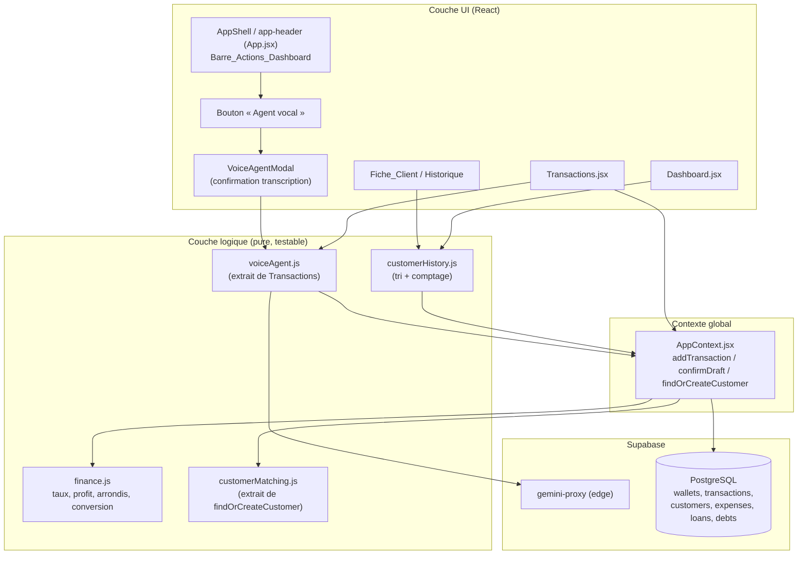
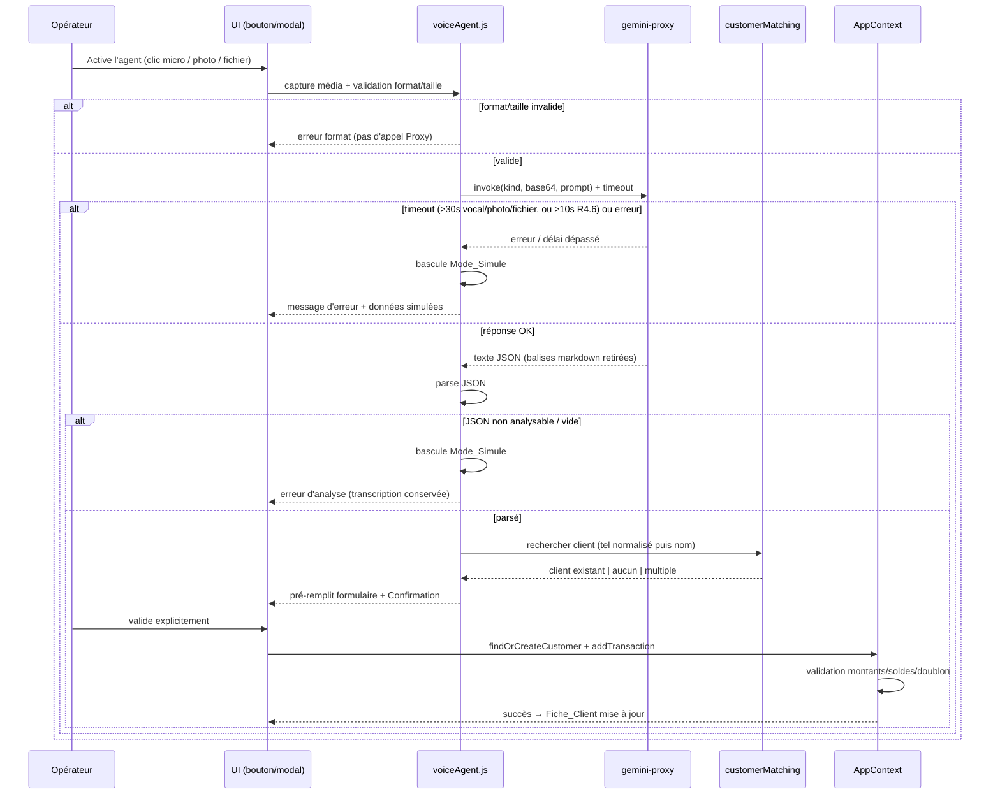
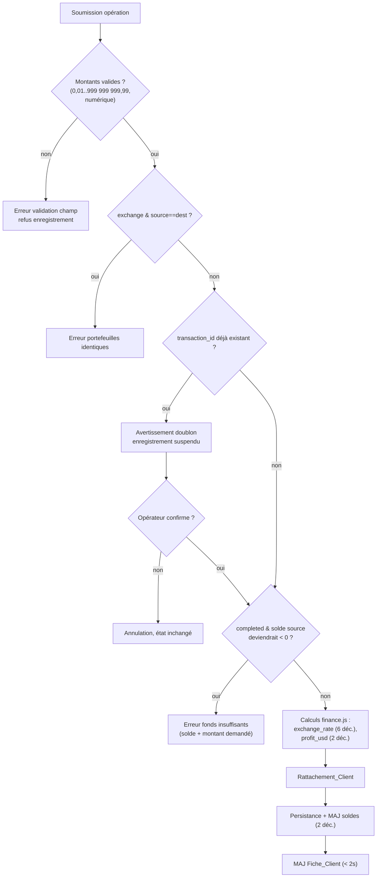

# Document de Conception

## Overview

Ce document de conception couvre un chantier en cinq axes sur l'application **OpaysFox** (PWA React + Vite, données Supabase) :

1. **Audit d'intégrité financière** (calculs, navigation/contrôleurs/sécurité-RLS, cohérence du schéma, gestion des erreurs) produisant un livrable **Rapport_Audit**.
2. **Audit et fiabilisation des trois agents IA** existants : saisie vocale, capture photo (OCR) et capture de fichier (PDF/Image).
3. **Corrections** : déduplication/rattachement client avant enregistrement et historique détaillé par client.
4. **Nouvelle fonctionnalité** : bouton « Agent vocal » dans la barre d'actions du tableau de bord, responsive, avec barre fixe au scroll, sans régression ni rupture de la Charte_Graphique.
5. **Validation finale** vérifiable des comportements clés.

### Principe directeur : ancrage dans le code existant

Conformément à `AGENTS.md`, la conception **réutilise et fiabilise** le code existant plutôt que d'introduire des implémentations parallèles :

| Préoccupation | Code existant ancré | Action de conception |
|---|---|---|
| Calculs financiers | `src/utils/finance.js` (`convertToUSD`, `calculateLoanRepaymentUSD`, `sumDailyProfit`, `sumMonthlyProfit`) | Étendre avec des fonctions pures d'arrondi/calcul de taux/profit ; tests dans `finance.test.js` + `*.property.test.js` |
| Mutations soldes & dédup client | `src/context/AppContext.jsx` (`addTransaction`, `confirmDraft`, `findOrCreateCustomer`, `createCustomer`) | Fiabiliser la validation et la déduplication ; extraire la logique pure testable |
| Agents IA (vocal / photo / fichier) | `src/pages/Transactions.jsx` (`processAudioWithGemini`, `processImageWithGemini`, upload, `applyGeminiResult`, `simulateVoiceResult`, `simulateOcrResult`, `callGeminiProxy`) | Extraire la logique commune dans un module réutilisable, branché sur le bouton du dashboard |
| Relais Gemini | `supabase/functions/gemini-proxy/index.ts` | Aucune modification de contrat ; ajout du traitement délai/erreur côté client |
| Charte graphique | `src/styles/buttonPalette.js`, variables CSS `var(--...)` | Réutiliser pour le bouton « Agent vocal » |

### Découverte importante (à intégrer au Rapport_Audit)

La barre d'actions contenant « Paramètres » et « Dettes » n'est **pas** dans `Dashboard.jsx` mais dans l'en-tête `app-header` de `AppShell` (`src/App.jsx`). La **Barre_Actions_Dashboard** au sens de l'Exigence 10 correspond donc à ce cluster d'actions (`settings-fab`, `debts-fab`). Le bouton « Agent vocal » sera ajouté **à côté du bouton Paramètres dans `app-header`**, ce qui satisfait la contrainte « immédiatement adjacent au bouton Paramètres » tout en restant visible au-dessus du tableau de bord. Cette décision est documentée pour éviter toute régression sur `Dashboard.jsx`.

## Architecture

### Vue d'ensemble des couches



### Flux d'un agent IA (vocal / photo / fichier) avec déduplication client



### Flux d'enregistrement d'une opération avec validation financière



### Stratégie d'audit (Rapport_Audit)

L'audit (Exigences 1, 2, 3, 4) produit un livrable **Rapport_Audit** (fichier Markdown `docs/Rapport_Audit.md`) généré par un script d'audit Node exécutable (`scripts/audit/`), s'appuyant sur des modules d'analyse purs et testables. Le rapport est structuré par axe avec, pour chaque écart : chemin de fichier, numéro de ligne, sévérité, valeur attendue vs constatée.

| Axe d'audit | Méthode de production | Entrées analysées | Sortie dans le Rapport_Audit |
|---|---|---|---|
| **Intégrité des calculs** (Ex. 1) | Tests de propriété (fast-check) sur `finance.js` + comparaison valeur code/valeur attendue avec seuil 0,01 | `src/utils/finance.js`, `src/context/AppContext.jsx` | Écarts par sévérité `critique`/`majeur`/`mineur` |
| **Navigation / contrôleurs / sécurité** (Ex. 2) | Inventaire statique routes↔fonctions de contexte ; lecture des `ALTER TABLE ... ENABLE ROW LEVEL SECURITY` | `src/App.jsx`, `AppContext.jsx`, `supabase_schema.sql` | Table route→fonction, état RLS ∈ {Activée, Désactivée, Indéterminée}, sévérités |
| **Cohérence du schéma** (Ex. 3) | Comparaison des champs/clés étrangères/contraintes entre code et deux sources de schéma | `AppContext.jsx`, `supabase_schema.sql`, `docs/03_Architecture/db_schema.md` | Correspondances champ par champ, écarts FK/contraintes, récapitulatif + verdict |
| **Erreurs non gérées** (Ex. 4) | Recensement statique des cas d'erreur financière et de leur prise en charge dans le code | `Transactions.jsx`, `AppContext.jsx` | Localisation + type pour chaque cas non géré |

**Écart de schéma déjà identifié** (preuve de faisabilité de l'audit) : `docs/03_Architecture/db_schema.md` décrit la table `transactions` **sans** les colonnes `type` ni `customer_id`, et déclare `source_wallet_id`/`dest_wallet_id` en `NOT NULL`, alors que `supabase_schema.sql` ajoute `type`, `customer_id` et rend ces clés nullables. Le code (`AppContext.jsx`) manipule `type` et `customer_id`. → écart de cohérence à consigner (champ absent de la doc de référence).

### Stack et conventions

- **React + Vite**, navigation par état `activeTab` dans `AppShell` (pas de routes pour les onglets internes).
- **react-router-dom** pour les routes publiques/privées, **framer-motion**, **lucide-react**, **i18n** (`src/i18n.js`, clés `transactions.voice_button`, etc.).
- **Styles** via variables CSS (`var(--color-red)`, `var(--primary-blue)`...) et palette `src/styles/buttonPalette.js`.
- **Tests** : `vitest` + `@testing-library` + `fast-check` (convention de tag `// Feature: {feature}, Property {n}: ...`, `numRuns: 100`).

## Components and Interfaces

### 1. Module logique d'agent vocal réutilisable — `src/utils/voiceAgent.js` (extrait de `Transactions.jsx`)

Objectif : factoriser la logique aujourd'hui inline dans `Transactions.jsx` pour la partager entre la page Transactions et le nouveau bouton du dashboard, **sans dupliquer**.

```js
// Construit la requête Gemini selon le kind ('audio' | 'ocr' | 'file')
buildGeminiRequest({ kind, wallets, file|blob }): { kind, prompt, mimeType, base64Data }

// Retire les balises markdown puis JSON.parse de façon sûre
parseGeminiResponse(text): { ok: boolean, data?: object, error?: string }

// Validation format/taille avant transmission (Ex. 6.2, 7.6)
validateMediaInput({ mimeType, sizeBytes, kind }): { ok: boolean, error?: string }

// Appel proxy avec timeout configurable (Ex. 4.6, 5.2, 6.4, 7.7)
callGeminiWithTimeout({ supabase, payload, timeoutMs }): Promise<string>

// Données de repli (Mode_Simule) déjà présentes
simulateVoiceResult(), simulateOcrResult()
```

`Transactions.jsx` et `VoiceAgentModal` consomment ce module ; les fonctions existantes `processAudioWithGemini`/`processImageWithGemini` sont refactorisées pour l'utiliser.

### 2. Bouton « Agent vocal » — dans `app-header` (`src/App.jsx`)

Ajouté immédiatement adjacent au bouton « Paramètres » (`settings-fab`).

```jsx
<button
  className="voice-agent-btn"      // reprend les variables Charte_Graphique
  aria-label={t('dashboard.voice_agent_aria')}
  onClick={() => setVoiceAgentOpen(true)}
>
  <Mic size={18} />
  <span className="voice-agent-label">{t('dashboard.voice_agent')}</span>
</button>
```

**Positionnement responsive (CSS, réutilisant la Charte_Graphique)** :

| Condition | Comportement |
|---|---|
| `@media (max-width: 767.98px)` | Cluster d'actions en **haut à droite**, `voice-agent-btn` adjacent à `settings-fab`, `gap` issu des variables d'espacement, aucun chevauchement (`flex`, `flex-wrap: nowrap`) |
| `@media (min-width: 768px)` | Cluster aligné dans la zone d'actions (barre latérale gauche / en-tête desktop), dans l'ordre existant, bouton ajouté sans déplacer les autres |
| Tous écrans | `position: sticky; top: 0; z-index` élevé sur le conteneur de la Barre_Actions_Dashboard → barre fixe au scroll (Ex. 11.1, 11.2) |

Les couleurs/typographie proviennent des mêmes `var(--...)` que `settings-fab`/`debts-fab` ; la paire texte/fond est ajoutée à `BUTTON_PALETTE` (variante `fab`) pour rester couverte par le test de contraste P15 existant.

### 3. Modal de l'agent vocal — `src/components/VoiceAgentModal.jsx` (nouveau, réutilise `voiceAgent.js`)

Responsabilités :
- Démarrer l'écoute micro en ≤ 2 s (Ex. 10.4) via `navigator.mediaDevices.getUserMedia` (même mécanique que `startRecording` de `Transactions.jsx`).
- Afficher la **Transcription** puis une **Confirmation** de l'action interprétée (opération ou recherche d'historique) avant toute exécution (Ex. 10.6, 5.5).
- Sur refus micro ou échec de démarrage : message d'erreur, dashboard inchangé (Ex. 10.5), bascule Mode_Simule (Ex. 5.6).
- Réutilise le composant de formulaire/confirmation de `Transactions.jsx` (via `applyGeminiResult`) pour le pré-remplissage et la validation explicite.

Interface :
```js
<VoiceAgentModal
  open={boolean}
  onClose={() => void}
  onConfirmOperation={(payload) => addTransaction(payload)}  // via AppContext
  onSearchHistory={(query) => void}                          // recherche d'historique
/>
```

### 4. Fiche_Client / Historique — `src/components/CustomerCard.jsx` (nouveau) + helpers `src/utils/customerHistory.js`

```js
// Tri par date décroissante, départage par ordre d'enregistrement décroissant (Ex. 9.7)
sortCustomerOperations(operations): Operation[]

// Nombre total borné [0, 999 999] (Ex. 9.3)
countCustomerOperations(operations): number

// Formatage d'affichage : date JJ/MM/AAAA, montant 2 décimales, type (Ex. 9.2)
formatOperationRow(operation): { date: string, amount: string, type: string }
```

`CustomerCard` affiche l'identité du client, la liste triée et le compteur ; si aucune opération, affiche le compteur `0` et un message d'absence (Ex. 9.4).

### 5. Déduplication client — `src/utils/customerMatching.js` (extrait de `findOrCreateCustomer`)

Fonctions pures extraites pour test, consommées par `AppContext.findOrCreateCustomer` :

```js
normalizePhone(phone): string   // retire tous les espaces (Ex. 8.5)
normalizeName(name): string     // minuscule + trim (Ex. 8.6)

// Sélection déterministe (Ex. 8.1, 8.2, 8.7)
matchCustomer(customers, { name, phone }):
  { match: Customer|null, ambiguous: boolean }
  // priorité : correspondance téléphone normalisé ;
  // sinon nom normalisé ; si plusieurs → téléphone d'abord,
  // à défaut date de création la plus ancienne
```

### 6. Couche financière — `src/utils/finance.js` (étendue)

Ajouts de fonctions **pures** alignées sur les règles de l'Exigence 1 :

```js
roundHalfUp(value, decimals): number          // arrondi demi vers le haut

computeExchangeRate(sourceAmount, destAmount): number   // dest/source, 6 déc. (Ex. 1.1)
  // lève/retourne erreur si sourceAmount <= 0 (Ex. 1.2)

computeProfitUSD(sourceAmount, sourceCur, destAmount, destCur, rates): number
  // valeurUSD(source) - valeurUSD(dest), 2 déc. (Ex. 1.3)

applyBalances(wallets, txn): { wallets, error? }
  // exchange/deposit/withdrawal, frais, arrondi 2 déc., rejet si solde < 0 (Ex. 1.4–1.9)
```

`convertToUSD` existante est conservée (division par `rate_to_usd`, garde le 0 sûr) et alignée sur l'arrondi 2 décimales pour les valeurs monétaires (Ex. 1.10, 1.11).

## Data Models

Modèles de référence (source de vérité : `supabase_schema.sql`). Aucun changement de schéma n'est requis par ce chantier ; l'audit vérifie la cohérence existante.

### Operation_Financiere (`transactions`)

| Champ | Type | Règle |
|---|---|---|
| `id` | UUID | PK |
| `type` | `'exchange'`\|`'deposit'`\|`'withdrawal'` | défaut `exchange` |
| `source_wallet_id` | UUID? | FK `wallets`, requis hors `deposit` |
| `dest_wallet_id` | UUID? | FK `wallets`, requis hors `withdrawal` |
| `customer_id` | UUID? | FK `customers` (ON DELETE SET NULL) |
| `source_amount` | DECIMAL(18,4) | `> 0`, ∈ [0,01 ; 999 999 999,99] |
| `dest_amount` | DECIMAL(18,4) | `> 0`, ∈ [0,01 ; 999 999 999,99] |
| `exchange_rate` | DECIMAL(18,8) | `dest_amount / source_amount`, 6 déc. |
| `fee` | DECIMAL(18,4) | `>= 0` |
| `fee_wallet_id` | UUID? | FK `wallets` |
| `profit_usd` | DECIMAL(18,4) | valeur USD source − valeur USD dest, 2 déc. |
| `status` | `'completed'`\|`'draft'` | défaut `completed` ; `draft` n'affecte pas les soldes |
| `transaction_id` | VARCHAR(100) | ID réseau, détection doublon |
| `timestamp` | TIMESTAMPTZ | tri historique |

### Portefeuille (`wallets`)

`id`, `name`, `currency` (VARCHAR 3), `type` ∈ {`cash`,`mobile_money`}, `balance` DECIMAL(18,4), `is_active`.

### Client (`customers`)

`id`, `name` (NOT NULL), `phone` (nullable), `created_at` (utilisé pour départage Ex. 8.7).

### Taux (`exchange_rates`)

`currency`, `rate_to_usd` DECIMAL(18,8) `> 0`, `date`, contrainte unique `(currency, date)`.

### Fiche_Client (vue dérivée, non persistée)

```
Fiche_Client {
  customer: Customer
  operations: Operation[]   // triées date décroissante (Ex. 9.7)
  total: integer            // [0, 999 999] (Ex. 9.3)
}
```

### Rapport_Audit (livrable, `docs/Rapport_Audit.md`)

```
Rapport_Audit {
  axe: 'calculs' | 'securite' | 'schema' | 'erreurs'
  findings: Array<{
    file: string
    line?: number
    severity: 'critique' | 'majeur' | 'mineur'   // axe calculs
             | 'Critique' | 'Élevée' | 'Moyenne' | 'Faible'  // axe sécurité
    expected?: string
    actual?: string
    description: string
  }>
  summary?: { totalEcarts: number, verdict: 'cohérent' | 'incohérent' }  // axe schéma
}
```

## Correctness Properties

*Une propriété est une caractéristique ou un comportement qui doit rester vrai pour toutes les exécutions valides du système — un énoncé formel de ce que le logiciel doit faire. Les propriétés font le pont entre une spécification lisible par l'humain et des garanties de correction vérifiables par la machine.*

Ces propriétés s'appliquent aux **fonctions pures** extraites (`finance.js`, `customerMatching.js`, `customerHistory.js`, `voiceAgent.js`) et seront implémentées avec **fast-check** (≥ 100 itérations), selon la convention de tag existante.

### Property 1: Calcul du taux de change

*Pour tout* `source_amount` strictement positif et tout `dest_amount` positif, `computeExchangeRate(source, dest)` est égal à `dest / source` arrondi à 6 décimales (demi vers le haut).

**Validates: Requirements 1.1**

### Property 2: Montant source non positif rejeté pour le taux

*Pour tout* `source_amount` inférieur ou égal à 0, `computeExchangeRate` signale une erreur, ne produit aucun taux, et `applyBalances` appliqué à une telle opération laisse tous les soldes de portefeuilles inchangés.

**Validates: Requirements 1.2**

### Property 3: Conversion USD par division et garde de taux invalide

*Pour tout* montant et toute devise non-USD possédant un `rate_to_usd` strictement positif, `convertToUSD` est égal au montant divisé par le taux (arrondi monétaire à 2 décimales) ; et *pour toute* devise non-USD dont le taux est nul, négatif ou absent, aucune valeur USD n'est produite (retour neutre / signalement d'erreur).

**Validates: Requirements 1.10, 1.11**

### Property 4: Mutation des soldes selon le type d'opération

*Pour tout* ensemble de portefeuilles et toute opération au statut `completed`, `applyBalances` modifie exactement les portefeuilles attendus selon le type — `exchange` : source débité de `source_amount` et destination créditée de `dest_amount` ; `deposit` : seule la destination est créditée ; `withdrawal` : seule la source est débitée — en arrondissant chaque solde résultant à 2 décimales, et débite le portefeuille de frais de `fee` arrondi à 2 décimales lorsque `fee > 0`.

**Validates: Requirements 1.4, 1.5, 1.6, 1.8**

### Property 5: Fonds insuffisants rejetés sans effet de bord

*Pour toute* opération `completed` dont le débit rendrait le solde du portefeuille source strictement négatif, `applyBalances` rejette l'opération, laisse tous les soldes inchangés et retourne un message indiquant le solde disponible et le montant demandé.

**Validates: Requirements 1.7, 4.1**

### Property 6: Les brouillons n'affectent aucun solde

*Pour toute* opération au statut `draft`, `applyBalances` laisse identiques les soldes de tous les portefeuilles.

**Validates: Requirements 1.9**

### Property 7: Calcul du profit en USD

*Pour toute* opération `exchange` et toute table de taux, `computeProfitUSD` est égal à la valeur USD du `source_amount` moins la valeur USD du `dest_amount`, arrondi à 2 décimales (demi vers le haut).

**Validates: Requirements 1.3**

### Property 8: Verdict de cohérence du schéma

*Pour tout* ensemble de constats (findings) produit par l'audit de schéma, le récapitulatif indique un nombre total d'écarts égal au cardinal de l'ensemble et un verdict `cohérent` si et seulement si ce total est égal à 0 (sinon `incohérent`).

**Validates: Requirements 3.7**

### Property 9: Validation des montants d'opération

*Pour toute* valeur de montant absente, nulle, négative, non numérique, strictement inférieure à 0,01 ou strictement supérieure à 999 999 999,99, la validation rejette l'opération en identifiant le champ concerné ; et *pour tout* montant dans l'intervalle [0,01 ; 999 999 999,99], la validation l'accepte.

**Validates: Requirements 4.2**

### Property 10: Portefeuilles source et destination distincts (exchange)

*Pour tout* portefeuille `w`, une opération `exchange` désignant `w` à la fois en source et en destination est rejetée avec un message d'erreur dédié.

**Validates: Requirements 4.3**

### Property 11: Détection de doublon par identifiant réseau

*Pour toute* liste d'opérations existantes et tout `transaction_id` non vide déjà présent dans cette liste, la détection de doublon renvoie l'opération existante correspondante et suspend l'enregistrement ; pour un `transaction_id` absent, aucun doublon n'est signalé.

**Validates: Requirements 4.4**

### Property 12: Robustesse de l'analyse de la réponse Gemini

*Pour toute* chaîne de caractères en entrée — y compris JSON valide entouré de balises markdown (```), chaîne vide, ou contenu non analysable — `parseGeminiResponse` ne lève jamais d'exception, retire les balises markdown avant analyse, et retourne `{ ok: true, data }` pour un JSON valide ou `{ ok: false, error }` sinon.

**Validates: Requirements 5.7, 6.8, 6.9, 7.5, 7.7**

### Property 13: Validation des champs extraits par les agents

*Pour tout* jeu de données d'opération extrait par un agent, chaque champ obligatoire (type, portefeuille source, portefeuille destination, montant source, montant destination) absent ou hors des bornes définies (montants ∈ [0,01 ; 999 999 999,99], frais ∈ [0 ; 999 999 999,99]) est laissé vide et marqué invalide, et la Confirmation reste bloquée tant qu'un champ obligatoire est invalide.

**Validates: Requirements 5.3, 5.4, 12.2**

### Property 14: Validation du format et de la taille des médias

*Pour tout* couple (type MIME, taille) tel que le type n'est pas dans {application/pdf, image/jpeg, image/png} ou la taille dépasse 10 Mo, `validateMediaInput` rejette l'entrée sans déclencher d'appel au Gemini_Proxy ; pour tout couple valide, il l'accepte.

**Validates: Requirements 6.2, 7.6**

### Property 15: Priorité et déterminisme du rattachement client

*Pour tout* ensemble de clients et toute entrée (nom, téléphone), `matchCustomer` renvoie en priorité le client dont le téléphone normalisé correspond ; à défaut, un client dont le nom normalisé correspond ; en cas de correspondances multiples, le client correspondant par téléphone normalisé d'abord, sinon le client de `created_at` le plus ancien ; et ne crée jamais de nouvel enregistrement.

**Validates: Requirements 8.1, 8.2, 8.7, 5.8, 5.9, 6.5, 7.3, 12.3**

### Property 16: Création puis rattachement en l'absence de correspondance

*Pour toute* entrée fournissant un nom ou un téléphone et ne correspondant à aucun client existant, le système crée exactement un nouveau client puis rattache l'opération à ce client.

**Validates: Requirements 8.3**

### Property 17: Normalisation des numéros de téléphone (insensible aux espaces)

*Pour tout* numéro de téléphone et toute insertion arbitraire de caractères d'espacement dans ce numéro, `normalizePhone` produit la même valeur, de sorte que deux numéros ne différant que par leurs espaces sont considérés comme identiques.

**Validates: Requirements 8.5**

### Property 18: Normalisation des noms (casse et espaces de bord)

*Pour tout* nom, toute variation de casse et tout ajout d'espaces en début ou fin produit la même valeur normalisée via `normalizeName`, de sorte que ces variations sont considérées comme identiques.

**Validates: Requirements 8.6**

### Property 19: Absence de rattachement sans identité

*Pour toute* opération dont ni le nom ni le téléphone de client ne sont fournis, le système enregistre l'opération sans rattachement de client (aucun `customer_id`).

**Validates: Requirements 8.4**

### Property 20: Appartenance à l'historique du client

*Pour toute* opération enregistrée et rattachée à un client (quel que soit le canal, dont l'Agent_Vocal), cette opération apparaît dans l'historique de la Fiche_Client de ce client ; et *pour toute* opération sans `customer_id`, aucune Fiche_Client ne la contient.

**Validates: Requirements 9.1, 9.5, 9.6**

### Property 21: Formatage des lignes d'historique

*Pour toute* opération, `formatOperationRow` produit une date au format JJ/MM/AAAA, un montant à exactement 2 décimales et un type non vide.

**Validates: Requirements 9.2**

### Property 22: Comptage borné des opérations

*Pour toute* liste d'opérations rattachées à un client, `countCustomerOperations` retourne un entier compris entre 0 et 999 999, égal au nombre d'opérations rattachées.

**Validates: Requirements 9.3**

### Property 23: Incrément du total à l'enregistrement

*Pour tout* client et toute opération rattachée nouvellement enregistrée, le total des opérations de la Fiche_Client est incrémenté d'exactement 1 par rapport à l'état précédent.

**Validates: Requirements 12.5**

### Property 24: Tri de l'historique par date décroissante

*Pour toute* liste d'opérations, `sortCustomerOperations` retourne une liste triée par date décroissante (de la plus récente à la plus ancienne), les opérations de même date étant départagées par ordre d'enregistrement décroissant.

**Validates: Requirements 9.7**

### Property 25: Contraste accessible du bouton « Agent vocal »

*Pour toute* paire texte/fond du bouton « Agent vocal » ajoutée à `BUTTON_PALETTE`, le ratio de contraste WCAG 2.1 est supérieur ou égal à 4,5:1 (réutilise le test de propriété de palette existant).

**Validates: Requirements 10.7**

## Error Handling

| Cas d'erreur | Détection | Réponse système | Exigence |
|---|---|---|---|
| `source_amount <= 0` | `computeExchangeRate` | Rejet, aucun taux, soldes inchangés, message « montant source strictement positif » | 1.2 |
| Solde source deviendrait négatif | `applyBalances` (pré-contrôle) | Rejet, soldes inchangés, message avec solde dispo + montant demandé | 1.7, 4.1 |
| Montant hors bornes / non numérique | `validateAmount` | Rejet, message identifiant le champ | 4.2 |
| Portefeuilles source = destination (exchange) | validation formulaire | Rejet, message « portefeuilles distincts » | 4.3 |
| `transaction_id` déjà existant | `detectDuplicate` | Avertissement doublon, **enregistrement suspendu** jusqu'à confirmation/annulation explicite | 4.4, 4.5 |
| Taux de devise invalide/manquant | `convertToUSD` | Aucune valeur USD, message « taux invalide ou manquant » | 1.11 |
| Gemini_Proxy timeout (>10s R4.6 ; >30s agents) ou erreur | `callGeminiWithTimeout` (AbortController) | Message d'échec, bascule **Mode_Simule**, session conservée | 4.6, 5.2, 6.4, 7.7 |
| Réponse Gemini vide / non analysable | `parseGeminiResponse` | Message d'échec d'analyse, transcription conservée, Mode_Simule | 5.7, 6.9, 7.7 |
| Format/taille média non supporté | `validateMediaInput` | Rejet sans transmission, message format/taille acceptés | 6.2, 7.6 |
| Accès micro refusé | `getUserMedia` rejeté | Message d'autorisation micro, Mode_Simule, dashboard inchangé | 5.6, 10.5 |
| Échec création client | `createCustomer` retourne `success:false` | Annulation de l'opération, données saisies conservées, message d'échec | 8.8 |
| Champ reçu illisible / client introuvable | flux agent photo/fichier | Indication de la cause, reçu conservé sans opération | 12.4 |
| Fichier source d'audit illisible | script d'audit | Interruption de l'audit concerné, erreur consignée, autres audits poursuivis | 3.6, 2.6 |

**Stratégie générale** : conformément à l'implémentation existante de `Transactions.jsx`, toute défaillance des agents IA bascule en **Mode_Simule** (`simulateVoiceResult`/`simulateOcrResult`) sans interrompre la session. Le délai d'appel est imposé via `AbortController`/`Promise.race`, le contrat de `gemini-proxy` restant inchangé.

## Testing Strategy

Approche duale conforme aux conventions du dépôt (`vitest` + `@testing-library` + `fast-check`).

### Tests de propriété (fast-check, ≥ 100 itérations)

Cibles : fonctions pures uniquement. Chaque test est tagué `// Feature: financial-ops-audit-voice-agent, Property {n}: {texte}`.

| Module | Propriétés | Fichier de test |
|---|---|---|
| `src/utils/finance.js` | P1–P7 | `finance.property.test.js` (+ existant `conversion.property.test.js`, `gains.property.test.js`) |
| `src/utils/customerMatching.js` | P15–P19 | `customerMatching.property.test.js` |
| `src/utils/customerHistory.js` | P20–P24 | `customerHistory.property.test.js` |
| `src/utils/voiceAgent.js` | P12, P13, P14 | `voiceAgent.property.test.js` |
| audit schéma | P8 | `audit/schemaAudit.property.test.js` |
| `src/styles/buttonPalette.js` | P25 | `buttonContrast.property.test.js` (existant, paire `fab` ajoutée) |
| validation montants / doublon | P9, P10, P11 | `txnValidation.property.test.js` |

### Tests unitaires (exemples & cas limites)

- **Mapping agents** (5.3, 6.3, 7.2) : `applyGeminiResult` remplit correctement le formulaire à partir d'un JSON donné ; champs absents laissés vides.
- **Flux de confirmation** (5.5, 6.6, 6.7, 7.4, 10.6) : aucun enregistrement sans validation explicite ; rejet conserve les données.
- **Timeouts / erreurs proxy** (4.6, 5.1, 5.2, 6.1, 6.4, 7.1, 7.7, 12.1) : mocks de `supabase.functions.invoke` avec faux timers → Mode_Simule.
- **Refus micro** (5.6, 10.5) : `getUserMedia` rejeté.
- **Échec création client** (8.8) : `createCustomer` en échec → `addTransaction` non appelé.
- **Cas limites historique** (9.4) : liste vide → total 0 + message.
- **Audit** (1.12, 2.x, 3.1–3.6, 4.7) : exemples avec entrées de code/schéma construites produisant des findings attendus (sévérité, fichier, ligne) ; cas du fichier illisible.

### Tests d'intégration UI (`@testing-library`)

- **Bouton « Agent vocal »** (10.1) : présence et libellé dans la Barre_Actions_Dashboard.
- **Responsive** (10.2, 10.3) : rendu à largeur < 768px (haut-droite, adjacent à Paramètres) et ≥ 768px (liste latérale), sans chevauchement.
- **Barre fixe au scroll** (11.1, 11.2) : la barre d'actions reste ancrée (`position: sticky`) et ses boutons restent cliquables.
- **Non-régression** (11.3, 11.4, 12.6) : la suite de tests existante du dashboard reste verte ; ordre/comportement des boutons existants (Paramètres, Dettes) inchangés.
- **Garde d'authentification** (2.3) : sans utilisateur, l'accès à `/app/*` redirige vers `/login`.

### Tests de non-régression (smoke / build)

- `npm run build` → code de sortie 0 (Ex. 11.5).
- `npm test` → 0 test en échec, y compris les tests de propriété existants (Ex. 11.6).

### Livrable d'audit

Le **Rapport_Audit** (`docs/Rapport_Audit.md`) est généré par les modules d'audit et validé par les tests d'exemple ci-dessus. Les axes calculs et schéma s'appuient sur les propriétés P1–P8 pour démontrer la conformité (ou révéler les écarts) de `finance.js` / `AppContext.jsx` aux règles attendues.

