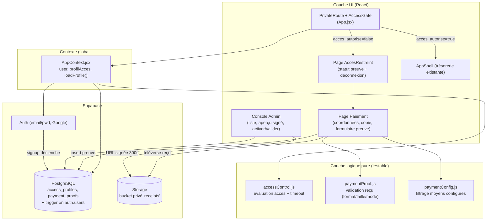
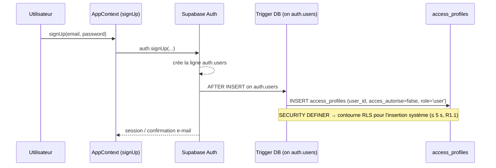
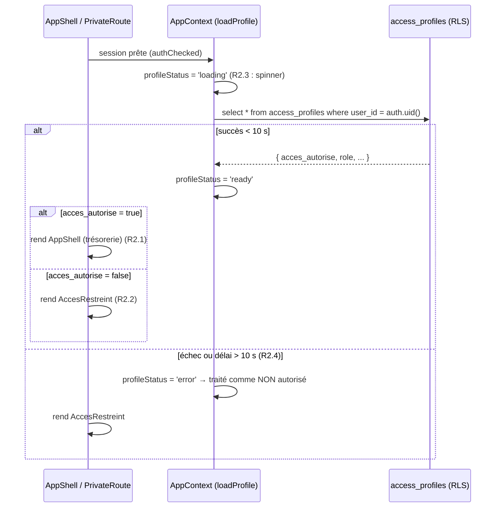
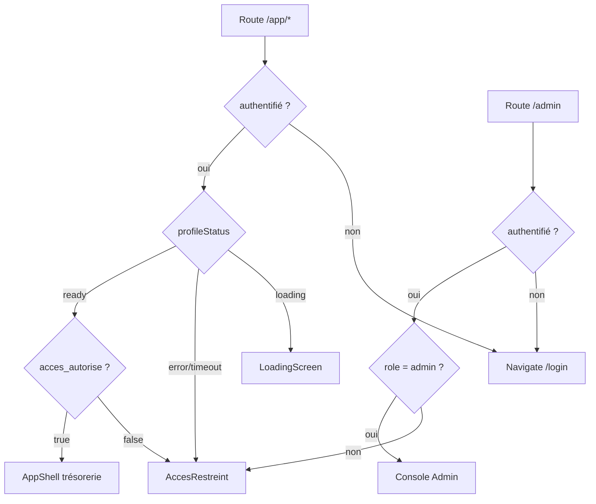

# Document de Conception

## Overview

Cette fonctionnalité ajoute un **contrôle d'accès par activation manuelle** à l'application OpaysFox (PWA React + Vite, backend Supabase : Auth + PostgreSQL + Storage). L'authentification existante (e-mail/mot de passe et Google, gérée dans `src/context/AppContext.jsx`) est **conservée intégralement** : un utilisateur peut toujours créer un compte et se connecter. Ce qui change, c'est qu'un utilisateur authentifié ne peut **utiliser** les fonctionnalités de trésorerie qu'une fois son champ `acces_autorise` passé à `true` par l'Administrateur.

Les contraintes du projet imposent des solutions **open source, sans API payante**. Les paiements sont donc traités manuellement :

1. L'utilisateur non activé voit la **Page_Acces_Restreint** au lieu de l'application.
2. Il consulte la **Page_Paiement** (coordonnées Bitcoin / Lightning / USDT / Mobile Money, boutons de copie, procédure) et paie par le canal de son choix.
3. Il soumet une **Preuve_Paiement** (mode, référence optionnelle, reçu image/PDF ≤ 5 Mo) téléversée dans un bucket Storage **privé**.
4. L'Administrateur consulte les preuves dans la **Console_Admin** (aperçu via URL signée), puis **active/désactive** l'accès et **valide/rejette** les preuves.

Référence Lago : **écartée pour la V1** (cf. requirements). On reproduit seulement le concept minimal d'un « statut d'accès binaire » par compte, sans service additionnel.

### Principe directeur : ancrage dans le code existant

Conformément à `AGENTS.md`, la conception **réutilise et étend** l'existant plutôt que d'introduire des implémentations parallèles.

| Préoccupation | Code existant ancré | Action de conception |
|---|---|---|
| Authentification + session | `AppContext.jsx` (`signUp`, `signIn`, `signInWithGoogle`, `logOut`, `onAuthStateChange`, état `user`/`authChecked`) | Réutiliser ; ajouter le chargement du Profil_Accès après la session |
| Client Supabase | `src/services/supabase.js` (singleton `supabase`, peut être `null` en mode démo) | Réutiliser tel quel pour DB + Storage + URL signées |
| Garde de route | `PrivateRoute` dans `src/App.jsx` (redirige les non-authentifiés vers `/login`) | Étendre : après authentification, brancher la garde d'accès (`acces_autorise`) |
| Écran de chargement | `LoadingScreen` dans `src/App.jsx` | Réutiliser pendant le chargement du Profil_Accès |
| Pages | `src/pages/*.jsx` (convention : un composant page par fichier) | Ajouter `AccesRestreint.jsx`, `Paiement.jsx`, `ConsoleAdmin.jsx` |
| i18n | `src/i18n.js` (dictionnaires `fr`/`en`, hook `useT()`) | Ajouter les clés `access`, `payment`, `admin` dans `fr` **et** `en` |
| Logique pure testable | `src/utils/*.js` (+ tests `fast-check`/`vitest`) | Ajouter `accessControl.js`, `paymentProof.js`, `paymentConfig.js` (fonctions pures) |
| Mode démo / mock | `AppContext.jsx` (`isUsingMock`, fallback localStorage) | Préserver : en mode démo, accès accordé localement, aucun appel réseau |

### Décision d'architecture clé : la sécurité repose sur la base, pas sur le front

Le *gating* visuel côté React (afficher la Page_Acces_Restreint vs l'application) est une **commodité UX**, pas une barrière de sécurité. Comme la clé `VITE_SUPABASE_ANON_KEY` est publique dans le bundle, **la véritable autorisation est imposée par les politiques RLS PostgreSQL et les politiques Storage**. Un utilisateur non activé qui contournerait l'UI ne pourrait toujours **ni lire ni écrire** de données de trésorerie : les politiques RLS exigent `acces_autorise = true`. Cette double couche (UX + RLS) est le pivot de la conception.

## Architecture

### Vue d'ensemble des couches



### Flux d'inscription et de création du Profil_Accès



### Flux de *gating* à l'ouverture de l'application



### Hiérarchie des gardes de route (App.jsx)



## Components and Interfaces

### 1. Couche logique pure — `src/utils/`

Ces modules ne font **aucun** appel réseau : ils sont entièrement testables par propriétés.

#### `accessControl.js`
```js
// Évalue l'état d'accès à partir d'un profil chargé et d'un résultat de chargement.
// status ∈ 'loading' | 'ready' | 'error'
export function evaluateAccess({ status, profile }) // → { allowed: boolean, view: 'loading'|'app'|'restricted' }

// Vrai uniquement si profil chargé avec succès ET acces_autorise === true.
export function isAccessGranted(profile) // → boolean

// Vrai si le rôle correspond exactement à 'admin'.
export function isAdmin(profile) // → boolean

// Indique si un délai de chargement (en ms) dépasse le plafond de 10 000 ms (R2.4).
export function isLoadTimedOut(elapsedMs, capMs = 10000) // → boolean
```

Règle centrale : **toute incertitude = accès refusé**. `evaluateAccess` ne retourne `allowed:true` que pour `status === 'ready'` ET `profile.acces_autorise === true`. `status === 'error'` ⇒ `view:'restricted'`, `status === 'loading'` ⇒ `view:'loading'`.

#### `paymentProof.js`
```js
export const ACCEPTED_MIME = ['image/png', 'image/jpeg', 'image/webp', 'application/pdf'];
export const ACCEPTED_MODES = ['bitcoin', 'lightning', 'usdt', 'mobile_money'];
export const MAX_RECEIPT_BYTES = 5 * 1024 * 1024; // 5 Mo

// Valide une soumission AVANT tout effet de bord (upload/insert).
// Retourne { ok: true } ou { ok: false, code, message }
// codes : 'missing_receipt' | 'invalid_format' | 'invalid_size' | 'invalid_mode'
export function validateProofSubmission({ mode, file }) // → ValidationResult

// Construit le chemin Storage : `${userId}/${timestamp}-${safeName}`.
export function buildReceiptPath(userId, fileName) // → string
```

Ordre de validation déterministe (R5.3→R5.6) : mode accepté → reçu présent → format accepté → taille dans `]0, 5 Mo]`. La fonction ne lève jamais et ne touche pas le réseau.

#### `paymentConfig.js`
```js
// Coordonnées de paiement lues depuis la config (env VITE_* / table optionnelle).
// Filtre les moyens non renseignés (R4.9) et signale l'absence totale (R4.10).
export function getConfiguredMethods(rawConfig) // → { methods: Method[], anyConfigured: boolean }

// Indique si une chaîne d'adresse est "copiable" (non vide après trim).
export function isCopyable(address) // → boolean
```

### 2. Contexte global — `src/context/AppContext.jsx`

Extensions (sans casser l'existant) :

```js
// Nouveaux états
const [profilAcces, setProfilAcces] = useState(null);
const [profileStatus, setProfileStatus] = useState('loading'); // 'loading'|'ready'|'error'

// Charge le Profil_Accès de l'utilisateur courant, avec garde de délai 10 s (R2.3, R2.4).
const loadProfile = useCallback(async () => { ... }, [user]);

// Soumet une Preuve_Paiement : valide (paymentProof) → upload Storage → insert DB (R5).
const submitPaymentProof = async ({ mode, reference, file }) => { ... };

// Exposés via le contexte
{ profilAcces, profileStatus, loadProfile, submitPaymentProof,
  isAccessGranted, isAdmin, /* + existant : user, signUp, signIn, logOut, ... */ }
```

Comportement mode démo : si `!supabase || user?.isDemo`, `profileStatus = 'ready'` et `profilAcces = { acces_autorise: true, role: 'user' }` (accès local accordé, aucun appel réseau) — préserve le mode démo existant.

Chargement : `loadProfile` est appelé quand `authChecked && user && !user.isDemo`. Implémente le délai de 10 s via `Promise.race([requête, timeout(10000)])` ; en cas de rejet/timeout ⇒ `profileStatus = 'error'`.

### 3. Gardes de route — `src/App.jsx`

- `PrivateRoute` (existant) inchangé pour la redirection des non-authentifiés (R2.5).
- Nouveau `AccessGate` (interne à `App.jsx`) consommant `profileStatus` + `profilAcces` :
  - `loading` → `LoadingScreen` (réutilisé, R2.3).
  - non autorisé / erreur → rend `AccesRestreint` (R2.2, R2.4).
  - autorisé → rend les enfants (`AppShell`).
- Nouvelle route `/admin` protégée par `AdminRoute` : authentifié + `isAdmin(profilAcces)` sinon rend `AccesRestreint` (R6.9).

### 4. Pages — `src/pages/`

#### `AccesRestreint.jsx` (Page_Acces_Restreint)
- Message expliquant que l'accès nécessite un paiement validé par l'Administrateur (R3.1).
- Bouton unique vers `/paiement` (R3.2, R3.3).
- Affiche le **Statut_Preuve le plus récent** de l'utilisateur (`en_attente`/`validee`/`rejetee`) ou « aucune preuve soumise » (R3.4, R3.5).
- Bouton de déconnexion appelant `logOut()` puis redirection `/login` (R3.6, R3.7).
- Tout le texte via `useT()` (R3.8).

#### `Paiement.jsx` (Page_Paiement)
- Affiche les Coordonnées_Paiement configurées : Bitcoin (R4.1), Lightning (R4.2), USDT + réseau (R4.3), Mobile Money + devise/libellé (R4.4).
- Bouton de copie par adresse crypto (R4.5) ; `navigator.clipboard.writeText`, confirmation visuelle 2–5 s (R4.6) ; en cas d'échec, message « copier manuellement » + adresse sélectionnable conservée (R4.7).
- Procédure de soumission en ≤ 5 étapes (R4.8).
- Masque les moyens non configurés (R4.9) ; si aucun moyen configuré → message dédié (R4.10).
- Formulaire de preuve : sélecteur `Mode_Paiement`, champ référence optionnel, `input type=file` (accept image/PDF), validation cliente via `validateProofSubmission`, puis `submitPaymentProof`. Confirmation de réception < 5 s (R5.9). i18n + repli langue par défaut (R4.11).

#### `ConsoleAdmin.jsx` (Console_Admin)
- Liste des utilisateurs triée par preuve la plus récente d'abord, **50 par page** (pagination `range()`), colonnes e-mail / `acces_autorise` / dernier `Statut_Preuve` (R6.1) ; état vide explicite (R6.2).
- Sélection d'une preuve → détails (mode, référence, horodatage) + aperçu du reçu via **URL signée ≤ 300 s** (R6.3, R6.11) ; si reçu indisponible → indication dédiée (R6.12).
- Actions : activer / désactiver l'accès (R6.4, R6.5), valider / rejeter une preuve (R6.6, R6.7), avec gestion d'erreur conservant l'état précédent (R6.8).
- Accessible uniquement aux `admin` (garde `AdminRoute` + RLS, R6.9, R6.10).

### 5. Configuration des Coordonnées_Paiement

Open source / manuel uniquement, **aucune API payante** :
- Source primaire : variables `VITE_*` (build-time), p. ex. `VITE_PAY_BTC_ADDRESS`, `VITE_PAY_LIGHTNING`, `VITE_PAY_USDT_ADDRESS`, `VITE_PAY_USDT_NETWORK`, `VITE_PAY_MOMO` (JSON : liste `{label, number, currency}`).
- `paymentConfig.getConfiguredMethods` normalise et **filtre** les moyens vides (R4.9/R4.10).
- Les adresses crypto sont affichées en texte + (optionnel) QR généré **localement** par une lib open source côté client — aucun service distant.

### 6. Stockage des reçus — bucket Storage privé `receipts`

- Bucket **privé** (R7.1) : aucune URL publique, lecture/écriture non authentifiée refusée.
- Arborescence : `receipts/{user_id}/{timestamp}-{nom}` (R7.2).
- Upload via `supabase.storage.from('receipts').upload(path, file)` après validation cliente (R7.3).
- Lecture admin via `createSignedUrl(path, 300)` (R6.11).

## Data Models

### Table `access_profiles` (Profil_Accès)

```sql
CREATE TABLE access_profiles (
    user_id UUID PRIMARY KEY REFERENCES auth.users(id) ON DELETE CASCADE,
    acces_autorise BOOLEAN NOT NULL DEFAULT FALSE,            -- R1.2
    role VARCHAR(10) NOT NULL DEFAULT 'user'                  -- R1.3
        CHECK (role IN ('user', 'admin')),                    -- ensemble fermé (R1.4)
    created_at TIMESTAMPTZ NOT NULL DEFAULT TIMEZONE('utc', NOW()), -- R1.4
    activated_at TIMESTAMPTZ,                                 -- horodatage dernière activation (R1.4, R1.5)
    activated_by UUID REFERENCES auth.users(id),              -- admin ayant activé (R1.5)
    -- Invariant R1.8 : un accès actif doit porter l'identité de l'activateur.
    CONSTRAINT activation_traceability CHECK (
        acces_autorise = FALSE OR activated_by IS NOT NULL
    )
);
```

### Table `payment_proofs` (Preuve_Paiement)

```sql
CREATE TABLE payment_proofs (
    id UUID PRIMARY KEY DEFAULT gen_random_uuid(),
    user_id UUID NOT NULL REFERENCES auth.users(id) ON DELETE CASCADE,
    mode_paiement VARCHAR(20) NOT NULL
        CHECK (mode_paiement IN ('bitcoin', 'lightning', 'usdt', 'mobile_money')), -- R5.6
    reference TEXT,                                           -- référence optionnelle (R5.8)
    recu_path TEXT NOT NULL,                                  -- chemin Storage du reçu (R5.2, R5.8)
    statut VARCHAR(10) NOT NULL DEFAULT 'en_attente'
        CHECK (statut IN ('en_attente', 'validee', 'rejetee')), -- Statut_Preuve (R5.1)
    submitted_at TIMESTAMPTZ NOT NULL DEFAULT TIMEZONE('utc', NOW()), -- R5.8
    reviewed_at TIMESTAMPTZ,                                  -- R6.6, R6.7
    reviewed_by UUID REFERENCES auth.users(id)               -- admin réviseur (R6.6, R6.7)
);
CREATE INDEX idx_payment_proofs_user ON payment_proofs(user_id);
CREATE INDEX idx_payment_proofs_submitted ON payment_proofs(submitted_at DESC); -- tri Console_Admin (R6.1)
```

### Trigger d'auto-création du Profil_Accès (R1.1, R1.9)

```sql
-- SECURITY DEFINER : s'exécute avec les droits du propriétaire, contourne la RLS
-- pour l'insertion système déclenchée par l'inscription.
CREATE OR REPLACE FUNCTION public.handle_new_user()
RETURNS TRIGGER LANGUAGE plpgsql SECURITY DEFINER SET search_path = public AS $$
BEGIN
    INSERT INTO public.access_profiles (user_id, acces_autorise, role)
    VALUES (NEW.id, FALSE, 'user')
    ON CONFLICT (user_id) DO NOTHING;   -- idempotent (R1.1 unicité)
    RETURN NEW;
END;
$$;

CREATE TRIGGER on_auth_user_created
    AFTER INSERT ON auth.users
    FOR EACH ROW EXECUTE FUNCTION public.handle_new_user();
```

R1.9 : si l'INSERT du profil échoue, l'utilisateur Auth existe néanmoins ; côté application, l'absence de profil est traitée comme **non autorisé** (`profileStatus='error'` → AccesRestreint), conformément à « toute incertitude = accès refusé ». Un mécanisme de *self-heal* optionnel (ré-essai d'`INSERT ... ON CONFLICT DO NOTHING` au premier chargement par une RPC `SECURITY DEFINER`) peut combler le profil manquant sans jamais accorder l'accès.

### Politiques RLS

#### `access_profiles`
```sql
ALTER TABLE access_profiles ENABLE ROW LEVEL SECURITY;

-- R1.6 : un utilisateur lit uniquement son propre profil.
CREATE POLICY ap_select_own ON access_profiles
    FOR SELECT USING (auth.uid() = user_id);

-- R6.10 : un admin lit tous les profils.
CREATE POLICY ap_select_admin ON access_profiles
    FOR SELECT USING (public.is_admin(auth.uid()));

-- R1.7 / R6.10 : seul un admin modifie acces_autorise (et la traçabilité).
CREATE POLICY ap_update_admin ON access_profiles
    FOR UPDATE USING (public.is_admin(auth.uid()))
    WITH CHECK (public.is_admin(auth.uid()));
-- Aucune politique UPDATE pour 'user' ⇒ toute tentative de modification est refusée (R1.7).
```

`public.is_admin(uid)` est une fonction `SECURITY DEFINER` retournant `EXISTS(SELECT 1 FROM access_profiles WHERE user_id = uid AND role = 'admin')`, utilisée pour éviter la récursion RLS.

#### `payment_proofs`
```sql
ALTER TABLE payment_proofs ENABLE ROW LEVEL SECURITY;

-- R5.10 : l'utilisateur crée et lit uniquement ses propres preuves.
CREATE POLICY pp_select_own ON payment_proofs
    FOR SELECT USING (auth.uid() = user_id);
CREATE POLICY pp_insert_own ON payment_proofs
    FOR INSERT WITH CHECK (auth.uid() = user_id);

-- R6.10 : l'admin lit toutes les preuves et met à jour le statut (validee/rejetee).
CREATE POLICY pp_select_admin ON payment_proofs
    FOR SELECT USING (public.is_admin(auth.uid()));
CREATE POLICY pp_update_admin ON payment_proofs
    FOR UPDATE USING (public.is_admin(auth.uid()))
    WITH CHECK (public.is_admin(auth.uid()));
```

#### Storage — bucket privé `receipts`
```sql
-- R7.2, R7.4, R7.5 : un utilisateur n'écrit/lit que dans son dossier {user_id}/...
CREATE POLICY recus_user_rw ON storage.objects
    FOR ALL TO authenticated
    USING (
        bucket_id = 'receipts'
        AND (storage.foldername(name))[1] = auth.uid()::text
    )
    WITH CHECK (
        bucket_id = 'receipts'
        AND (storage.foldername(name))[1] = auth.uid()::text
    );

-- R6.6 (lecture admin de tous les reçus pour aperçu/URL signée).
CREATE POLICY recus_admin_read ON storage.objects
    FOR SELECT TO authenticated
    USING (bucket_id = 'receipts' AND public.is_admin(auth.uid()));
```

#### RLS sur les tables de trésorerie existantes (R2.7, R2.8)

Les politiques actuelles de `wallets`, `exchange_rates`, `transactions`, `expenses` (et `debts`, `customers`, `loans`, `message_templates`, `reminder_history`) sont **renforcées** pour exiger l'autorisation d'accès :

```sql
-- Fonction utilitaire : l'utilisateur courant a-t-il l'accès autorisé ?
CREATE OR REPLACE FUNCTION public.has_access(uid UUID)
RETURNS BOOLEAN LANGUAGE sql SECURITY DEFINER SET search_path = public AS $$
    SELECT EXISTS (
        SELECT 1 FROM access_profiles
        WHERE user_id = uid AND acces_autorise = TRUE
    );
$$;

-- Exemple pour `transactions` (à répliquer sur chaque table de trésorerie) :
DROP POLICY IF EXISTS <ancienne_politique> ON transactions;
CREATE POLICY tx_rw_access ON transactions
    FOR ALL TO authenticated
    USING (public.has_access(auth.uid()))
    WITH CHECK (public.has_access(auth.uid()));
```

Ainsi, même si le *gating* React est contourné, aucune donnée de trésorerie n'est lisible/écrivable sans `acces_autorise = true` (R2.7). Un refus RLS remonte une erreur que `fetchData`/les mutations interprètent pour afficher un message de restriction (R2.8).

### Modèle frontend (lecture seule, dérivé)

```ts
type ProfilAcces = {
  user_id: string;
  acces_autorise: boolean;
  role: 'user' | 'admin';
  created_at: string;       // ISO 8601 UTC
  activated_at: string | null;
  activated_by: string | null;
};

type PreuvePaiement = {
  id: string;
  user_id: string;
  mode_paiement: 'bitcoin' | 'lightning' | 'usdt' | 'mobile_money';
  reference: string | null;
  recu_path: string;
  statut: 'en_attente' | 'validee' | 'rejetee';
  submitted_at: string;
  reviewed_at: string | null;
  reviewed_by: string | null;
};

type Method = { kind: 'bitcoin'|'lightning'|'usdt'|'mobile_money'; address: string; network?: string; label?: string; currency?: string };
```

## Correctness Properties

*Une propriété est une caractéristique ou un comportement qui doit rester vrai pour toutes les exécutions valides du système — une formulation formelle de ce que le logiciel doit faire. Les propriétés font le pont entre les spécifications lisibles par l'humain et des garanties de correction vérifiables par la machine.*

Ces propriétés portent sur la **logique pure** de la fonctionnalité (évaluation d'accès, validation de preuve, construction de patchs/enregistrements, tri/pagination, filtrage des moyens de paiement, parité i18n). Les comportements RLS, Storage, le rendu UI et la configuration sont couverts par des tests d'intégration / d'exemple / de smoke (cf. Testing Strategy). Après réflexion, les critères redondants ont été regroupés (p. ex. tous les critères de gating ⇒ Property 1 ; tous les critères de validation de reçu ⇒ Property 5).

### Property 1: Évaluation d'accès complète et sûre par défaut

*Pour tout* couple `(status, profile)` où `status ∈ {'loading','ready','error'}`, `evaluateAccess` retourne : `view:'loading'` si `status='loading'` ; `view:'app'` (et `allowed:true`) **si et seulement si** `status='ready'` ET `profile.acces_autorise === true` ; et `view:'restricted'` (`allowed:false`) dans **tous** les autres cas (`status='ready'` avec `acces_autorise` faux/absent, `status='error'`, profil nul). Autrement dit, l'accès n'est jamais accordé en cas d'incertitude.

**Validates: Requirements 1.9, 2.1, 2.2, 2.3, 2.4**

### Property 2: Détection du dépassement de délai de chargement

*Pour toute* durée écoulée `elapsedMs` (entier ≥ 0), `isLoadTimedOut(elapsedMs)` retourne vrai **si et seulement si** `elapsedMs` dépasse le plafond de 10 000 ms.

**Validates: Requirements 2.4**

### Property 3: Reconnaissance du rôle administrateur

*Pour tout* profil dont le champ `role` est une chaîne arbitraire, `isAdmin(profile)` retourne vrai **si et seulement si** `role === 'admin'` ; toute autre valeur (`'user'`, valeur hors ensemble, nulle) retourne faux, ce qui refuse l'accès à la Console_Admin.

**Validates: Requirements 1.4, 6.9**

### Property 4: Invariant de traçabilité d'activation (validation)

*Pour tout* profil candidat, `validateProfile` retourne `ok:false` **si et seulement si** `acces_autorise === true` ET `activated_by` est absent/nul ; tout autre profil (`acces_autorise` faux, ou `acces_autorise` vrai avec `activated_by` renseigné) est accepté.

**Validates: Requirements 1.5, 1.8**

### Property 5: Validation de la soumission de preuve

*Pour toute* soumission `{ mode, file }`, `validateProofSubmission` retourne `ok:true` **si et seulement si** le `mode` appartient à `ACCEPTED_MODES`, **et** un `file` est présent, **et** son type appartient à `ACCEPTED_MIME`, **et** sa taille est strictement supérieure à 0 et au plus 5 Mo. Sinon elle retourne `ok:false` avec un `code` précis : `invalid_mode`, `missing_receipt`, `invalid_format` ou `invalid_size` selon la première contrainte violée dans cet ordre.

**Validates: Requirements 5.1, 5.3, 5.4, 5.5, 5.6, 7.3**

### Property 6: Chemin de reçu confiné au dossier de l'utilisateur

*Pour tout* identifiant d'utilisateur `userId` non vide et tout nom de fichier, `buildReceiptPath(userId, fileName)` produit un chemin dont le **premier segment de dossier est exactement `userId`** (c.-à-d. commence par `` `${userId}/` ``).

**Validates: Requirements 5.2, 7.2**

### Property 7: Enregistrement de preuve complet

*Pour toute* soumission valide `{ userId, mode, reference, recuPath }`, `buildProofRecord` produit un objet contenant `user_id = userId`, `mode_paiement = mode`, la `reference` fournie (ou nulle), `recu_path = recuPath`, un `submitted_at` horodaté non vide, et `statut = 'en_attente'`.

**Validates: Requirements 5.8**

### Property 8: Patch d'activation/désactivation tracé

*Pour tout* booléen `actif` et tout identifiant d'administrateur `adminId`, `buildActivationPatch(actif, adminId)` produit `{ acces_autorise: actif, activated_by: adminId, activated_at: <horodatage non nul> }`. En particulier, lorsque `actif` vaut `true`, le patch satisfait toujours l'invariant de traçabilité (Property 4) : `activated_by` est non nul.

**Validates: Requirements 6.4, 6.5**

### Property 9: Patch de revue de preuve tracé

*Pour tout* statut `s ∈ {'validee','rejetee'}` et tout identifiant d'administrateur `adminId`, `buildReviewPatch(s, adminId)` produit `{ statut: s, reviewed_by: adminId, reviewed_at: <horodatage non nul> }`.

**Validates: Requirements 6.6, 6.7**

### Property 10: Tri et pagination de la Console_Admin

*Pour toute* liste d'entrées utilisateur (chacune portant un horodatage de preuve éventuellement nul) et tout numéro de page, `buildAdminPage` retourne au plus 50 entrées, ordonnées par horodatage de preuve la plus récente en premier (les entrées sans preuve venant en dernier), et l'union de toutes les pages successives est une permutation exacte de la liste d'entrée sans perte ni doublon.

**Validates: Requirements 6.1, 6.2**

### Property 11: Statut de preuve le plus récent

*Pour toute* liste de Preuves_Paiement d'un utilisateur, `latestProofStatus` retourne le `statut` de la preuve au `submitted_at` maximal ; si la liste est vide, elle retourne `null` (signalant « aucune preuve soumise »).

**Validates: Requirements 3.4, 3.5**

### Property 12: Filtrage des moyens de paiement configurés

*Pour toute* configuration brute de Coordonnées_Paiement, `getConfiguredMethods` retourne uniquement les moyens dont l'adresse/le numéro est non vide après nettoyage (aucun moyen vide n'est jamais inclus), et `anyConfigured` est vrai **si et seulement si** au moins un moyen est retourné.

**Validates: Requirements 4.9, 4.10**

### Property 13: Parité des clés de traduction fr/en

*Pour toute* clé de texte des sections `access`, `payment` et `admin` présente dans le dictionnaire `fr`, la même clé existe dans le dictionnaire `en`, et réciproquement (parité structurelle complète garantissant qu'aucun texte n'est dépourvu de traduction, le repli s'appuyant sur la langue par défaut).

**Validates: Requirements 3.8, 4.11**

## Error Handling

Tous les chemins `IF … THEN` des exigences sont traités explicitement. Principe transverse : **toute incertitude conduit à un refus d'accès** côté front, tandis que la RLS reste l'autorité finale côté données.

| Cas d'erreur (exigence) | Détection | Comportement |
|---|---|---|
| Échec de création du Profil_Accès (R1.9) | Profil absent au chargement ou erreur DB | `profileStatus='error'` ⇒ Page_Acces_Restreint ; option *self-heal* `INSERT … ON CONFLICT DO NOTHING` sans accorder l'accès ; message d'erreur de chargement de profil |
| Tentative `user` de modifier `acces_autorise` (R1.7) | RLS `ap_update_admin` (aucune politique user) | UPDATE refusé, valeur inchangée, erreur PostgREST remontée et signalée |
| Profil `acces_autorise=true` sans admin (R1.8) | CHECK `activation_traceability` + `validateProfile` | INSERT/UPDATE rejeté, état antérieur conservé, erreur de validation |
| Chargement profil échoué ou > 10 s (R2.4) | `Promise.race` + `isLoadTimedOut` | `profileStatus='error'` ⇒ Page_Acces_Restreint, aucune donnée trésorerie |
| Utilisateur non authentifié (R2.5) | `PrivateRoute` (`!user`) | `Navigate to="/login"` |
| Désactivation par admin (R2.6) | RLS `has_access` à la requête suivante | Données trésorerie refusées ⇒ Page_Acces_Restreint |
| Refus RLS lecture/écriture trésorerie (R2.7, R2.8) | Erreur PostgREST (code 401/403/`42501`) sur `fetchData`/mutations | Message de restriction d'accès, aucune mutation d'état local |
| Échec de copie presse-papiers (R4.7) | `navigator.clipboard.writeText` rejette / indisponible | Message « copier manuellement », adresse conservée et sélectionnable |
| Aucun moyen de paiement configuré (R4.10) | `getConfiguredMethods().anyConfigured === false` | Message « aucun moyen de paiement disponible » |
| Soumission sans reçu (R5.3) | `validateProofSubmission` ⇒ `missing_receipt` | Refus, aucun enregistrement, message « reçu requis » |
| Format de reçu invalide (R5.4, R7.3) | `validateProofSubmission` ⇒ `invalid_format` | Refus, message des formats acceptés |
| Taille de reçu nulle ou > 5 Mo (R5.5, R7.3) | `validateProofSubmission` ⇒ `invalid_size` | Refus, message de la plage autorisée |
| Mode de paiement non accepté (R5.6) | `validateProofSubmission` ⇒ `invalid_mode` | Refus, message des modes acceptés |
| Échec téléversement Storage (R5.7) | Erreur `storage.upload` | **Aucun** insert DB (upload d'abord, insert ensuite), message « réessayer », aucun chemin enregistré |
| Échec maj `acces_autorise` admin (R6.8) | Erreur `update` | Valeur précédente conservée (pas de mise à jour optimiste persistée), message d'échec |
| `user` accède à la Console_Admin (R6.9) | `AdminRoute` (`isAdmin` faux) + RLS | Rend Page_Acces_Restreint |
| Reçu introuvable / URL signée échoue (R6.12) | Erreur `createSignedUrl` | Indication « reçu indisponible » |
| Accès Storage hors dossier (R7.5) | Policies `recus_user_rw` | Opération refusée, aucun contenu retourné |

Comportement mode démo : si `supabase` est `null` (configuration absente) ou `user.isDemo`, l'accès est accordé localement et aucune table/bucket n'est sollicité — aucune régression du mode démo existant.

## Testing Strategy

### Approche duale

- **Tests de propriété** (≥ 100 itérations) : valident la logique pure universelle (Propriétés 1 à 13).
- **Tests d'exemple / d'intégration / smoke** : valident les comportements RLS, Storage, le rendu UI, la navigation, la configuration et la non-régression du mode démo.

### Bibliothèque et conventions

- Bibliothèque PBT : **fast-check** (déjà présente dans `devDependencies`, cf. specs existantes). Ne pas réimplémenter de PBT maison.
- Lanceur : **vitest** (`npm test` ⇒ `vitest run`), environnement `jsdom` pour les tests de composants.
- Chaque test de propriété : **minimum 100 itérations** (`fc.assert(..., { numRuns: 100 })`).
- Chaque test de propriété est étiqueté en commentaire au format :
  `// Feature: paid-access-control, Property {n}: {texte de la propriété}`
- **Une seule** implémentation de test de propriété par propriété de conception.

### Emplacements des tests (cohérents avec l'existant)

- `src/utils/accessControl.property.test.js` — P1 (`evaluateAccess`), P2 (`isLoadTimedOut`), P3 (`isAdmin`), P4 (`validateProfile`).
- `src/utils/paymentProof.property.test.js` — P5 (`validateProofSubmission`), P6 (`buildReceiptPath`), P7 (`buildProofRecord`).
- `src/utils/adminActions.property.test.js` — P8 (`buildActivationPatch`), P9 (`buildReviewPatch`), P10 (`buildAdminPage`), P11 (`latestProofStatus`).
- `src/utils/paymentConfig.property.test.js` — P12 (`getConfiguredMethods`).
- `src/i18n.property.test.js` — P13 (parité fr/en des sections `access`/`payment`/`admin`).

### Générateurs (fast-check)

- **Statut/profil (P1, P3, P4)** : `fc.constantFrom('loading','ready','error')` × profils générés (`acces_autorise` booléen ou absent, `role` parmi un échantillon incluant `'admin'`, `'user'` et des valeurs arbitraires, `activated_by` nul ou UUID factice).
- **Durées (P2)** : `fc.nat()` autour du seuil 10 000 (inclure 0, 9999, 10000, 10001, grandes valeurs).
- **Fichiers (P5, P6)** : objets `{ type, size }` mélangeant MIME acceptés/refusés et tailles `{0, 1, 5Mo, 5Mo+1, grandes}` ; noms de fichiers arbitraires (caractères spéciaux, espaces) et `userId` UUID factice non vide.
- **Listes de preuves (P10, P11)** : tableaux de preuves avec `submitted_at` aléatoires (et listes vides) pour vérifier tri, pagination ≤ 50, non-perte et cas vide.
- **Config paiement (P12)** : objets dont chaque moyen a une adresse vide / blanche / non vide (et la config entièrement vide).

### Tests d'exemple / intégration / smoke (non PBT)

- **Gating & routes (R2.5, R3.x, R6.9)** : `@testing-library/react` — non authentifié ⇒ `/login` ; non autorisé ⇒ AccesRestreint ; `user` sur `/admin` ⇒ AccesRestreint ; déconnexion ⇒ `logOut` + `/login`.
- **Page_Paiement (R4.1–R4.8)** : rendu des moyens configurés, boutons de copie (mock `navigator.clipboard`), confirmation/échec de copie, procédure ≤ 5 étapes.
- **Soumission preuve I/O (R5.2, R5.7, R5.9)** : mocks `storage.upload` (succès/échec) ⇒ insert présent/absent, confirmation/erreur.
- **Console_Admin (R6.3, R6.8, R6.11, R6.12)** : aperçu via `createSignedUrl` (assert `expiresIn ≤ 300`), erreurs d'activation, reçu indisponible.
- **RLS & Storage (R1.6, R1.7, R2.6, R2.7, R5.10, R6.10, R7.1, R7.4–R7.6)** : tests d'intégration Supabase (deux comptes de test + un admin) — isolation des profils/preuves, refus trésorerie sans accès, isolation des dossiers de reçus, bucket privé. Le délai d'auto-création du profil (R1.1) est vérifié par un test d'intégration sur le trigger.
- **Parité & non-régression** : `npm test` complet ; vérifier que le mode démo (sans Supabase) accorde l'accès localement sans appel réseau.
