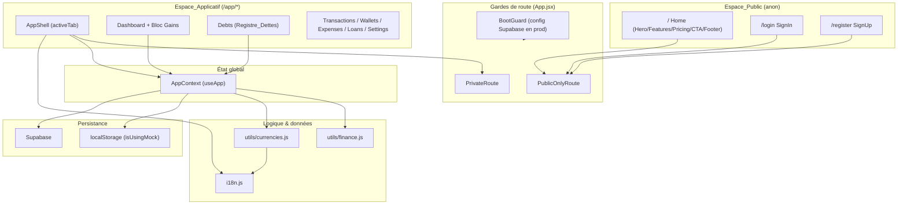
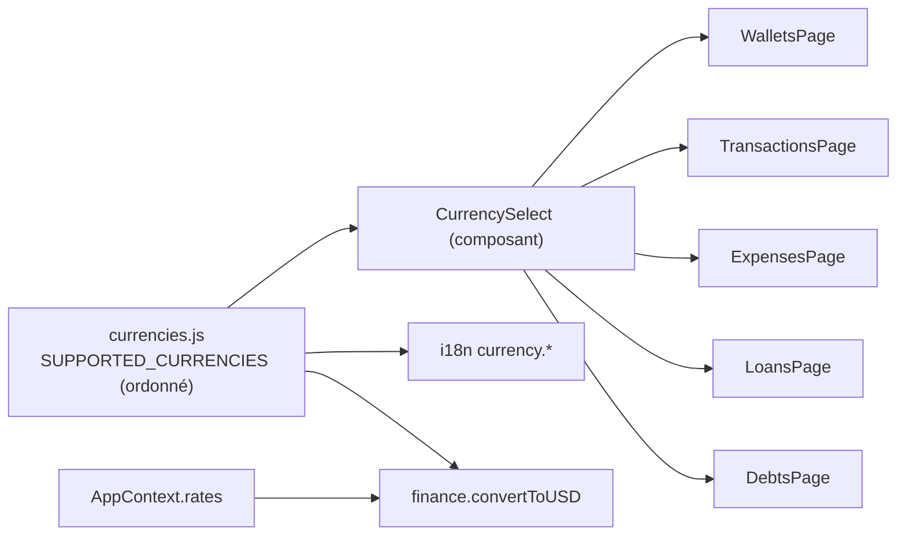

# Design Document — Finalisation SaaS OpaysFox

## Overview

Ce document décrit la conception technique de la finalisation SaaS d'**OpaysFox** (PWA React 19 + Vite 8, UI en français, backend Supabase, déploiement Vercel). Il couvre les dix exigences du document de requirements :

1. Isolation stricte de l'espace public après authentification (R1).
2. Registre centralisé des devises (R2), disponibilité permanente dans les sélecteurs (R3), conversion multi-devises (R4).
3. Suivi des créances et dettes — `Registre_Dettes` (R5) avec un bouton d'accès dédié (R6).
4. Contraste et accessibilité des boutons (R7).
5. Stabilité de la mise en page mobile (R8).
6. Suivi des gains journaliers et mensuels (R9).
7. Conformité architecturale (R10).

### Principes directeurs

- **Réutiliser avant d'ajouter.** On étend `AppContext`, `finance.js`, `i18n.js` et `index.css` existants plutôt que de créer des implémentations parallèles (conforme à `AGENTS.md`).
- **Source de vérité unique pour les devises.** Un nouveau module `src/utils/currencies.js` centralise la liste ordonnée des devises supportées ; tous les sélecteurs et libellés en dérivent.
- **Logique financière pure et testable.** Les conversions et les calculs de gains restent des fonctions pures dans `src/utils/finance.js`, avec tests dans `src/utils/finance.test.js`.
- **Persistance double cohérente.** Toute nouvelle entité (dettes) suit le pattern `isUsingMock` existant : `localStorage` en mode démo, Supabase sinon.

### Constat issu de l'inspection du code

L'inspection a révélé que les classes CSS applicatives (`.mobile-navbar`, `.settings-fab`, `.btn`, `.navbar-tab`, `.page-content`, `.app-header`, etc.) sont **référencées par les composants mais ne sont pas définies dans `src/index.css`** (qui ne contient que les variables de base et la configuration Tailwind). Cette absence explique directement les problèmes de contraste (R7) et de stabilité mobile (R8). La conception prévoit donc l'ajout d'une couche de styles applicatifs dédiée dans `src/index.css` (ou un module CSS importé par `main.jsx`), avec une palette dont les ratios de contraste sont calculés.

## Architecture

### Vue d'ensemble des couches



### R1 — Isolation de l'espace public

L'architecture de routage actuelle (`App.jsx`) est globalement correcte : `PublicOnlyRoute` redirige tout utilisateur authentifié vers `/app`, `PrivateRoute` redirige tout anonyme vers `/login`, et le `LoadingScreen` masque les deux espaces pendant `loading`. Comme `BrowserRouter` réévalue les gardes à **chaque** navigation (saisie d'URL directe, bouton précédent, navigation programmatique), les critères 1.1–1.5 sont satisfaits par construction dès lors que les gardes restent en place.

Ajustements de conception :

- **Catch-all (R1.9).** La route `*` redirige vers `/`. Pour un anonyme cela affiche Home ; pour un authentifié, `PublicOnlyRoute` sur `/` le renvoie vers `/app`. Comportement conforme : anonyme → `/`, authentifié → `/app`.
- **Session invalide (R1.7).** `onAuthStateChange` met `user` à `null` lorsque la session expire ; `PrivateRoute` réagit en redirigeant vers `/login`. On documente que tout `SIGNED_OUT`/erreur de session déclenche cette mise à jour d'état.
- **Mode démo.** `loginAsDemo` pose un `user` avec `isDemo: true`, traité comme authentifié par les gardes — comportement conservé.
- **Drapeau debug.** Le paramètre `debug_force_demo` de `PrivateRoute` est conservé (non utilisé en production publique).

### R5.9 — Démarrage en production sans Supabase

Aujourd'hui, `AppContext` retombe silencieusement sur les données mock si les identifiants Supabase manquent. La conception ajoute un **garde de démarrage** : en mode production (`import.meta.env.PROD`), si la configuration Supabase est absente (`hasCredentials === false`), l'application affiche un écran d'erreur de configuration bloquant et **n'expose ni l'espace public ni l'espace applicatif**. En développement, le repli mock reste autorisé pour le confort de travail. Ce garde s'insère au niveau de `App` (avant `BrowserRouter`) ou dans `AppProvider` via un état `configError`.

### R2–R4 — Devises



Le registre est la **source de vérité unique**. Ajouter une devise dans `SUPPORTED_CURRENCIES` la rend automatiquement disponible dans tous les sélecteurs (R3.1, R2.3) sans modification écran par écran. Le composant `CurrencySelect` parcourt le registre dans un ordre stable (R3.6) et rend chaque devise sélectionnable indépendamment de la présence d'un taux (R3.2, R3.3). Lorsqu'un taux manque pour la devise sélectionnée, un message d'avertissement non bloquant s'affiche (R3.4) tout en conservant la sélection.

### R5–R6 — Registre des dettes

Le `Registre_Dettes` est un grand livre **distinct des prêts** (`loans`). Il n'a aucun effet sur les soldes de portefeuilles (pas de trigger de débit/crédit), contrairement aux prêts. Il introduit :

- une table Supabase `debts` + données mock `MOCK_DEBTS` ;
- des méthodes `AppContext` : `createDebt`, `updateDebtStatus`, `getDebtTotals` ;
- une page `src/pages/Debts.jsx` rendue via l'`activeTab = 'debts'` de l'`AppShell` ;
- un `Bouton_Dettes` dans l'en-tête applicatif, positionné en haut à droite, adjacent à `settings-fab` (R6.2).

### R7–R8 — Styles et mise en page mobile

Une couche de styles applicatifs est (ré)introduite dans `src/index.css` :

- **Palette accessible** : variables de couleur de texte/fond pour chaque variante de bouton et chaque état (actif, désactivé), avec ratio de contraste ≥ 4,5:1 vérifié (R7).
- **Stabilité mobile** : `.mobile-navbar` en `position: fixed; bottom: 0`, `.page-content` avec `padding-bottom` réservant la hauteur de la barre (R8.5), `overflow-x: hidden` sur la racine (R8.4), usage d'unités stables (`100dvh`/`min-height`) pour éviter le jitter à l'ouverture du clavier (R8.2, R8.3).

### R9 — Module Gains

Deux helpers purs dans `finance.js` (`sumDailyProfit`, `sumMonthlyProfit`) agrègent `profit_usd` des transactions **complétées** (les `draft` sont exclus). Un bloc « Gains » est ajouté au `Dashboard` (réutilisant le calcul déjà présent) avec gain du jour et gain du mois (mois courant par défaut).

## Components and Interfaces

### Nouveau module : `src/utils/currencies.js`

```js
// Source de vérité unique des devises supportées (ordre stable).
export const SUPPORTED_CURRENCIES = [
  { code: 'USD',  labelKey: 'currency.USD'  },
  { code: 'EUR',  labelKey: 'currency.EUR'  },
  { code: 'UGX',  labelKey: 'currency.UGX'  },
  { code: 'KES',  labelKey: 'currency.KES'  },
  { code: 'TZS',  labelKey: 'currency.TZS'  },
  { code: 'BIF',  labelKey: 'currency.BIF'  },
  { code: 'CDF',  labelKey: 'currency.CDF'  },
  { code: 'FCFA', labelKey: 'currency.FCFA' },
];

export const SUPPORTED_CURRENCY_CODES = SUPPORTED_CURRENCIES.map(c => c.code);

// Vrai si un code appartient au registre.
export function isSupportedCurrency(code) { /* ... */ }

// Vrai s'il existe un taux_to_usd exploitable pour cette devise.
export function hasRate(code, rates) { /* USD => true; sinon rate présent et != 0 */ }
```

Remarque : `RWF` figure aujourd'hui dans le sélecteur de `Wallets.jsx`. Le registre officiel R2.1 comprend 8 devises (USD, EUR, UGX, KES, TZS, BIF, CDF, FCFA). `RWF` n'est pas dans le périmètre R2.1 ; la conception le retire des sélecteurs au profit du registre centralisé (ou l'ajoute au registre si le métier le confirme — décision laissée à la revue, valeur par défaut : aligné sur R2.1).

### Nouveau composant : `src/components/CurrencySelect.jsx`

```jsx
// Sélecteur réutilisable alimenté par le registre + i18n.
// Props: value, onChange, rates (optionnel), name, id, ariaLabel
// - Liste TOUTES les devises du registre, dans l'ordre du registre.
// - Chaque option est toujours sélectionnable (jamais disabled).
// - Si rates fourni et hasRate(value, rates) === false => affiche un message
//   d'avertissement « taux manquant » sous le select, sans bloquer la sélection.
export default function CurrencySelect({ value, onChange, rates, ariaLabel }) { /* ... */ }
```

Intégration : remplace les listes `<option>` codées en dur de `Wallets.jsx` (création de caisse) et alimente les sélecteurs de devises de `Debts.jsx`. `Settings.jsx` (taux) et les sélecteurs de portefeuilles (qui choisissent un portefeuille, pas une devise) restent inchangés sauf pour tirer les libellés du registre.

### Nouveau composant : `src/pages/Debts.jsx`

Page du `Registre_Dettes`. Responsabilités :

- Formulaire de création : type (`receivable` / `payable`), montant, devise (`CurrencySelect`), nom de contrepartie (optionnel), note (optionnelle). Type, montant et devise sont **obligatoires** (R5.3).
- Affichage séparé du **total des créances** et du **total des dettes** (R5.5), via `getDebtTotals()`.
- Liste des dettes avec action « Marquer réglée » qui appelle `updateDebtStatus(id, 'settled')` immédiatement, sans étape de confirmation supplémentaire (R5.6).

### En-tête applicatif : `Bouton_Dettes` (modif `App.jsx`)

Dans `AppShell`, à côté de `settings-fab` (en haut à droite), ajouter un bouton dédié :

```jsx
<button
  aria-label="Ouvrir le suivi des dettes"
  className="debts-fab"
  onClick={() => setActiveTab('debts')}
>
  <HandCoins size={18} />
</button>
```

`renderActiveTab()` gère le cas `'debts'` → `<Debts />`. Un onglet « Dettes » peut aussi être ajouté à `Navbar.jsx` pour la cohérence desktop (optionnel ; le bouton d'en-tête couvre R6).

### Extensions `AppContext`

Nouvel état et nouvelles méthodes, suivant strictement le pattern `isUsingMock` :

```js
const [debts, setDebts] = useState([]);

// Crée une dette/créance. type ∈ {'receivable','payable'}, status initial 'pending'.
const createDebt = async (debt) => { /* mock: forex_debts ; sinon supabase.from('debts') */ };

// Passe une dette au statut 'settled' immédiatement (renseigne settled_at).
const updateDebtStatus = async (debtId, newStatus) => { /* ... */ };

// Totaux séparés créances/dettes (montants dans leur devise + total USD via convertToUSD).
const getDebtTotals = () => ({
  receivableByCurrency, payableByCurrency,
  receivableUSD, payableUSD,
});
```

`fetchData` charge également `debts` (depuis `localStorage` clé `forex_debts` / défaut `MOCK_DEBTS`, ou depuis Supabase). `resetMockData` réinitialise `forex_debts`.

### Extensions `finance.js`

```js
// Somme des profit_usd des transactions complétées du jour `dateISO` (défaut: aujourd'hui).
// Exclut les drafts. Inclut les profit_usd négatifs (pertes).
export function sumDailyProfit(transactions, dateISO = today()) { /* ... */ }

// Somme des profit_usd des transactions complétées du mois `monthISO` (YYYY-MM, défaut: mois courant).
// Exclut les drafts. Inclut les valeurs négatives.
export function sumMonthlyProfit(transactions, monthISO = currentMonth()) { /* ... */ }
```

`convertToUSD` et `calculateLoanRepaymentUSD` conservent leur signature et leur comportement testé (R4.5).

### Bloc Gains (modif `Dashboard.jsx`)

Un bloc « Gains » affiche `sumDailyProfit(transactions)` et `sumMonthlyProfit(transactions)`. Le calcul de profit du jour déjà présent est réusiné pour s'appuyer sur `sumDailyProfit`, garantissant une logique unique.

### Interfaces i18n (fr/en)

Ajouts dans `src/i18n.js` :

- Libellés devises enrichis avec la zone pour FCFA (R2.4) — voir Data Models.
- Section `debts.*` : titre, types (« Ce qu'on te doit » / « Ce que tu dois »), champs, totaux, action « Marquer réglée », messages de validation.
- Section `gains.*` : titres « Gain du jour » / « Gain du mois ».
- Section `currency_warning.missing_rate` : message « taux manquant ».
- `nav.debts`, `nav.gains` si onglets ajoutés.

## Data Models

### Entité `Debt` (nouvelle table Supabase `debts`)

```sql
CREATE TABLE IF NOT EXISTS debts (
    id UUID PRIMARY KEY DEFAULT gen_random_uuid(),
    type VARCHAR(20) NOT NULL CHECK (type IN ('receivable', 'payable')),
    counterparty_name VARCHAR(120),
    amount DECIMAL(18, 4) NOT NULL CHECK (amount > 0),
    currency VARCHAR(5) NOT NULL,
    note TEXT,
    status VARCHAR(20) DEFAULT 'pending' NOT NULL CHECK (status IN ('pending', 'settled')),
    created_at TIMESTAMP WITH TIME ZONE DEFAULT TIMEZONE('utc'::text, NOW()) NOT NULL,
    settled_at TIMESTAMP WITH TIME ZONE
);

ALTER TABLE debts ENABLE ROW LEVEL SECURITY;
DROP POLICY IF EXISTS "Allow full access on debts" ON debts;
CREATE POLICY "Allow full access on debts" ON debts FOR ALL TO anon USING (true) WITH CHECK (true);
```

Notes :
- `currency` en `VARCHAR(5)` pour accepter `FCFA` (les tables existantes utilisent `VARCHAR(3)` ; les codes 4 lettres comme FCFA y sont déjà stockés en pratique côté app — la nouvelle table élargit explicitement le champ).
- **Aucun trigger** de solde : le `Registre_Dettes` est purement déclaratif (R5.7), distinct des `loans`.

Forme JS / mock (`MOCK_DEBTS`) :

```js
const MOCK_DEBTS = [
  { id: 'd1', type: 'receivable', counterparty_name: 'Jean Kabamba', amount: 200, currency: 'USD',
    note: 'Avance échange', status: 'pending', created_at: '…', settled_at: null },
  { id: 'd2', type: 'payable', counterparty_name: 'Fournisseur Goma', amount: 150000, currency: 'CDF',
    note: 'Stock à régler', status: 'pending', created_at: '…', settled_at: null },
];
```

Clé `localStorage` : `forex_debts` (cohérent avec `forex_wallets`, `forex_loans`, …).

### Registre des devises (libellés i18n)

| Code | Libellé FR | Libellé EN |
|------|-----------|------------|
| USD  | Dollar américain (USD) | US Dollar (USD) |
| EUR  | Euro (EUR) | Euro (EUR) |
| UGX  | Shilling ougandais (UGX) | Ugandan Shilling (UGX) |
| KES  | Shilling kényan (KES) | Kenyan Shilling (KES) |
| TZS  | Shilling tanzanien (TZS) | Tanzanian Shilling (TZS) |
| BIF  | Franc burundais (BIF) | Burundian Franc (BIF) |
| CDF  | Franc congolais (CDF) | Congolese Franc (CDF) |
| FCFA | Franc CFA — BCEAO/BEAC (FCFA) | CFA Franc — BCEAO/BEAC (FCFA) |

Les libellés de la section `currency.*` de Settings (qui contiennent « / 1 USD ») restent dédiés à l'écran des taux ; le registre fournit des libellés génériques distincts (p. ex. `currency.<code>` côté sélecteurs vs `settings.rate_label.<code>`). La conception sépare les deux familles de clés pour éviter toute régression sur Settings.

### Modèle de conversion (existant, confirmé)

`convertToUSD(amount, currency, rates)` :
- `USD` → montant inchangé (R4.1) ;
- devise ≠ USD avec taux présent → `amount / rate_to_usd` (R4.2) ;
- aucun taux → `0` (R4.3) ;
- `rate_to_usd === 0` → `0` (R4.4).

### Modèle des gains

- `Gain_Journalier(d)` = Σ `profit_usd` des transactions où `status === 'completed'` et `timestamp` tombe le jour `d`.
- `Gain_Mensuel(m)` = Σ `profit_usd` des transactions où `status === 'completed'` et `timestamp` tombe dans le mois `m` (mois courant par défaut).
- Les `draft` sont exclus ; les `profit_usd` négatifs sont inclus (pertes).

## Correctness Properties

*Une propriété est une caractéristique ou un comportement qui doit rester vrai pour toutes les exécutions valides du système — autrement dit, un énoncé formel de ce que le système doit faire. Les propriétés font le pont entre une spécification lisible par un humain et des garanties de correction vérifiables par la machine.*

Le périmètre testable par PBT se concentre sur la **logique pure** : le registre des devises (`currencies.js`), la conversion et les gains (`finance.js`), l'agrégation et la validation des dettes, et la palette de contraste des boutons (ratio WCAG calculable). Les gardes de route (R1), la persistance I/O (R5.8), le démarrage (R5.9), le placement UI (R6), la mise en page mobile (R8) et la conformité structurelle (R10) sont couverts par des tests d'exemple / d'intégration / de configuration (voir Testing Strategy).

### Property 1: Le sélecteur de devises dérive intégralement du registre

*Pour tout* état de taux de change (présents, partiels ou vides, y compris des `rate_to_usd` à 0), un `CurrencySelect` rendu présente **exactement** les devises de `SUPPORTED_CURRENCIES`, dans l'ordre du registre, et chaque option est sélectionnable (aucune option n'est `disabled`), indépendamment de la présence d'un taux.

**Validates: Requirements 2.3, 3.1, 3.2, 3.3, 3.6**

### Property 2: Chaque devise supportée possède un libellé dans les deux langues

*Pour toute* devise du `Registre_Devises` et *pour toute* langue ∈ {`fr`, `en`}, le libellé résolu via `i18n` est défini, non vide, et distinct de la clé brute.

**Validates: Requirements 2.2, 2.5**

### Property 3: Détection cohérente d'un taux manquant sans perte de sélection

*Pour toute* devise supportée et *pour tout* jeu de taux, `hasRate(code, rates)` vaut vrai si et seulement si `code === 'USD'` ou qu'il existe pour `code` un `rate_to_usd` non nul ; lorsque `hasRate` est faux, la sélection de la devise reste conservée (un avertissement non bloquant est affiché).

**Validates: Requirements 3.3, 3.4**

### Property 4: Identité de conversion pour l'USD

*Pour tout* montant numérique `a` et *pour tout* jeu de taux, `convertToUSD(a, 'USD', rates) === a`.

**Validates: Requirements 4.1**

### Property 5: Conversion par division pour une devise avec taux

*Pour tout* montant `a` et *pour toute* devise non-USD disposant d'un `rate_to_usd` `r > 0`, `convertToUSD(a, cur, [{ currency: cur, rate_to_usd: r }]) ≈ a / r`.

**Validates: Requirements 4.2**

### Property 6: Conversion sûre en l'absence de taux exploitable

*Pour tout* montant `a` et *pour toute* devise non-USD soit absente des taux, soit dotée d'un `rate_to_usd === 0`, `convertToUSD(a, cur, rates) === 0`.

**Validates: Requirements 4.3, 4.4**

### Property 7: Round-trip de création d'une dette

*Pour toute* dette valide (type ∈ {`receivable`, `payable`}, montant > 0, devise supportée, `counterparty_name` et `note` optionnels), après `createDebt`, l'enregistrement récupéré conserve à l'identique `type`, `amount`, `currency`, `counterparty_name`, `note`, et démarre au statut `pending`.

**Validates: Requirements 5.1, 5.2, 5.4**

### Property 8: Validation des champs obligatoires d'une dette

*Pour toute* entrée de dette à laquelle manque le montant, la devise **ou** le type (champ absent ou vide), `createDebt` rejette l'opération et le grand livre des dettes reste inchangé.

**Validates: Requirements 5.3**

### Property 9: Séparation des totaux créances / dettes

*Pour tout* ensemble de dettes, `getDebtTotals().receivableUSD` est égal à la somme des `convertToUSD` des créances `pending` et `getDebtTotals().payableUSD` à la somme des `convertToUSD` des dettes `pending`, sans contamination entre les deux catégories.

**Validates: Requirements 5.5**

### Property 10: Règlement immédiat et idempotent d'une dette

*Pour toute* dette, `updateDebtStatus(id, 'settled')` met son statut à `settled` (et renseigne `settled_at`) sans étape de validation supplémentaire ; appliquer à nouveau le règlement laisse le statut à `settled`.

**Validates: Requirements 5.6**

### Property 11: Le registre des dettes n'affecte pas les soldes des portefeuilles

*Pour tout* ensemble de portefeuilles et *pour toute* dette créée, les soldes des portefeuilles après `createDebt` sont identiques aux soldes avant (le `Registre_Dettes` est purement déclaratif, distinct des `loans`).

**Validates: Requirements 5.7**

### Property 12: Gain journalier = somme des profits complétés du jour

*Pour toute* liste de transactions et *pour toute* date `d`, `sumDailyProfit(transactions, d)` est égal à la somme des `profit_usd` (valeurs négatives incluses) des transactions de statut `completed` dont l'horodatage tombe le jour `d` ; la somme vaut 0 si aucune transaction ne correspond.

**Validates: Requirements 9.3, 9.6**

### Property 13: Gain mensuel = somme des profits complétés du mois

*Pour toute* liste de transactions et *pour tout* mois `m` (mois courant par défaut), `sumMonthlyProfit(transactions, m)` est égal à la somme des `profit_usd` (valeurs négatives incluses) des transactions de statut `completed` dont l'horodatage tombe dans le mois `m` ; la somme vaut 0 si aucune transaction ne correspond.

**Validates: Requirements 9.4, 9.5, 9.6**

### Property 14: Les brouillons n'influencent jamais les gains (métamorphique)

*Pour toute* liste de transactions et *pour tout* ajout d'un nombre quelconque de transactions au statut `draft`, les valeurs de `sumDailyProfit` et `sumMonthlyProfit` restent inchangées.

**Validates: Requirements 9.8**

### Property 15: Contraste accessible du texte des boutons dans tous les états

*Pour toute* paire (couleur de texte, couleur de fond) définie dans la palette des boutons pour une variante et un état (actif ou désactivé), le ratio de contraste WCAG 2.1 entre le texte et le fond est ≥ 4,5:1.

**Validates: Requirements 7.1, 7.2**

## Error Handling

### Gardes de route et session (R1)

- **Anonyme sur `/app/*`** : `PrivateRoute` redirige vers `/login` (R1.6).
- **Session invalide/expirée** : `onAuthStateChange` repositionne `user = null` (événement `SIGNED_OUT` ou erreur de rafraîchissement de jeton) ; `PrivateRoute` redirige alors vers `/login` (R1.7).
- **Phase de vérification** : tant que `loading` est vrai, les deux gardes rendent `LoadingScreen` et n'exposent aucun contenu (R1.8).
- **Route inconnue** : la route `*` renvoie vers `/` (R1.9) ; l'authentifié est ensuite redirigé vers `/app` par `PublicOnlyRoute`.

### Démarrage en production sans Supabase (R5.9)

- Si `import.meta.env.PROD` et `hasCredentials === false`, le garde de démarrage affiche un écran d'erreur de configuration bloquant et n'initialise ni l'espace public ni l'espace applicatif. En développement, le repli mock reste autorisé.

### Devises et taux manquants (R3.4, R4.3, R4.4)

- Sélection d'une devise sans taux : la sélection est conservée et un avertissement non bloquant (`currency_warning.missing_rate`) est affiché ; aucune exception n'interrompt le flux.
- Conversion sans taux ou taux à 0 : `convertToUSD` retourne `0` (jamais `NaN`/`Infinity`), garantissant des agrégats de patrimoine robustes.
- Entrées non numériques de montant : `convertToUSD` applique `Number(amount) || 0`.

### Validation et persistance des dettes (R5.3, R5.8)

- `createDebt` rejette toute entrée sans montant valide (> 0), sans devise supportée, ou sans type valide, et retourne `{ success: false, error }` sans modifier l'état.
- Échec d'écriture Supabase : l'erreur est journalisée et renvoyée via `{ success: false, error }` (cohérent avec `createLoan`/`addExpense`) ; l'UI affiche un message d'erreur. En mode démo, l'écriture `localStorage` (`forex_debts`) suit le même contrat de retour.

### Gains (R9.6)

- Aucune transaction correspondante ⇒ les helpers retournent `0`. Les `profit_usd` non numériques sont neutralisés via `Number(...) || 0` pour éviter les `NaN` dans les agrégats.

## Testing Strategy

### Approche duale

- **Tests unitaires / d'exemple** : cas concrets, conditions limites, intégrations UI et configuration.
- **Tests de propriété** : propriétés universelles sur la logique pure (devises, conversion, gains, dettes, contraste).

L'outillage existant est **Vitest** (`finance.test.js`). Pour les tests de propriété, on ajoute **fast-check** (`fast-check`), bibliothèque PBT standard de l'écosystème JS/Vitest — on n'implémente pas le PBT à la main. Pour les tests de rendu (gardes, bouton, bloc Gains), on utilise **@testing-library/react**.

### Configuration des tests de propriété

- Minimum **100 itérations** par test de propriété (`fc.assert(fc.property(...), { numRuns: 100 })`).
- Chaque test de propriété porte un commentaire de traçabilité au format :
  `// Feature: saas-finalization, Property {number}: {texte de la propriété}`
- Une propriété du design ⇒ **un** test de propriété.

### Cartographie propriétés → tests

| Propriété | Cible | Générateurs |
|-----------|-------|-------------|
| P1 | `CurrencySelect` (rendu) | sous-ensembles aléatoires de `rates` (codes du registre, valeurs incluant 0) |
| P2 | `i18n` + `currencies` | échantillonnage des codes du registre × {fr, en} |
| P3 | `hasRate` | code de devise × jeux de taux aléatoires |
| P4 | `convertToUSD` | montants arbitraires (incl. négatifs, 0, décimaux) |
| P5 | `convertToUSD` | montant × taux `r > 0` |
| P6 | `convertToUSD` | montant × (devise absente | `rate_to_usd === 0`) |
| P7 | `createDebt` (mock) | dettes aléatoires des deux types, champs optionnels présents/absents |
| P8 | `createDebt` (mock) | entrées invalides (un champ requis manquant/vide) |
| P9 | `getDebtTotals` | ensembles mixtes créances/dettes × taux |
| P10 | `updateDebtStatus` | dette aléatoire, double règlement |
| P11 | `createDebt` (mock) | portefeuilles aléatoires + dette |
| P12 | `sumDailyProfit` | transactions (statut, timestamp, `profit_usd` ±) × date |
| P13 | `sumMonthlyProfit` | transactions × mois |
| P14 | `sumDailyProfit` / `sumMonthlyProfit` | liste de base + drafts ajoutés aléatoirement |
| P15 | palette de contraste | énumération des paires texte/fond par variante+état |

Note P15 : le test calcule le ratio de contraste WCAG 2.1 (luminance relative) sur chaque paire de la palette de boutons définie dans `index.css`. La distinction visuelle actif/désactivé (R7.4) est vérifiée par un test d'exemple (couleurs actives ≠ désactivées).

### Tests d'exemple et d'intégration (non-PBT)

- **R1 gardes** (`@testing-library/react`) : authentifié sur `/`, `/login`, `/register` → redirige `/app` ; anonyme sur `/app/*` → `/login` ; `loading` → `LoadingScreen` ; route inconnue → `/`.
- **R2.1 / 2.4** : le registre contient exactement les 8 codes attendus ; le libellé FCFA (fr/en) contient « BCEAO » et « BEAC ».
- **R4.5** : conservation des tests existants de `finance.test.js` + ajout d'exemples couvrant les devises ajoutées (TZS, BIF, CDF, EUR, FCFA).
- **R5.8** : test mock (l'écriture en mode démo persiste `forex_debts` dans `localStorage`) ; test d'intégration Supabase à 1–2 exemples.
- **R5.9** : en `PROD` sans credentials, le garde de démarrage affiche l'écran de configuration.
- **R6** : `Bouton_Dettes` présent avec `aria-label` français ; clic → `activeTab='debts'` rend `Debts` ; bouton adjacent à `settings-fab`.
- **R7.3 / R8** : assertions CSS ponctuelles (`.mobile-navbar` `position: fixed; bottom: 0`, `.page-content` `padding-bottom` ≥ hauteur de la barre, `overflow-x: hidden`) + tests visuels/manuels mobile et clavier.
- **R9.1 / 9.2 / 9.7** : le bloc Gains rend les deux valeurs dans le `Dashboard`.
- **R10** : le `build`, le `lint` et la suite de tests existants restent verts ; revue de structure (fichiers dans `src/pages`, `src/components`, état dans `AppContext`, libellés via `i18n`, logique dans `finance.js`).

### Compatibilité (R10.5)

Aucune dépendance lourde n'est ajoutée hormis les bibliothèques de test (`fast-check`, `@testing-library/react`) en `devDependencies`. La chaîne React 19 / Vite 8 / Vercel / Supabase reste inchangée.
