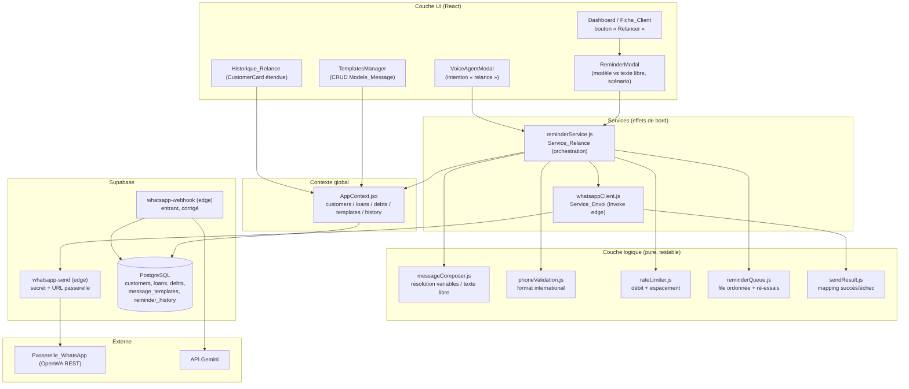
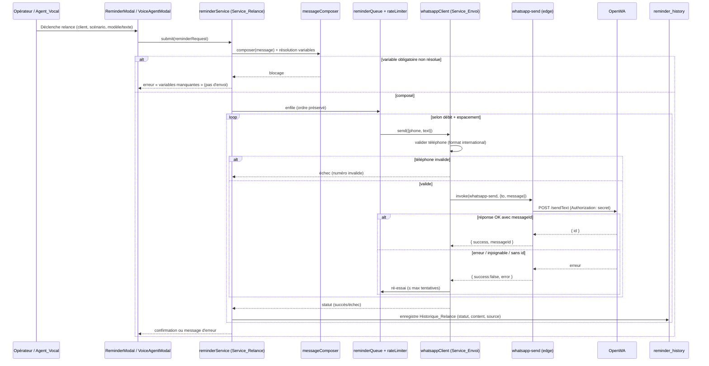

# Document de Conception

## Overview

Cette fonctionnalité ajoute un **canal WhatsApp sortant** à l'application Opays Forex (PWA React + Vite, backend Supabase) et fiabilise le **canal entrant** existant. Elle couvre quatre volets issus des exigences :

1. **Audit + corrections** de la fonction Edge entrante `supabase/functions/whatsapp-webhook/index.ts` (timeouts d'appels réseau séquentiels, vérification du `WEBHOOK_SECRET`, gestion d'erreurs portefeuille inconnu / Gemini) — sans rupture du comportement entrant actuel.
2. **Service d'envoi sortant (`Service_Envoi`)** : une **nouvelle fonction Edge `whatsapp-send`** appelant l'API REST de la passerelle OpenWA avec un secret d'authentification, renvoyant un statut succès (avec identifiant de message) ou échec.
3. **Orchestration des relances (`Service_Relance`)** : limitation de débit configurable, file d'attente ordonnée, espacement minimal, ré-essais ; déclenchement manuel (tableau de bord) ou vocal (agent vocal existant) ; trois scénarios (recouvrement, annonce collective, relance personnalisée) ; composition par modèle ou texte libre avec résolution de variables et préservation littérale de la syntaxe variable en texte libre.
4. **Persistance** : nouvelles tables Supabase `message_templates` et `reminder_history` (Historique_Relance) avec RLS cohérente ; **UI** de déclenchement, d'historique par client et de gestion des modèles, bilingue (fr/en) ; **nettoyage terminologique** (« kiosque » → terme professionnel) dans `src/i18n.js` et les composants.

### Principe directeur : ancrage dans le code existant

Conformément à `AGENTS.md`, la conception **réutilise et fiabilise** l'existant plutôt que d'introduire des implémentations parallèles.

| Préoccupation | Code existant ancré | Action de conception |
|---|---|---|
| Secret serveur + appel d'API externe | `supabase/functions/gemini-proxy/index.ts` (clé en `Deno.env`, jamais exposée au navigateur) | Reproduire le patron pour la nouvelle fonction `whatsapp-send` (secret OpenWA + URL passerelle côté serveur) |
| Flux entrant | `supabase/functions/whatsapp-webhook/index.ts` | Corrections ciblées (timeouts, `WEBHOOK_SECRET`, codes d'erreur) à comportement inchangé sur le cas nominal |
| Données client / créances | `customers` (id, name, phone), `loans` (customer_id, amount, currency, due_date, status), `debts` (counterparty_name) via `AppContext.jsx` | Réutiliser ; rattacher l'Historique_Relance à `customers.id` et, pour le recouvrement, à `loans.id` |
| Déduplication / rattachement client | `src/utils/customerMatching.js` (`normalizePhone`, `matchCustomer`) | Réutiliser pour la résolution du Client en mode vocal |
| Historique client | `src/utils/customerHistory.js`, `src/components/CustomerCard.jsx` | Étendre la Fiche_Client avec l'Historique_Relance |
| Agent vocal | `src/components/VoiceAgentModal.jsx`, `src/utils/voiceAgent.js` | Brancher l'intention « relance » sur `Service_Relance` |
| i18n | `src/i18n.js` (dictionnaires `fr`/`en`) | Ajouter les clés relances + corriger la terminologie |
| Charte graphique | classes `card`, `btn`, `modal-*`, `alert`, variables `var(--...)` | Réutiliser pour toutes les nouvelles UI |

### Décision d'architecture clé : où vit la logique d'envoi ?

**La logique d'appel à OpenWA vit dans une nouvelle fonction Edge Supabase `whatsapp-send`, côté serveur.** Justification :

- Le bundle du navigateur n'expose que les variables `VITE_*` ; tout secret placé côté client serait **public**. Le secret d'authentification OpenWA (`WHATSAPP_API_SECRET`, Exigence 3.7) et l'URL de la passerelle (Exigence 12) **doivent rester serveur**.
- Le patron est déjà éprouvé dans le dépôt (`gemini-proxy`), ce qui garantit la cohérence et évite une implémentation parallèle.
- La PWA appelle la fonction via `supabase.functions.invoke('whatsapp-send', …)`, comme `voiceAgent.js` appelle `gemini-proxy`.

**La logique d'orchestration (`Service_Relance`)** — limitation de débit, file d'attente, espacement, ré-essais, composition des messages, résolution de variables — est implémentée en **modules purs et testables côté client** (`src/utils/…` et `src/services/…`), pilotant les appels à `whatsapp-send` et la journalisation dans `reminder_history`. Les fonctions de débit/file/composition sont **pures** (horloge injectée), donc vérifiables par tests de propriété sans réseau.

## Architecture

### Vue d'ensemble des couches



### Flux d'une relance (manuelle ou vocale)



## Audit du flux entrant et corrections (Exigences 1, 2, 14.1)

### Constat (état actuel de `whatsapp-webhook/index.ts`)

- **Flux** : `OPTIONS`/CORS → `req.json()` → extraction `data.body|message.text`, `from`, média (`mediaUrl`/`media`) → téléchargement média si URL → `SELECT wallets is_active` → `SELECT exchange_rates` → prompt Gemini → `fetch` Gemini → parse JSON (nettoyage markdown) → résolution floue des portefeuilles → calcul `profit_usd` → `INSERT transactions {status:'draft'}` → réponse 200. En erreur : `catch` global → réponse 500 JSON.
- **Authentification** : **aucune vérification de `WEBHOOK_SECRET`** ni de l'en-tête `Authorization` (Exigence 2.2). CORS `*`. La fonction n'utilise que les clés Supabase/Gemini d'environnement.
- **Dépendances externes** : Passerelle OpenWA (source du webhook + média), API Gemini, Supabase (lecture `wallets`/`exchange_rates`, écriture `transactions`).
- **Schéma associé** : table `transactions` (insertion au statut `draft`, déclencheurs de solde ignorant les `draft` — cf. `docs/03_Architecture/db_schema.md`).

### Bugs / risques identifiés et corrections proposées

| # | Risque (Exigence) | Correction de conception |
|---|---|---|
| A1 | **Aucune vérification du `WEBHOOK_SECRET`** : tout tiers peut injecter des transactions `draft` (Ex. 2.2). | Lire `Deno.env.get('WEBHOOK_SECRET')`. Si défini, comparer à un en-tête entrant (`x-webhook-secret` ou paramètre `?secret=`). En cas d'absence/mismatch → **401** sans traiter. Si `WEBHOOK_SECRET` non configuré, journaliser un avertissement (rétro-compatibilité), comportement inchangé. |
| A2 | **Timeouts des appels réseau séquentiels** (téléchargement média, Gemini, Supabase) : un appel lent bloque la requête jusqu'au timeout de la plateforme (Ex. 2.1). | Encadrer chaque `fetch` externe (média, Gemini) par un `AbortController` + délai configurable (`MEDIA_TIMEOUT_MS`, `GEMINI_TIMEOUT_MS`, défaut 10 s). En cas de dépassement → erreur explicite, réponse maîtrisée. |
| A3 | **Portefeuille inconnu** : `throw` générique → **500**, indistinct d'une panne (Ex. 2.3, 2.4). | Distinguer les cas métier (aucun portefeuille actif, résolution source/dest impossible) et renvoyer **422 Unprocessable Entity** avec `{ success:false, reason:'no_matching_wallet' }`, sans interrompre le traitement des requêtes ultérieures (chaque requête est indépendante). |
| A4 | **Erreur Gemini** (HTTP non-OK, réponse vide, JSON non analysable) → **500** indistinct (Ex. 2.4). | Code **502 Bad Gateway** pour une panne Gemini en amont ; **422** pour une réponse non analysable. Corps `{ success:false, reason }`. |
| A5 | **Échec silencieux du téléchargement média** (`catch` qui ignore) → Gemini reçoit le texte seul. | Conserver le repli sur texte mais journaliser `media_download_failed` et l'inclure dans la réponse de diagnostic (pas d'échec dur). |
| A6 | **Parsing JSON Gemini** non protégé (`JSON.parse` peut lever). | Réutiliser le patron sûr de `voiceAgent.parseGeminiResponse` (retrait markdown + `try/catch`) → **422** si non analysable. |

> **Non-régression (Ex. 14.1)** : le cas nominal (payload valide d'OpenWA, portefeuilles présents, Gemini OK) **continue de créer une transaction `draft`** et de répondre **200** avec le même corps. Les corrections n'ajoutent que des branches d'erreur mieux typées et un contrôle d'authentification activé uniquement si `WEBHOOK_SECRET` est configuré.

## Components and Interfaces

### Couche Edge (serveur)

#### 1. `whatsapp-send` (NOUVELLE fonction Edge) — Service_Envoi serveur

Reçoit une requête JSON, valide, appelle l'API REST OpenWA avec le secret, et renvoie un statut normalisé. Secret et URL **jamais** exposés au client.

```ts
// Requête (corps invoke)
interface SendRequest {
  to: string;        // numéro destinataire (format international, ex. +243...)
  message: string;   // texte déjà composé/résolu côté Service_Relance
}
// Réponse
interface SendResponse {
  success: boolean;
  messageId?: string;  // fourni par OpenWA en cas de succès (Ex. 3.4)
  error?: string;      // cause en cas d'échec (Ex. 3.6)
}
```

Variables d'environnement (Exigence 12) :

| Variable | Rôle |
|---|---|
| `WHATSAPP_SEND_GATEWAY_URL` | URL de la passerelle d'**envoi** (optionnelle). |
| `WHATSAPP_GATEWAY_URL` | URL de la passerelle **partagée/entrante** (repli). |
| `WHATSAPP_API_SECRET` | Secret d'authentification des appels OpenWA (Ex. 3.7). |

Résolution d'URL : `gatewayUrl = WHATSAPP_SEND_GATEWAY_URL || WHATSAPP_GATEWAY_URL`. Si aucune n'est définie → **500** `{ error:'gateway_not_configured' }` (Ex. 12.2, 12.3).

Comportement :
1. CORS/`OPTIONS` (patron `gemini-proxy`).
2. Validation : `to` non vide, `message` non vide → sinon **400**.
3. `POST {gatewayUrl}/sendText` (ou endpoint OpenWA configuré) avec en-tête `Authorization`/`x-api-key` = `WHATSAPP_API_SECRET`, corps `{ chatId/to, message }`, encadré d'un `AbortController` (timeout configurable).
4. Mapping de la réponse via la logique pure `sendResult.js` :
   - réponse OK **avec** identifiant → `{ success:true, messageId }` (Ex. 3.4) ;
   - réponse OK **sans** identifiant → `{ success:false, error:'missing_message_id' }` (Ex. 3.5) ;
   - HTTP non-OK / passerelle injoignable / timeout → `{ success:false, error }` (Ex. 3.6).

#### 2. `whatsapp-webhook` (corrigée) — voir section Audit ci-dessus.

### Couche logique pure (`src/utils/`)

#### 3. `phoneValidation.js`

```js
export const isValidInternationalPhone = (phone) => boolean; // +[indicatif][8..15 chiffres]
export const normalizeForGateway = (phone) => string;        // réutilise normalizePhone, conserve « + »
```
Règle (Ex. 3.2, 3.3) : un numéro valide commence par `+`, suivi de 8 à 15 chiffres (E.164), espaces ignorés. Sinon rejet.

#### 4. `messageComposer.js` — composition & résolution de variables

```js
// Variables connues et leur caractère obligatoire/optionnel + repli.
export const resolveTemplate = (templateBody, variables, options) =>
  { ok: boolean, text?: string, missing?: string[] };

export const composeFreeText = (rawText) => string; // identité : aucune résolution
```
Règles :
- **Mode modèle** (Ex. 9.2, 9.3, 10.3, 10.4) : chaque marqueur `{{nom}}` est remplacé par la valeur du Client. Variable **optionnelle** sans valeur → **repli défini** (jamais le marqueur brut). Variable **obligatoire** sans valeur → `ok:false` + liste `missing` (blocage d'envoi, Ex. 10.4).
- **Mode texte libre** (Ex. 5.3, 5.4) : `composeFreeText` renvoie le texte **tel quel** ; toute syntaxe `{{…}}` y est **préservée littéralement** (aucune résolution).
- Variables minimales supportées (Ex. 9.1) : `customer_name` (obligatoire), `amount_due`, `currency`, `due_date` (optionnelles avec repli, ex. `« — »`).

#### 5. `rateLimiter.js` — limitation de débit & espacement (pur, horloge injectée)

```js
// state immuable ; renvoie un nouvel état + décision
export const canSend = (state, nowMs, config) =>
  { allowed: boolean, nextAllowedAtMs: number };
export const registerSend = (state, nowMs, config) => newState;
```
Règles (Ex. 4.1, 4.4) : au plus `config.maxPerInterval` envois par `config.intervalMs` glissant ; deux envois consécutifs espacés d'au moins `config.minSpacingMs`.

#### 6. `reminderQueue.js` — file ordonnée & ré-essais (pur)

```js
export const enqueue = (queue, item) => newQueue;          // FIFO, ordre de soumission
export const dequeueReady = (queue, nowMs, limiterState, config) =>
  { item: QueueItem|null, queue, limiterState };
export const onFailure = (queue, item, config) =>
  { queue, retried: boolean };  // ré-essai si attempts < maxAttempts (Ex. 4.5)
```
Règles (Ex. 4.2, 4.3, 4.5) : ordre de soumission **préservé** (FIFO) ; un envoi différé reste en file (jamais rejeté) ; un échec transitoire est ré-essayé tant que `attempts < config.maxAttempts`.

#### 7. `sendResult.js` — mapping du résultat passerelle (pur, partagé client/edge logique)

```js
export const mapGatewayResponse = ({ httpOk, messageId, error }) =>
  { success: boolean, messageId?: string, error?: string };
```
Règle (Ex. 3.4, 3.5, 3.6) : succès **si et seulement si** `httpOk && messageId` non vide.

### Couche services (effets de bord, `src/services/`)

#### 8. `whatsappClient.js` — Service_Envoi côté client

```js
export const sendWhatsApp = async ({ supabase, to, message }) =>
  { success, messageId?, error? };
```
Valide le numéro (`phoneValidation`), puis `supabase.functions.invoke('whatsapp-send', { body:{ to:normalizeForGateway(to), message } })`, et normalise via `sendResult`. Numéro invalide → `{ success:false, error }` **sans** appel réseau (Ex. 3.2, 3.3).

#### 9. `reminderService.js` — Service_Relance (orchestration)

```js
export const buildReminders = ({ scenario, customers, loans, template, freeText, lang }) =>
  { reminders: ReminderRequest[], blocked: {customerId, missing}[] };

export const runReminderBatch = async ({ supabase, reminders, config, clock, onResult }) =>
  ResultSummary; // applique débit + file + ré-essais + journalisation
```
Responsabilités :
- **Recouvrement** (Ex. 7) : pour un Client ayant une créance (`loans` au statut `pending`/`overdue`, ou `debts` rapprochée par nom), résout `customer_name` + `amount_due` + `currency` ; rattache `loan_id`. Si aucun montant dû → ne référence pas de montant (Ex. 7.3).
- **Annonce collective** (Ex. 8) : crée une Relance par Client sélectionné ; un échec n'interrompt pas les autres (Ex. 8.4) ; une entrée d'historique par Client (Ex. 8.3).
- **Personnalisée** (Ex. 9) : résolution complète des variables.
- **Source vocale** (Ex. 6) : reçoit le Client résolu par `customerMatching`; ambiguïté → pas d'envoi + signalement (Ex. 6.2) mais **tentative comptabilisée** dans le débit (Ex. 6.5) ; source enregistrée `« vocale »` (Ex. 6.3).
- **Journalisation** (Ex. 11) : chaque envoi (succès/échec) crée une entrée `reminder_history`. Si l'écriture d'historique échoue, l'envoi est tout de même effectué (Ex. 11.4).

#### 10. Extensions `AppContext.jsx`

Nouvelles entrées d'état et actions (mêmes patrons que `createDebt`/`createCustomer`, avec repli mock localStorage) :

```js
templates, reminderHistory
createTemplate(t) / updateTemplate(id, u) / deleteTemplate(id)
fetchTemplates()
logReminder(entry)               // insert reminder_history
getCustomerReminders(customerId) // historique par client (Ex. 11.5)
```

### Couche UI (`src/components/`, `src/pages/`)

| Composant | Rôle | Exigences |
|---|---|---|
| `ReminderModal.jsx` (nouveau) | Sélection scénario (recouvrement/annonce/personnalisé), choix modèle **vs** texte libre, aperçu résolu, confirmation/erreur. | 5.1–5.6, 8.1, 10.1 |
| Bouton « Relancer » sur la Fiche_Client (`CustomerCard.jsx` étendu) et action client du tableau de bord | Déclenche `ReminderModal`. | 5.1 |
| `CustomerCard.jsx` (étendu) | Affiche l'Historique_Relance du Client (date, contenu, source, statut). | 11.5 |
| `TemplatesManager.jsx` (nouveau, intégré à `Settings.jsx` ou page Prêts/Clients) | CRUD des `message_templates`, bilingue. | 10.2, 10.5 |
| `VoiceAgentModal.jsx` (étendu) | Reconnaît l'intention « relance » et délègue à `reminderService`. | 6.1, 6.2 |

Toutes les UI réutilisent les classes/variables CSS existantes et passent par `useT()` (i18n).

## Data Models

### Tables existantes réutilisées (rappel, non modifiées)

- `customers (id uuid, name, phone, created_at)`
- `loans (id uuid, customer_id uuid, wallet_id, amount, currency, interest_rate, due_date date, status, note, contract_image_url, created_at)`
- `debts (id uuid, type, counterparty_name, amount, currency, note, status, created_at, settled_at)`

> Le recouvrement (Ex. 7) s'appuie principalement sur `loans` (rattachées à `customer_id`, avec `amount`/`currency`/`due_date`). Les `debts` n'ont pas de `customer_id` (champ `counterparty_name`) ; elles peuvent être rapprochées par nom mais ne sont pas la source primaire du lien client.

### Nouvelles tables (SQL)

```sql
-- A. Modèles de message réutilisables (Modele_Message)
CREATE TABLE message_templates (
    id UUID PRIMARY KEY DEFAULT gen_random_uuid(),
    name VARCHAR(120) NOT NULL,
    lang VARCHAR(2) NOT NULL DEFAULT 'fr' CHECK (lang IN ('fr','en')),
    scenario VARCHAR(20) NOT NULL DEFAULT 'personalized'
        CHECK (scenario IN ('recovery','announcement','personalized','custom')),
    body TEXT NOT NULL,                       -- contient des marqueurs {{variable}}
    created_at TIMESTAMP WITH TIME ZONE DEFAULT TIMEZONE('utc'::text, NOW()) NOT NULL,
    updated_at TIMESTAMP WITH TIME ZONE DEFAULT TIMEZONE('utc'::text, NOW()) NOT NULL
);

-- B. Historique des relances par client (Historique_Relance)
CREATE TABLE reminder_history (
    id UUID PRIMARY KEY DEFAULT gen_random_uuid(),
    customer_id UUID NOT NULL REFERENCES customers(id) ON DELETE CASCADE,
    loan_id UUID REFERENCES loans(id) ON DELETE SET NULL,   -- rattachement recouvrement (Ex. 7.2)
    template_id UUID REFERENCES message_templates(id) ON DELETE SET NULL,
    scenario VARCHAR(20) NOT NULL
        CHECK (scenario IN ('recovery','announcement','personalized','custom')),
    content TEXT NOT NULL,                    -- message effectivement envoyé (Ex. 11.2)
    trigger_source VARCHAR(10) NOT NULL DEFAULT 'manual'
        CHECK (trigger_source IN ('manual','voice')),       -- Ex. 6.3, 11.2
    status VARCHAR(10) NOT NULL DEFAULT 'sent'
        CHECK (status IN ('sent','failed','queued')),       -- Ex. 11.2, 11.3
    provider_message_id VARCHAR(120),         -- identifiant OpenWA si succès (Ex. 3.4)
    error_reason TEXT,                         -- cause si échec (Ex. 11.3)
    created_at TIMESTAMP WITH TIME ZONE DEFAULT TIMEZONE('utc'::text, NOW()) NOT NULL
);

CREATE INDEX idx_reminder_history_customer ON reminder_history(customer_id, created_at DESC);
CREATE INDEX idx_message_templates_lang ON message_templates(lang, scenario);
```

### RLS — cohérente avec les tables existantes (Ex. 11.6)

Conformément à `docs/03_Architecture/db_schema.md` (V1 privée, accès via clé anonyme), on active RLS avec des politiques pour le rôle `anon`/`public`, à l'identique de `customers`/`loans`/`debts` :

```sql
ALTER TABLE message_templates ENABLE ROW LEVEL SECURITY;
ALTER TABLE reminder_history  ENABLE ROW LEVEL SECURITY;

CREATE POLICY "templates_all_anon" ON message_templates
    FOR ALL TO anon USING (true) WITH CHECK (true);
CREATE POLICY "reminders_all_anon" ON reminder_history
    FOR ALL TO anon USING (true) WITH CHECK (true);
```

> Note de sécurité : ces politiques reproduisent le modèle V1 (mono-opérateur). Si une isolation multi-utilisateurs devient nécessaire, ajouter une colonne `owner_id uuid` et des politiques `auth.uid() = owner_id` sur l'ensemble des tables (évolution cohérente à appliquer globalement).

### Modèle d'objet « ReminderRequest » (en mémoire)

```ts
interface ReminderRequest {
  customerId: string;
  phone: string;
  scenario: 'recovery'|'announcement'|'personalized'|'custom';
  triggerSource: 'manual'|'voice';
  templateId?: string;
  content: string;        // texte composé (résolu si modèle, littéral si libre)
  loanId?: string;        // recouvrement
}
```

## Correctness Properties

*Une propriété est une caractéristique ou un comportement qui doit rester vrai pour toutes les exécutions valides du système — une formulation formelle de ce que le logiciel doit faire. Les propriétés font le pont entre les spécifications lisibles par l'humain et des garanties de correction vérifiables par la machine.*

Ces propriétés portent sur la **logique pure** de la fonctionnalité (validation, composition, débit, file, mapping de résultat, résolution d'URL, parité i18n). Les comportements d'I/O (appels OpenWA, edge functions), de rendu UI et de configuration sont couverts par des tests d'exemple/intégration (cf. Testing Strategy).

### Property 1: Validation du format de numéro international

*Pour tout* numéro composé de `+` suivi de 8 à 15 chiffres (avec d'éventuels espaces), `isValidInternationalPhone` retourne vrai ; *pour toute* autre chaîne (vide, sans `+`, avec des lettres, trop courte ou trop longue), elle retourne faux.

**Validates: Requirements 3.2**

### Property 2: Aucun appel passerelle pour un numéro invalide

*Pour tout* numéro invalide, `sendWhatsApp` retourne `success:false` avec une cause descriptive et **n'invoque jamais** la fonction `whatsapp-send`.

**Validates: Requirements 3.3**

### Property 3: Mapping du résultat de la passerelle

*Pour toute* réponse de passerelle, `mapGatewayResponse` retourne `success:true` avec l'identifiant **si et seulement si** la réponse est HTTP OK **et** l'identifiant de message est présent et non vide ; dans tous les autres cas (HTTP non-OK, injoignable, identifiant absent), elle retourne `success:false` en incluant une cause.

**Validates: Requirements 3.4, 3.5, 3.6**

### Property 4: Respect de la limite de débit et de l'espacement minimal

*Pour toute* séquence d'envois autorisés par le limiteur, le nombre d'envois sur toute fenêtre glissante de `intervalMs` n'excède jamais `maxPerInterval`, et l'écart entre deux envois consécutifs autorisés est toujours supérieur ou égal à `minSpacingMs`.

**Validates: Requirements 4.1, 4.4, 6.4, 8.2**

### Property 5: File d'attente FIFO sans perte

*Pour toute* séquence de relances soumises alors que la limite de débit est atteinte, aucune relance n'est rejetée (toutes restent en file) et l'ordre de défilement préserve exactement l'ordre de soumission.

**Validates: Requirements 4.2, 4.3**

### Property 6: Ré-essais bornés

*Pour toute* relance subissant des échecs transitoires répétés, le nombre de tentatives n'excède jamais `maxAttempts` ; au-delà, la relance est abandonnée (et non ré-essayée indéfiniment).

**Validates: Requirements 4.5**

### Property 7: Texte libre préservé littéralement

*Pour toute* chaîne de texte libre — y compris une chaîne contenant une syntaxe ressemblant à une variable (`{{customer_name}}`) — le contenu composé est strictement identique à l'entrée : aucune résolution n'est appliquée et les marqueurs sont conservés tels quels.

**Validates: Requirements 5.3, 5.4**

### Property 8: Résolution complète des variables d'un modèle

*Pour tout* Modele_Message et *pour tout* Client disposant de toutes les valeurs requises, le message résolu ne contient plus aucun marqueur `{{…}}` connu et chaque marqueur est remplacé par la valeur correspondante du Client.

**Validates: Requirements 7.1, 9.1, 9.2, 10.3**

### Property 9: Repli des variables optionnelles

*Pour tout* Modele_Message contenant des variables optionnelles sans valeur pour le Client (y compris l'absence de montant dû), le message résolu remplace ces variables par la valeur de repli définie et ne contient jamais le marqueur brut ni un montant inventé.

**Validates: Requirements 7.3, 9.3**

### Property 10: Blocage sur variable obligatoire non résolue

*Pour tout* Modele_Message dont au moins une variable obligatoire n'a pas de valeur pour le Client, `resolveTemplate` retourne `ok:false` et l'orchestration n'effectue aucun envoi tant que les variables ne sont pas résolues.

**Validates: Requirements 10.4**

### Property 11: Ambiguïté vocale sans envoi

*Pour toute* commande vocale dont la résolution du Client est ambiguë (plusieurs correspondances) ou nulle (aucune correspondance), `Service_Relance` n'invoque aucun envoi et signale l'ambiguïté.

**Validates: Requirements 6.2**

### Property 12: Une tentative vocale ambiguë est comptabilisée dans le débit

*Pour toute* tentative de relance vocale échouant pour cause d'ambiguïté de Client, le compteur de la Limite_de_Debit est tout de même incrémenté (la tentative est comptabilisée) bien qu'aucun message ne soit envoyé.

**Validates: Requirements 6.5**

### Property 13: Cardinalité d'une annonce collective

*Pour tout* ensemble de N Clients valides sélectionnés pour une annonce, `buildReminders` crée exactement N relances, une par Client.

**Validates: Requirements 8.1**

### Property 14: Résilience du lot d'annonce

*Pour toute* combinaison de résultats d'envoi (succès/échec) sur un ensemble de Clients, chaque Client de l'ensemble fait l'objet d'une tentative d'envoi : un échec sur un Client n'empêche pas les tentatives sur les autres.

**Validates: Requirements 8.4**

### Property 15: Entrée d'historique complète et rattachée pour chaque envoi

*Pour tout* envoi de relance (succès ou échec) et *pour chaque* Client destinataire, exactement une entrée d'Historique_Relance est produite, rattachée au bon `customer_id`, et contenant le contenu envoyé, l'horodatage, la source de déclenchement et le statut.

**Validates: Requirements 6.3, 8.3, 11.1, 11.2**

### Property 16: Historique d'échec horodaté avec cause

*Pour tout* envoi en échec, l'entrée d'Historique_Relance correspondante porte le statut `failed` et une cause d'erreur non vide.

**Validates: Requirements 7.2, 11.3**

### Property 17: Résolution de l'URL de passerelle d'envoi

*Pour toute* paire (URL d'envoi dédiée, URL partagée) : si l'URL d'envoi dédiée est définie, l'URL résolue est l'URL d'envoi ; sinon, l'URL résolue est l'URL partagée/entrante.

**Validates: Requirements 12.2, 12.3**

### Property 18: Parité des clés de traduction fr/en

*Pour toute* clé de texte présente dans le dictionnaire `fr`, la même clé existe dans le dictionnaire `en`, et réciproquement (parité structurelle complète des deux dictionnaires).

**Validates: Requirements 13.2**

## Error Handling

### Fonction entrante `whatsapp-webhook` (corrigée)

| Situation | Code HTTP | Corps | Exigence |
|---|---|---|---|
| `WEBHOOK_SECRET` configuré et en-tête absent/incorrect | 401 | `{ success:false, reason:'unauthorized' }` | 2.2 |
| Aucun portefeuille actif / résolution source-dest impossible | 422 | `{ success:false, reason:'no_matching_wallet' }` | 2.3, 2.4 |
| Réponse Gemini non analysable / vide | 422 | `{ success:false, reason:'gemini_unparseable' }` | 2.4 |
| Gemini HTTP non-OK / injoignable | 502 | `{ success:false, reason:'gemini_upstream' }` | 2.4 |
| Dépassement de délai (média/Gemini) | 504 | `{ success:false, reason:'timeout' }` | 2.1 |
| Téléchargement média échoué | (poursuite) | repli texte + `media_download_failed` journalisé | 2.1 |
| Cas nominal | 200 | `{ success:true, … }` (inchangé) | 14.1 |

Chaque requête est traitée indépendamment : une erreur sur un payload n'affecte pas les requêtes ultérieures (Ex. 2.3).

### Fonction `whatsapp-send` (Service_Envoi)

| Situation | Réponse | Exigence |
|---|---|---|
| `to`/`message` manquant | 400 `{ error:'invalid_request' }` | 3.1 |
| Passerelle non configurée (aucune URL) | 500 `{ error:'gateway_not_configured' }` | 12.2, 12.3 |
| OpenWA OK avec id | 200 `{ success:true, messageId }` | 3.4 |
| OpenWA OK sans id | 200 `{ success:false, error:'missing_message_id' }` | 3.5 |
| OpenWA erreur / injoignable / timeout | 200 `{ success:false, error }` | 3.6 |

> Le secret OpenWA et l'URL ne figurent **jamais** dans les corps de réponse ni les logs (sécurité).

### Service_Relance (orchestration côté client)

- **Numéro invalide** : rejet immédiat sans appel réseau, entrée d'historique `failed` (Ex. 3.3, 11.3).
- **Variable obligatoire manquante** : blocage avant enfilement, message d'erreur UI listant les variables manquantes (Ex. 10.4).
- **Échec transitoire** : ré-essai ≤ `maxAttempts` (Ex. 4.5) ; au-delà, entrée `failed`.
- **Échec d'écriture de l'historique** : l'envoi est tout de même tenté/effectué ; l'échec de journalisation est seulement journalisé en console (Ex. 11.4).
- **Ambiguïté vocale** : pas d'envoi, signalement, tentative comptabilisée dans le débit (Ex. 6.2, 6.5).
- **Lot d'annonce** : un échec individuel est capturé et n'interrompt pas la boucle (Ex. 8.4).

### Repli hors-ligne / Supabase non configuré

Comme le reste de l'application (cf. `AppContext.jsx`), si `supabase` est absent (mode démo/mock), `Service_Relance` fonctionne sur les données mock localStorage et n'effectue pas d'appel réseau ; l'UI indique le mode simulé. Aucune régression du mode démo existant.

## Testing Strategy

### Approche duale

- **Tests de propriété** (≥ 100 itérations) : valident la logique pure universelle (Propriétés 1 à 18).
- **Tests d'exemple / d'intégration** : valident les comportements d'I/O, le rendu UI, la configuration et la non-régression.

### Bibliothèque et conventions

- Bibliothèque PBT : **fast-check** (déjà utilisée dans le dépôt, cf. `*.property.test.js`/`.jsx`). Ne pas réimplémenter de PBT maison.
- Chaque test de propriété : **minimum 100 itérations** (`fc.assert(..., { numRuns: 100 })`).
- Chaque test de propriété est étiqueté en commentaire au format :
  `// Feature: whatsapp-client-reminders, Property {n}: {texte de la propriété}`
- Emplacements (cohérents avec l'existant) :
  - `src/utils/phoneValidation.property.test.js` (P1)
  - `src/services/whatsappClient.property.test.js` (P2, P3 via `sendResult`)
  - `src/utils/rateLimiter.property.test.js` (P4)
  - `src/utils/reminderQueue.property.test.js` (P5, P6)
  - `src/utils/messageComposer.property.test.js` (P7, P8, P9, P10)
  - `src/services/reminderService.property.test.jsx` (P11, P12, P13, P14, P15, P16)
  - `src/utils/gatewayUrl.property.test.js` (P17)
  - `src/i18n.property.test.js` (P18)

### Générateurs (fast-check)

- **Numéros** : composition de `+`, indicatif, 8–15 chiffres, insertion aléatoire d'espaces (valides) ; et chaînes arbitraires/courtes/avec lettres (invalides).
- **Modèles** : corps avec marqueurs choisis dans `{customer_name, amount_due, currency, due_date}` + texte arbitraire ; jeux de valeurs Client complets/partiels.
- **Débit/file** : séquences de timestamps croissants (horloge déterministe injectée), configs `{maxPerInterval, intervalMs, minSpacingMs, maxAttempts}` bornées.
- **Résultats d'envoi** : objets `{ httpOk, messageId?, error? }` couvrant toutes les combinaisons.
- **Clients** : `fc.record({ id, name, phone, created_at })` pour annonces et historique.

### Tests d'exemple / intégration (non PBT)

- **Audit webhook** : tests avec `fetch`/Supabase mockés — secret absent → 401 ; portefeuille inconnu → 422 ; Gemini KO → 502 ; timeout → 504 ; cas nominal → 200 + draft (Ex. 2.x, 14.1).
- **whatsapp-send (edge)** : invoke mocké — en-tête d'auth posé depuis l'env (Ex. 3.7) ; résolution d'URL (Ex. 12.1).
- **CRUD modèles** : round-trip insert → relecture (Ex. 10.2, 10.5).
- **UI** : présence du bouton « Relancer » sur la Fiche_Client (Ex. 5.1), confirmation/erreur (Ex. 5.5, 5.6), rendu de l'Historique_Relance (Ex. 11.5), intention vocale (Ex. 6.1).
- **Terminologie** : absence de « kiosque »/« kiosk » dans `src/i18n.js` et les composants après correction (Ex. 13.1, 13.4, 13.5).
- **Non-régression** : exécution de `npm test` complet (Ex. 14.4) ; intacte de `finance.js` (Ex. 14.3) et des commandes vocales existantes (Ex. 14.5).

### Plan de validation finale (Exigence 15)

1. Démonstration du flux entrant (réception → draft) après corrections (Ex. 15.1).
2. Déclenchement d'une relance manuelle **et** vocale → envoi effectif via `whatsapp-send` (Ex. 15.2).
3. Vérification d'une entrée d'Historique_Relance rattachée au Client (Ex. 15.3).
4. Vérification du remplacement des termes inappropriés (Ex. 15.4).
5. Parcours de non-régression du tableau de bord et des fonctions existantes (Ex. 15.5).

## Implications de sécurité

- **Secret OpenWA et URL de passerelle côté serveur uniquement** (`whatsapp-send`), jamais dans le bundle `VITE_*` ni dans les réponses/logs.
- **Authentification du webhook entrant** via `WEBHOOK_SECRET` (correction A1) pour empêcher l'injection de transactions `draft`.
- **RLS** activée sur `message_templates` et `reminder_history`, cohérente avec l'existant ; voie d'évolution `owner_id` documentée pour une isolation multi-utilisateurs.
- **Validation des entrées** (numéro, contenu) avant tout appel réseau pour réduire la surface d'abus et le risque de bannissement WhatsApp (limite de débit).
- **Pas de données sensibles superflues** : l'historique stocke le contenu envoyé et le statut, pas de secret.
