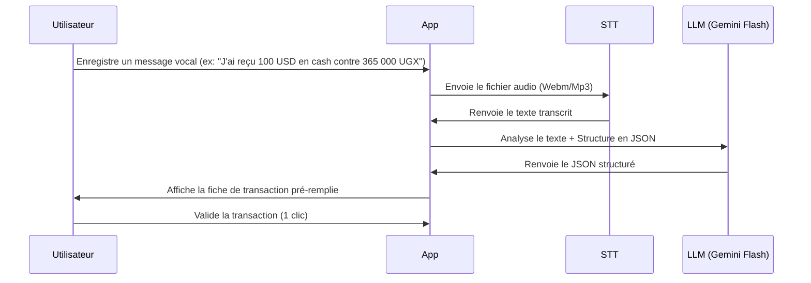

# Intégration Vocale & Analyse de VoxCPM

Ce document analyse les technologies vocales pour l'application, en se basant sur le dépôt **OpenBMB/VoxCPM** pour la synthèse et le clonage de voix, ainsi que sur l'intégration de la transcription pour l'enregistrement automatique des transactions.

---

## 1. Analyse de OpenBMB/VoxCPM (Synthèse et Clonage de Voix)

**VoxCPM** est un modèle de synthèse vocale (Text-to-Speech) de pointe, open-source et "tokenizer-free". 
*   **Rôle dans notre projet** : Il permet à l'application de parler à l'utilisateur avec une voix humaine, naturelle et chaleureuse. Cela est idéal pour créer un "Agent IA Vocal" qui confirme les transactions ou donne des rapports oraux hebdomadaires.
*   **Avantages** :
    *   **Zéro-shot Voice Cloning** : On peut cloner la voix de l'utilisateur (ou une voix choisie) à partir d'un échantillon audio de quelques secondes.
    *   **Contrôle créatif** : Permet de générer des voix à partir d'une simple description textuelle (ex: *"une voix d'homme calme, posée, avec un accent congolais"*).
    *   **Haute qualité** : Sortie audio studio 48kHz.
*   **Limites techniques pour la V1** :
    *   Le modèle nécessite une puissance de calcul importante (GPU NVIDIA ou processeur Apple Silicon haut de gamme) pour s'exécuter en temps réel en local.
    *   Pour une application légère et sans frais, faire tourner VoxCPM en local sur le téléphone de l'ami est impossible.
*   **Stratégie d'intégration** :
    *   *Phase 1 (V1)* : Pas de synthèse vocale complexe. Les retours sont purement textuels et visuels.
    *   *Phase 2 (Extension)* : Utilisation des API Cloud légères (comme Gemini Audio output ou ElevenLabs Free Tier) ou déploiement de VoxCPM sur un serveur GPU partagé si le budget le permet.

---

## 2. Le Système "Voice-to-Ledger" (Entrée Vocale)

C'est la fonctionnalité vocale la plus utile pour notre utilisateur à Kampala. Au lieu de taper manuellement :
1.  Il enregistre un mémo vocal dans l'application ou via WhatsApp.
2.  Le système transcrit et extrait les entités (devises, montants, portefeuilles).

### Architecture du Flux Vocal



### Exemple de Parsing par l'IA (Gemini Flash)
*   **Texte transcrit** : *"Envoi de 500 dollars sur Airtel RDC, le client a donné 1 850 000 UGX cash"*
*   **JSON généré par l'IA** :
    ```json
    {
      "source_wallet": "Cash UGX",
      "source_amount": 1850000,
      "dest_wallet": "Airtel RDC (USD)",
      "dest_amount": 500,
      "fee": 0,
      "note": "Transaction vocale"
    }
    ```

---

## 3. Recommandation d'Implémentation
1.  **Vocal Input (STT) en priorité** : Implémenter l'enregistrement audio dans l'application Web. Utiliser l'API gratuite de Gemini 1.5 Flash (qui accepte directement l'audio en entrée !) pour faire la transcription ET le parsing en une seule requête. Cela coûte **0$** et fonctionne directement en français/lingala/swahili.
2.  **VoxCPM pour l'interaction vocale future** : Dès que l'application passe à l'échelle, intégrer VoxCPM sur un serveur cloud pour permettre à l'application de répondre vocalement de manière personnalisée.
