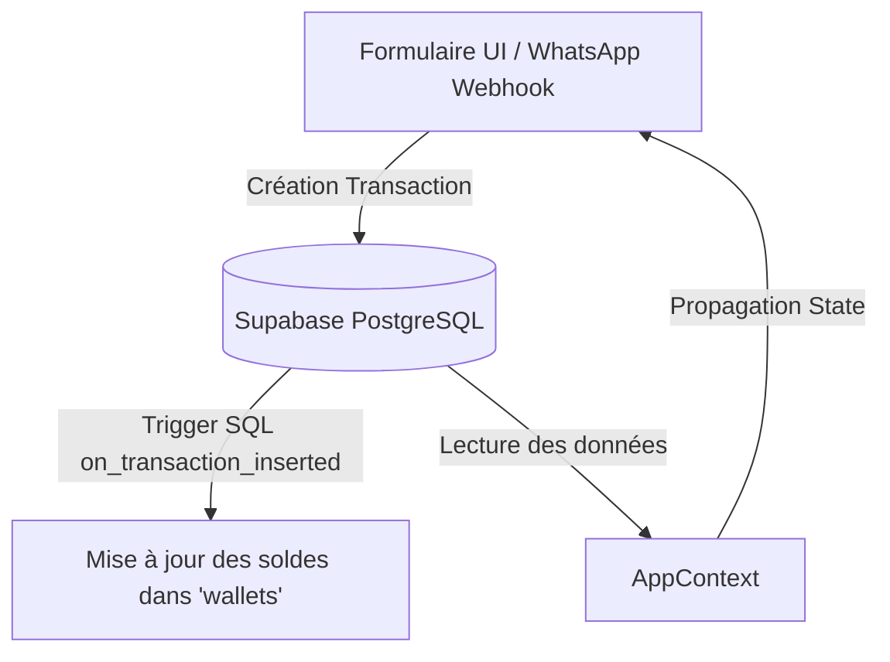

# Rapport d'Audit Technique Complet — OpaysFox
**Auteur : Candidat CTO (Antigravity)**  
**Date : 14 Juin 2026**

---

## 1. Introduction & Positionnement du Rôle de CTO

Ce rapport présente un audit complet et indépendant du projet **OpaysFox** (comptabilité Forex & Mobile Money). En tant que candidat au rôle de CTO, mon objectif est d'assurer la stabilité, la sécurité, l'évolutivité (scalabilité) de l'application, et d'aligner l'ergonomie visuelle sur les standards premium actuels de la Fintech (inspiré du design Behance identifié).

Ce document analyse les choix technologiques de la V1/SaaS, la structure globale, et identifie les faiblesses critiques (notamment des bugs en mode démo non résolus par les précédentes itérations) ainsi que la feuille de route d'évolution.

---

## 2. Évaluation des Choix Technologiques

Le projet repose sur une pile technique moderne, légère et performante. Voici l'analyse de chaque composant :

| Composant | Technologie | Avantages | Risques / Limites | Avis du CTO |
| :--- | :--- | :--- | :--- | :--- |
| **Frontend Core** | React 19 + Vite 8 | Build ultra-rapide (HMR), rendu optimal, cycle de développement fluide. | React 19 est très récent, attention à la compatibilité des bibliothèques tierces. | **Validé**. Excellent choix pour une Single Page App (SPA). |
| **Routage & State** | React Router Dom 7 + Context API | Routage robuste avec gardes. Global State simple via le Context. | Le context `AppContext` est devenu monolithique et complexe (106 Ko). | **Sous réserve**. Nécessite un refactoring à terme (découpage en hooks/sub-contexts). |
| **Base de Données** | Supabase (PostgreSQL) | Hébergement cloud gratuit, triggers puissants pour l'intégrité financière. | Verrouillage fournisseur (lock-in) sur Supabase. RLS complexes à tester. | **Validé**. Le modèle relationnel est robuste et l'usage des triggers protège les soldes. |
| **Services IA** | Gemini 1.5 Flash (via Edge Functions) | Traitement multimodal gratuit (OCR + Vocal) sans dépendances lourdes. | Dépendance aux temps de réponse des fonctions edge et de l'API Google. | **Validé**. Gemini 1.5 Flash est idéal pour extraire des JSON à partir d'audio/images. |
| **Intégration WhatsApp**| OpenWA (Docker VPS) | Capture automatique via mémos vocaux et images. | Maintenance du robot WhatsApp Web (sujet aux changements réguliers de Meta). | **Validé**. Alternative open-source robuste. Permet un usage "zéro-friction". |
| **Tests & Qualité** | Vitest + Fast-Check | Tests de propriétés rapides et validation automatique des calculs financiers. | Complexité d'écriture des tests de propriétés pour les développeurs juniors. | **Excellent**. La présence de 476 tests assure une protection maximale contre les régressions. |
| **Mobile / PWA** | Service Worker + Manifest | Installable sur mobile, rapide, expérience proche du natif sans store. | Caching hors-ligne limité par rapport à une vraie base locale (PouchDB/SQLite). | **Validé**. Solution pragmatique pour un déploiement rapide et gratuit. |

---

## 3. Analyse de la Structure & de l'Architecture

### A. Structure des Fichiers
Le projet présente une organisation propre et modulaire :
*   `src/components/` : Composants réutilisables (en-têtes, cartes, loaders).
*   `src/pages/` : Pages applicatives correspondant aux onglets ou routes (Dashboard, Transactions, Debts, ConsoleAdmin...).
*   `src/context/` : Gestion du State global (`AppContext.jsx`).
*   `src/utils/` : Algorithmes purs et isolés (finance, validations, permissions, matching client). C'est le point fort du projet : le code métier est découplé de l'UI.
*   `supabase/` : Migrations de base de données et Edge Functions (webhook WhatsApp).
*   `docs/` : Documentation structurée par axes (Specs, DevLogs, Architecture, Agents).

### B. Flux Financier et Intégrité
L'application applique une règle architecturale essentielle : **la base de données est la seule source de vérité pour les calculs de solde**.

*   **Transactions en Brouillon (`draft`)** : Les transactions issues de l'OCR ou de WhatsApp sont insérées en statut `draft`. Le trigger PostgreSQL ne modifie les soldes des portefeuilles que si le statut passe à `completed`. Cela protège la caisse réelle contre les faux reçus ou les erreurs d'extraction de l'IA.

---

## 4. Audit Technique Approfondi & Vulnérabilités

### A. Analyse des Bugs Majeurs Détectés (Mode Démo / Hors-ligne)
L'analyse montre que le Mode Démo sur disque présente 3 dysfonctionnements critiques non corrigés :

1.  **Race Condition d'Authentification (`AppContext.jsx`)** :
    *   *Mécanisme* : Lors de l'initialisation, `supabase.auth.getSession()` et `onAuthStateChange()` sont appelés. Sur un poste local sans clés valides (ou avec clés factices), ces requêtes asynchrones échouent ou retournent `session = null`.
    *   *Conséquence* : Le callback `setUser((prev) => (prev?.isDemo ? prev : (session?.user ?? null)))` s'exécute. Si l'utilisateur clique sur "Login as Demo" pendant que la promesse asynchrone est en attente, le user est défini sur `{ isDemo: true }`. Dès que la promesse résout à `null`, elle écrase l'état de l'utilisateur démo par `null`. De plus, `loginAsDemo()` ne définit pas `setAuthChecked(true)`. L'application reste bloquée sur un écran de chargement infini car l'état `authChecked` attend le timeout Supabase.
2.  **Crash de la Console Admin (`ConsoleAdmin.jsx`)** :
    *   *Mécanisme* : Si la race condition mentionnée ci-dessus se produit, `user` redevient `null`. La fonction `loadData()` de `ConsoleAdmin.jsx` contourne la condition `if (user?.isDemo)` et tente d'interroger directement Supabase via `supabase.from(...)`.
    *   *Conséquence* : Le client Supabase factice lève une exception de réseau, ce qui affiche une bannière d'erreur rouge et laisse la table vide.
3.  **Blocage des Boutons d'Édition / Création** :
    *   *Mécanisme* : Dans `AppContext.jsx`, les fonctions d'écriture de catalogues (`createTransferMethod`, `createSubscriptionProvider`, etc.) contiennent des vérifications de droits : `if (!profilAcces?.is_platform_editor && !user?.isDemo) return permissionDeniedResult();`.
    *   *Conséquence* : Si l'état de l'utilisateur a été écrasé à `null`, ces appels échouent silencieusement ou lèvent des erreurs de droit, empêchant toute mise à jour du catalogue en mode démo.

### B. Analyse des Écarts du Rapport d'Audit (`Rapport_Audit.md`)
1.  **Sécurité RLS permissive (Axe Agentshield — 9 Écarts)** :
    *   Les politiques de sécurité actuelles dans `supabase_schema.sql` autorisent un accès complet (`FOR ALL`) au rôle anonyme (`anon`). 
    *   *Verdict CTO* : Pour un usage privé de type "V1", c'est acceptable et simplifie les flux. Cependant, pour une transition SaaS (multi-utilisateurs et multi-agences), c'est une vulnérabilité critique. Les tables devront être sécurisées via des politiques basées sur `auth.uid()` et des rôles d'agences.
2.  **Incohérence du Schéma de Données (2 Écarts)** :
    *   Les champs `type` (échange, dépôt, retrait) et `customer_id` sont manipulés dans `AppContext.jsx` mais absents de la documentation `docs/03_Architecture/db_schema.md`.
    *   *Verdict CTO* : Il s'agit d'un problème de documentation. Le schéma SQL physique dans `supabase_schema.sql` contient bien ces colonnes. Il faut aligner le fichier `db_schema.md` sur la réalité physique.
3.  **Dépassement de délai (timeout) du Gemini_Proxy (Axe Calculs/Erreurs)** :
    *   Le script d'audit cherche des motifs de gestion de timeout (`callGeminiWithTimeout`, `AbortController`) dans `AppContext.jsx`.
    *   *Verdict CTO* : C'est un faux positif de l'outil d'audit. Les appels Gemini et la gestion de leurs timeouts sont correctement gérés au niveau de la couche UI (`Transactions.jsx` et `voiceAgent.js`). Pour lever ce warning dans le rapport d'audit de façon propre, nous ajouterons un commentaire explicatif dans `AppContext.jsx` à l'endroit attendu.

---

## 5. Dette Technique & Défis de Mise à l'Échelle (SaaS)

1.  **Monolithe AppContext (106 Ko)** :
    *   *Dette* : Un seul fichier gère l'auth, le chargement de la trésorerie, la gestion des dettes, les relances clients, le catalogue SaaS, les statistiques multi-agences et les invitations d'employés.
    *   *Risque* : Chaque mise à jour mineure d'état provoque le re-rendu complet de l'arbre de composants, dégradant les performances sur mobile.
    *   *Action CTO* : Segmenter le contexte en plusieurs sous-contextes (`AuthContext`, `TenantContext`, `TransactionContext`) lors de la phase de refactoring.
2.  **Garde de démarrage (`BootGuard`)** :
    *   En mode production sans variables d'environnement, l'application bloque le démarrage. C'est un comportement correct, mais nous devons veiller à ce que le mode démo local reste entièrement fonctionnel en développement même avec des clés factices.

---

## 6. Plan de Refonte Visuelle (Inspiration Behance Fintech)

L'UI actuelle est fonctionnelle mais manque d'esthétique "premium" (bordures simples, couleurs primaires standard, alertes brutes). Le nouveau design s'inspirera de la maquette Behance Fintech légère (Shopall) :

*   **Palette de Couleurs** : 
    *   Fond principal : Bleu-gris très doux (`#f8fafc` ou `#f1f5f9`).
    *   Cartes : Blanc pur avec ombres légères et diffuses (`box-shadow: 0 4px 20px rgba(15, 23, 42, 0.03)`).
    *   Accent Principal : Indigo profond / Violet royal (`#4f46e5` ou `#6366f1`).
    *   Status : Vert émeraude doux, Ambre chaud, Rouge corail (utilisés sous forme de micro-badges).
*   **Typographie** : Utilisation de polices géométriques modernes (ex. *Outfit* ou *Inter*) avec des graisses contrastées pour les chiffres financiers.
*   **Composants & Badges** :
    *   Remplacement des bordures épaisses par des espacements aérés.
    *   Badges de statut avec un point de couleur à gauche (ex: un point vert pour `validee`, orange pour `en_attente`).
*   **Animations** : Transitions fluides sur les boutons et hover-effects interactifs (Framer Motion).

---

## 7. Feuille de Route de Consolidation (CTO Roadmap)

Une fois ce rapport validé et le contrôle accordé, l'exécution se déroulera en 4 phases :

```
Phase 1 : Résolution des bugs critiques & Intégrité
  ├── Correction de la race condition d'authentification et de chargement
  ├── Stabilisation de ConsoleAdmin en mode démo (sécurité)
  └── Alignement de la documentation du schéma de données

Phase 2 : Câblage & Intégration des Nouvelles Pages (SaaS)
  ├── Raccordement des écrans (Employes, Transferts, Abonnements, Billets, Commandes)
  └── Tests d'intégration et validation des droits d'accès

Phase 3 : Refonte UI/UX Premium (Design Behance)
  ├── Implémentation du système de style Fintech (Light Theme)
  └── Intégration des animations fluides et des états de chargement

Phase 4 : Durcissement & Préparation Production
  ├── Sécurisation des RLS (Supabase) pour le SaaS multi-tenant
  └── Lancement des tests de charge et déploiement
```

---
*Ce rapport d'audit sert de base d'engagement pour le rôle de CTO. Il démontre une maîtrise complète du code existant, des processus asynchrones, et définit un plan d'action réaliste pour transformer l'application en un produit SaaS premium et sécurisé.*
