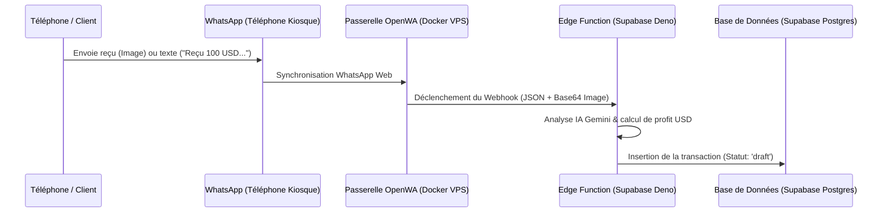

# Guide de Déploiement : Passerelle WhatsApp & Supabase Webhook (V2)

Ce guide détaille comment déployer la passerelle WhatsApp open source `rmyndharis/OpenWA` sur un VPS et la connecter à votre base de données Supabase via l'Edge Function pour capturer automatiquement les brouillons de transactions.

---

## Architecture de Fonctionnement



---

## 1. Déploiement de la Passerelle WhatsApp sur le VPS

### Prérequis sur le VPS
* Avoir installé **Docker** et **Docker Compose**.
* Ouvrir les ports suivants dans le pare-feu du VPS (ex: via `ufw`) :
  * `2886` : Dashboard React d'OpenWA (nécessaire temporairement pour le scanner QR).
  * `2785` : Port de l'API REST d'OpenWA (si vous souhaitez interagir avec).

### Étapes de déploiement
1. Connectez-vous en SSH à votre VPS :
   ```bash
   ssh user@vps-ip
   ```
2. Créez un répertoire pour la passerelle :
   ```bash
   mkdir -p /app/forex-whatsapp-gateway
   cd /app/forex-whatsapp-gateway
   ```
3. Copiez-y le fichier [docker-compose.yml](file:///c:/LAPOSTE/Projets/FOREX/whatsapp-gateway/docker-compose.yml) du projet.
4. Éditez le fichier pour renseigner l'URL de votre fonction Supabase :
   ```yaml
   environment:
     - WEBHOOK_URL=https://<votre-id-projet-supabase>.supabase.co/functions/v1/whatsapp-webhook
     - WEBHOOK_SECRET=une_cle_secrete_aleatoire_pour_la_securite
   ```
5. Lancez le conteneur en arrière-plan :
   ```bash
   docker compose up -d
   ```
6. Vérifiez que le conteneur tourne sans erreurs :
   ```bash
   docker compose logs -f
   ```

---

## 2. Authentification WhatsApp (Scanner le Code QR)

1. Ouvrez votre navigateur internet et accédez au Dashboard Web d'OpenWA :
   ```
   http://<vps-ip>:2886
   ```
2. Un code QR d'authentification s'affichera à l'écran.
3. Sur le téléphone WhatsApp affecté à la réception des transactions de vos clients :
   * Allez dans **Paramètres** (ou les trois points en haut à droite).
   * Sélectionnez **Appareils connectés**.
   * Appuyez sur **Connecter un appareil** et scannez le code QR affiché sur le navigateur.
4. Une fois connecté, la passerelle restera authentifiée de manière persistante grâce au dossier partagé `./sessions` sur votre VPS (pas besoin de scanner à nouveau en cas de redémarrage).

---

## 3. Déploiement de l'Edge Function sur Supabase

Pour installer l'Edge Function de réception et d'analyse IA sur votre compte Supabase :

1. Assurez-vous d'avoir installé la CLI Supabase en local et de vous y connecter :
   ```powershell
   supabase login
   ```
2. Associez votre CLI au projet Supabase :
   ```powershell
   supabase link --project-ref <votre-id-projet-supabase>
   ```
3. Déployez la fonction `whatsapp-webhook` :
   ```powershell
   supabase functions deploy whatsapp-webhook --project-ref <votre-id-projet-supabase>
   ```
4. Déclarez la clé API Gemini dans les variables d'environnement distantes de Supabase pour que l'IA fonctionne :
   ```powershell
   supabase secrets set GEMINI_API_KEY="votre_cle_api_gemini_reelle" --project-ref <votre-id-projet-supabase>
   ```

---

## 4. Tests et Validation de Fin en Bout

1. Envoyez un message ou une capture d'écran de reçu mobile money vers le compte WhatsApp configuré.
2. Surveillez les logs de l'Edge Function Supabase dans le tableau de bord Supabase (Section *Edge Functions > whatsapp-webhook > Logs*) pour voir l'extraction IA s'exécuter.
3. Allez sur le Dashboard de l'application **Forex Ledger** : le brouillon de transaction extrait par l'IA doit apparaître immédiatement dans la boîte orange, prêt à être édité ou validé d'un clic !
